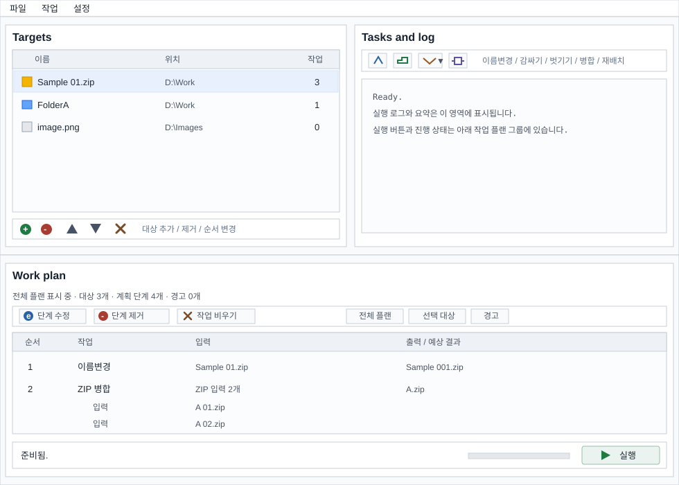
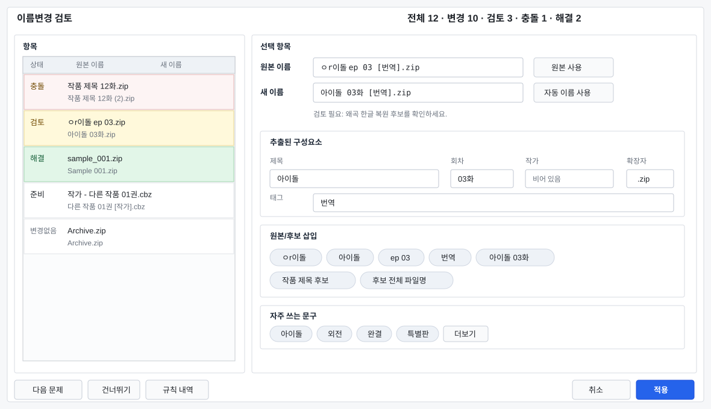

# FileTools

## 한국어

Windows 탐색기 ContextMenu와 독립 실행형 WinForms 유틸리티를 제공하는 작은 파일 관리 도구입니다.

현재 버전: `1.3.0.0-beta`.

### 개발 및 안정성 안내

FileTools는 취미 개발자가 개인적으로 관리하는 프로젝트이며, Codex를 활용해 제작 및 업데이트하고 있습니다. 따라서 일부 업데이트는 충분히 안정화되지 않았을 수 있고, 버그 테스트도 제한적으로 이루어질 수 있습니다. 중요한 파일에 적용하기 전에는 백업을 권장드리며, 문제가 발견되면 이슈로 알려주시면 가능한 범위에서 확인하겠습니다.

`1.3.0.0`은 베타 릴리스로 배포됩니다. ZIP 병합, 파일 비교, 이름변경 교정 플러그인 경계를 실제 사용 사례로 더 안정화한 뒤 같은 계열을 stable로 전환할 예정입니다.

### 기능

FileTools는 선택한 파일과 폴더에 대해 현재 사용자용 ContextMenu 작업 세 가지를 제공합니다.

1. **파일이름 자동 교정**
   - 파일명 교정 흐름을 사용합니다.
   - 한글 자모/유니코드를 정규화하고, 제목/회차/태그/작가 정보를 추출하며, Windows에서 안전한 이름을 만들고, 접미사를 붙여 충돌을 방지합니다.
   - 변경 적용 전 이름 바꾸기 검토 창이 기본으로 열립니다. ContextMenu 실행에서도 동일하며, 검토가 필요하거나 충돌이 있는 생성 행만 검토하도록 제한할 수 있습니다.

2. **폴더 wrapping / unwrapping**
   - 자동 모드에서는 선택한 파일을 같은 이름의 폴더로 감쌉니다.
   - 선택한 폴더가 단일 파일 폴더이면 풀고, 그렇지 않으면 바로 아래의 자식 파일을 상위로 이동합니다.
   - 단일 파일 폴더를 풀 때 기존 파일 이름 유지, 폴더 이름으로 변경, `folder-file` 형식 변경 중 하나를 선택할 수 있습니다.
   - wrapping/unwrapping 이름 계산은 공용 이름 템플릿 기반을 사용하며, 설정에서 wrap 폴더명, unwrap 불일치 파일명, 충돌 번호 규칙을 조정할 수 있습니다.
   - 선택한 여러 파일/폴더를 생성된 하나의 폴더로 병합할 수 있습니다. 폴더는 원본 폴더명을 유지한 하위 폴더로 이동합니다.
   - 기존 대상 파일은 덮어쓰지 않습니다.

3. **폴더 자동 재배치**
   - 가벼운 AutoRelocation 템플릿을 사용합니다.
   - 기본 템플릿은 항목을 `[ㄱ]`, `[A]`, `[0A]` 같은 제목 초성/이니셜 버킷으로 이동합니다.
   - 템플릿은 순서가 있는 경로 규칙 단계를 연결해 다단계 경로를 만들 수 있습니다.
   - 템플릿 필드는 파일, 폴더 또는 파싱된 파일 이름에서 얻을 수 있는 값으로 제한됩니다.

네이티브 ShellExt는 탐색기 메뉴 명령을 노출하고 실행 파일을 시작하는 역할만 합니다. 실행 파일은 선택 항목을 잠시 큐에 넣고, 탐색기가 항목별로 호출한 내용을 병합한 뒤, 비대화형 작업을 자동으로 수행하고 오류가 없으면 조용히 종료합니다.
비처리 명령인 **FileTools 열기 / Open FileTools**는 FileTools 하위 메뉴에 남아 있으며, 선택한 모든 항목을 로드한 독립 실행형 플래너를 엽니다.

### 독립 실행 UI

인수 없이 `FileTools.exe`를 실행하면 드래그 앤 드롭 작업 계획 창이 열립니다.



독립 실행 창은 다음 기능을 지원합니다.

- 대상 목록에 파일/폴더를 드래그 앤 드롭합니다.
- 파일/폴더 아이콘, 상위 위치, 대상별 작업 개수를 포함한 그리드에서 대상을 검토합니다.
- 대상 도구 모음으로 대상을 추가/제거하고, 선택한 대상을 실행 순서에서 위나 아래로 이동합니다.
- 드롭되거나 새로 추가된 대상은 자동으로 선택됩니다. 작업 버튼은 설정된 단계를 선택된 모든 대상에 추가하므로, 여러 폴더의 unwrap 작업 흐름을 한 번에 준비할 수 있습니다.
- 파일/폴더를 수동으로 선택합니다.
- 파일을 변경하기 전에 각 대상에 여러 계획 작업을 추가합니다.
- 파일명 교정, 폴더 wrapping, 폴더 unwrapping, AutoRelocation 작업을 체인으로 연결합니다.
- 메뉴 모음에서 파일, 작업, 설정 명령에 접근하고, 자주 쓰는 작업 명령은 고정 작업 도구 모음에 유지합니다.
- 파일 비교 전용 창에서 파일/폴더 대상을 모으고 이름/메타데이터/내용/압축 해제 옵션을 조정한 뒤, modeless 진행률 창과 결과 창에서 중복 후보, JSON 저장, 중복 삭제 step 추가를 처리합니다.
- ZIP 압축 병합 작업은 `A 01.zip`, `A 02.zip` 같은 번호 붙은 압축 묶음을 `A.zip`으로 제안하고, 옵션 창 하단에서 압축 내부 엔트리의 원래 경로와 충돌 처리 후 대상 경로를 미리 보여줍니다.
- 분할 버튼에서 폴더 unwrapping 변형을 선택합니다. 기본 설정, 같은 이름 폴더, 단일 파일 폴더 이름 불일치 처리 방식, 바로 아래 자식 파일 상위 이동을 포함합니다.
- 각 선택 대상의 작업 계획을 순서, 아이콘이 붙은 작업 종류, 예상 결과와 함께 그리드에서 검토합니다. 이름 변경 단계는 `original -> new name` 형식으로 표시됩니다.
- 작업 계획 위에 현재 표시 중인 대상, 선택된 대상 수, 선택된 대상의 계획 단계 수를 표시합니다.
- 별도 설정 열을 두지 않고 그리드 행 툴팁으로 단계별 상세 옵션을 보여줍니다.
- 계획 쪽 도구 모음에서 선택한 단계 하나를 제거하거나 현재 표시 중인 대상의 단계를 모두 지울 수 있으며, 남은 단계 체인을 기준으로 미리보기가 다시 계산됩니다.
- 계획 작업을 두 번 클릭하면 해당 작업 대화상자를 다시 엽니다. 이름 변경 단계는 파일별 후보, 수동 편집, 건너뛰기 컨트롤이 포함된 이름 바꾸기 검토 창을 다시 엽니다.
- 오른쪽 아래 실행/중지 버튼 하나로 모든 대상 계획을 순서대로 실행하고, 아래쪽 로그 보기에서 진행 상황을 검토합니다.
- 탐색기 ContextMenu 등록, 이름 변경 기본값, 폴더 기본값, AutoRelocation 기본값을 위한 고정 상태 헤더와 접을 수 있는 옵션 그룹이 있는 크기 조절 가능한 설정 창을 엽니다.

설정 창은 동작 기본값과 탐색기 ContextMenu 설치/제거를 관리합니다. 네이티브 ShellExt 등록은 하나의 FileTools 하위 메뉴를 사용하며, 개별 ContextMenu 작업은 켜거나 끌 수 있습니다.
폴더 wrapping/unwrapping과 AutoRelocation 명령은 탐색기 등록용으로 각각 선택할 수 있습니다. 설정 창에서 OK를 누르면 Install/Remove 버튼을 누르지 않았더라도 옵션을 저장하고 현재 사용자 ContextMenu 등록을 동기화합니다.
설정 레이아웃 메모는 `docs/ux-settings-dialog-review.md`에서 추적합니다.
앱 아이콘은 `src\FileTools.App\Resources` 아래에 투명 PNG와 다중 크기 ICO 자산으로 저장되어 있으며, EXE와 MSI 제품 메타데이터 모두 ICO를 사용합니다. Burn 설치 및 제거 UI는 `installer\FileTools.Bundle\Assets` 아래의 별도 파란색 설치 로고를 사용하고, MSI 마법사는 `installer\FileTools.Installer\Assets` 아래의 별도 파란색 대화상자/배너 비트맵을 사용합니다.

이름 바꾸기 검토 대화상자는 ContextMenu 이름 변경 명령과 독립 실행 계획 편집에서 사용됩니다.
이름 바꾸기 검토는 변경 적용 전에 항상 열리도록 설정하거나, 생성 행에 검토가 필요하거나 충돌이 있을 때만 열리도록 설정할 수 있습니다. 이 대화상자는 읽기 전용 항목 목록과 선택 항목 편집기를 함께 사용하므로 긴 대상 이름을 그리드 밖에서 편집할 수 있으며, 추출된 제목, 회차, 작가, 태그, 확장자, 후보, 공통 문구, 규칙 추적 값은 입력 보조 정보로 계속 사용할 수 있습니다. 공통 문구는 기본적으로 한 행으로 접혀 있으며 같은 패널에서 펼치거나 접을 수 있습니다. 오른쪽 위에는 전체 변경 요약을 표시하고, 검토/충돌 행을 강조하며, 편집한 대상 이름을 매번 검증하고, 적용 전에 선택 행을 자동/원본으로 복원하거나 건너뛸 수 있습니다.



현재 이름 바꾸기 대화상자의 UX 검토 메모는 `docs/ux-rename-dialog-review.md`에서 추적합니다.

별도 대화상자는 다음 용도로 제공됩니다.

- 이름 변경 교정 규칙. 내장 규칙 표시 여부, 활성 상태, 단계별 순서, 자동/검토/후보 전용 모드를 포함합니다. 오른쪽 `세부 설정` 탭은 기존 이름변경 사전(`source -> replacement`), 검토창 삽입 문구, 왜곡 한글 후보 점수 단어와 보호 영어 단어, 파서 프로파일의 태그 단어/작가 접두어/회차 접두어와 단위/제목 노이즈 단어를 선택 규칙 맥락에서 직접 편집합니다. 후보 프로파일은 `rename-candidate-profile.json`, 파서 프로파일은 `rename-parser-profile.json`에 저장하며, 스크립트 기반 규칙은 보류 중이고 `docs/ux-rename-rule-management.md`에 문서화되어 있습니다.
- 이름변경 교정 플러그인. 기본 언어와 플러그인별 활성 상태 및 설정을 관리합니다. 플러그인은 자동 적용 없이 검토 가능한 후보만 추가하며, 첫 샘플은 사용자 제공 사전/말뭉치 파일을 쓰는 SymSpell 후보 provider입니다. 설계 경계는 `docs/rename-correction-plugin-design.md`에 문서화되어 있습니다.
- AutoRelocation 템플릿 편집. 경로 규칙 단계는 순서대로 평가되므로 템플릿은 `{KnownFileKind}\[{Initial}]\{EpisodeRange}` 같은 경로를 만들 수 있습니다. 템플릿 편집기와 단계별 작업 대화상자는 긴 템플릿 이름, 경로, 현지화된 라벨을 위해 크기를 조절할 수 있습니다.

개인화 이름변경 학습은 파일 내용을 추론하지 않고 선택된 파일명 묶음의 구조 패턴과 사용자가 확정한 재구성 패턴을 학습하는 방향으로 준비 중입니다. 내부 기반은 결정론적 파일명 패턴 발견, 출력 패턴 후보 생성, 사용자 확정 이력 저장, 통계 기반 랭킹까지 포함하며, 설정에서 학습 사용 여부와 최대 이력 행 수를 조정합니다. 이력 제한 기본값은 2000행, 최소값은 100행이며, 충분한 로컬 피드백이 쌓인 뒤 작은 신경망 랭커를 shadow 검증과 혼합 점수로 점진 도입합니다. 설계 경계는 `docs/neural-rename-training-design.md`에 문서화되어 있습니다.

AutoRelocation 템플릿은 의도적으로 파일에서 파생된 값만 사용합니다.

- 파일 이름 stem.
- 파일 확장자.
- 설정 기반 확장자 규칙에서 판별한 알려진 파일 종류. 기본값은 `Folder`, `Archive`, `Image`, `Video`, `Music`, `Text`, `Document`, `Program`, `Other`이며, 분류 편집기에서 사용자 정의 종류를 추가하거나 대표 이름을 바꿀 수 있습니다.
- 파일 또는 폴더 이름에서 파싱한 제목과 회차 범위.
- 크기, 만든 시간, 수정한 시간.

알려진 파일 종류의 원본은 원시 확장자 원본과 분리되어 있습니다. 설정 창의 AutoRelocation 그룹에서 파일 종류 분류를 열어 파일 종류를 추가/삭제하거나 대표 이름과 확장자 규칙을 수정할 수 있고, Windows에 등록된 시스템 확장자를 참고 목록으로 검색해 추가할 수 있습니다. `Folder`는 실제 폴더일 때, `Other`는 어떤 규칙에도 맞지 않을 때 쓰는 고정 fallback입니다. 기본 규칙은 일반 확장자를 넓은 범주의 폴더로 묶습니다.

- `Archive`: `zip`, `rar`, `7z`, `tar`, `gz`, `cbz`, `cbr`, `iso` 같은 압축/아카이브 및 디스크 이미지 계열 파일.
- `Image`: `jpg`, `png`, `gif`, `webp`, `heic`, `svg`, `psd`, `ico` 같은 이미지/디자인/raw 형식.
- `Video`: `mp4`, `mkv`, `avi`, `mov`, `webm`, `srt`, `ass`, `vtt` 같은 동영상 파일과 자막 사이드카.
- `Music`: `mp3`, `flac`, `wav`, `m4a`, `ogg`, `opus`, `wma` 같은 오디오/음악 파일.
- `Text`: `txt`, `md`, `log`, `csv`, `json`, `xml`, `yaml`, `ini` 같은 일반 텍스트와 구조화 텍스트.
- `Document`: `pdf`, `docx`, `xlsx`, `pptx`, `odt`, `epub`, `hwp`, `hwpx` 같은 PDF, Office, OpenDocument, 전자책, HWP 형식.
- `Program`: `exe`, `msi`, `bat`, `ps1`, `js`, `jar`, `dll`, `apk` 같은 실행 파일, 설치 파일, 스크립트, 패키지, 라이브러리 파일.

설정과 템플릿은 다음 위치에 저장됩니다.

```text
%APPDATA%\FileTools
%APPDATA%\FileTools\settings.json
%APPDATA%\FileTools\rename-dictionary.json
%APPDATA%\FileTools\rename-candidate-profile.json
%APPDATA%\FileTools\rename-parser-profile.json
%APPDATA%\FileTools\rename-pattern-feedback.jsonl
%APPDATA%\FileTools\Plugins
%APPDATA%\FileTools\Relocate
```

`%APPDATA%`에 쓸 수 없으면 FileTools는 실행 파일 옆의 `FileToolsData`로 대체합니다.

### UI 현지화

앱 UI는 .NET `CurrentUICulture`를 통해 시스템 UI 문화권을 따릅니다.
영어는 중립/기본 리소스이며, 한국어는 satellite 리소스로 제공됩니다.
지원하지 않는 UI 문화권은 영어로 fallback됩니다.

```text
src\FileTools.App\Resources\Strings.resx
src\FileTools.App\Resources\Strings.ko.resx
```

`MainForm`은 WinForms Designer 친화적인 partial 클래스로 분리되어 있습니다.

```text
src\FileTools.App\Ui\MainForm.cs
src\FileTools.App\Ui\MainForm.Designer.cs
src\FileTools.App\Ui\MainForm.resx
```

레이아웃/컨트롤 선언은 `MainForm.Designer.cs`에 두고, 런타임 동작과 현지화 텍스트 바인딩은 `MainForm.cs`에 둡니다.
보조 다이얼로그도 같은 규칙을 따릅니다. `Ui\*Dialog.Designer.cs`에는 컨트롤 선언과 레이아웃 빌더를 두고, 해당 `Ui\*Dialog.cs`에는 데이터 바인딩, 검증, 저장/실행 로직을 둡니다.
`Ui\MainForm.ko.resx` 같은 폼 수준 문화권 리소스는 의도적으로 빌드에서 제외되어 있습니다. UI 문자열은 `Resources\Strings*.resx`에만 추가하세요.
Designer 파일은 Visual Studio가 런타임 현지화를 실행하지 않고도 폼을 렌더링할 수 있도록 중립 영어 텍스트와 placeholder 콤보 항목을 유지합니다. 앱은 시작 시 해당 값을 `Resources\Strings*.resx`에서 읽은 값으로 덮어씁니다.

### 빌드 요구 사항

- Windows
- .NET 8 SDK 이상
- `FileTools.ShellExt`용 C++ 워크로드가 포함된 Visual Studio Build Tools

### 빌드

`FileTools.sln`은 .NET/C++ 혼합 x64 솔루션입니다. WinForms 앱과 네이티브 ShellExt가 모두 필요하면 Visual Studio 또는 Visual Studio MSBuild에서 빌드하세요.

```powershell
MSBuild.exe FileTools.sln /p:Configuration=Release /p:Platform=x64
```

앱만 빌드하려면 다음 명령을 사용합니다.

```powershell
dotnet build .\src\FileTools.App\FileTools.App.csproj
```

게시:

```powershell
dotnet publish .\src\FileTools.App\FileTools.App.csproj -c Release -r win-x64 --self-contained false -p:PublishSingleFile=true
```

출력:

```text
src\FileTools.App\bin\Release\net8.0-windows\win-x64\publish\FileTools.exe
```

### 테스트

자동 테스트는 `tests\FileTools.Tests`에 있습니다. 현재 회귀 범위는 파일명 교정, 이름 템플릿과 충돌 해결, 이름 변경 적용, 폴더 병합, AutoRelocation 분류/계획 생성, 작업 계획 미리보기, 설정/규칙 정규화, ZIP 병합, ZIP extra field byte 보존, ZIP 병합 중복/충돌/취소 cleanup, 파일 비교 엔진의 폴더 확장/부분 일치/해시 캐시/ZIP 엔트리 순서 비교/공통 이름 비교/중간 부분 범위/압축 엔트리 범위, 파일 비교 결과의 중복 그룹 산출, 보존 기준 정렬, JSON export schema입니다. ZIP 출력 파일시스템 오류는 내부 `IArchiveMergeFileSystem` 어댑터로 주입하며, 테스트 프로젝트는 `InternalsVisibleTo`로 내부 엔진 API에 접근합니다.

```powershell
dotnet test .\tests\FileTools.Tests\FileTools.Tests.csproj
```

### 설치 관리자 빌드

설치 관리자는 WiX Toolset SDK 스타일 프로젝트 파일을 사용합니다. 빌드 스크립트는 먼저 Visual Studio MSBuild로 네이티브 ShellExt DLL을 빌드한 다음 WiX MSI와 Burn bundle 프로젝트를 복원/빌드합니다.

```powershell
.\build_msi.ps1
```

출력:

```text
installer\FileTools.Installer\bin\Release\FileTools.msi
installer\FileTools.Bundle\bin\Release\FileToolsSetup.exe
artifacts\identity\FileTools.Identity.msix
artifacts\identity\FileTools.Identity.cer
```

MSI는 FileTools를 framework-dependent `win-x64` single-file 앱으로 게시하고 사용자별 위치에 설치합니다.

```text
%LOCALAPPDATA%\Programs\FileTools
```

MSI는 의도적으로 작게 유지되며 Microsoft .NET 8 Desktop Runtime x64가 필요합니다. 일반 배포에는 `FileToolsSetup.exe`를 사용하세요. Burn bootstrapper는 Microsoft .NET Desktop Runtime 8.0.27 x64가 없으면 Microsoft 공식 런타임 엔드포인트에서 다운로드한 뒤 MSI를 실행합니다.
빌드 스크립트는 WiX `wix burn detach`와 `wix burn reattach` 흐름으로 Burn bootstrapper bundle에 서명하므로, 서명된 EXE도 연결된 MSI 컨테이너를 계속 추출할 수 있습니다.
런타임이 이미 설치되어 있으면 `FileToolsSetup.exe`는 사용자별 MSI만 설치하며 관리자 권한이 필요하지 않아야 합니다. 런타임이 없으면 bootstrapper는 machine-wide Microsoft .NET Desktop Runtime 설치 관리자에 대해서만 승격을 요청한 뒤 사용자별 FileTools MSI 설치를 계속합니다.
bootstrapper는 Windows 앱 및 기능에서 `FileTools`로 표시되며, 실행 파일 이름은 `FileToolsSetup.exe`로 유지됩니다.
bootstrapper는 MSI 마법사를 숨기고 자체 설치 옵션을 표시합니다.

- `Add Explorer Context Menu commands`: 기본 활성화.
- `Create Start Menu shortcut`: 기본 활성화.
- `Create Desktop shortcut`: 기본 비활성화.

설치가 성공하면 bootstrapper는 성공 페이지에 `Run FileTools` 버튼을 표시합니다.

MSI 옵션:

- `FileTools`: 애플리케이션과 시작 메뉴 바로가기.
- `Explorer Context Menu`: 선택 사항인 네이티브 ShellExt 등록.

`FileTools.msi`를 직접 실행하면 이 MSI 기능들은 MSI 마법사에서 계속 사용할 수 있습니다. bootstrapper에서 제공하는 속성이 없으면 MSI는 기본적으로 탐색기 ContextMenu와 시작 메뉴 바로가기를 설치하며, 바탕 화면 바로가기는 만들지 않습니다.

MSI는 네이티브 `FileTools.ShellExt.dll`을 현재 사용자 COM ExplorerCommand handler로 설치합니다. 첫 실행 후 FileTools 설정에서 개별 폴더 wrapping/unwrapping 및 AutoRelocation 명령을 선택하세요. 기존 정적 레지스트리 컴포넌트는 fallback 개발 용도로만 비활성 상태로 유지됩니다.

선택 사항인 Windows 11 네이티브 ContextMenu 경로는 서명된 sparse MSIX identity package를 등록합니다. 그러면 Windows가 `desktop4:FileExplorerContextMenus`와 `windows.comServer`를 통해 shell extension을 발견할 수 있습니다. 설치 프로그램은 지원 파일만 배치하며 인증서 가져오기와 identity 등록은 자동 실행하지 않습니다. 설치 후 FileTools 설정 창의 Windows 11 기본 메뉴 섹션에서 사용자가 명시적으로 실행하면, 공개 self-signed CER을 현재 사용자의 Trusted People 저장소로 가져오고 `PackageManager.AddPackageByUriAsync`로 sparse package identity를 등록합니다. 설치 또는 제거 후 메뉴가 즉시 갱신되지 않으면 Explorer를 다시 시작하세요.

네이티브 ShellExt는 `FileTools.ShellExt.def`를 통해 `DllGetClassObject`, `DllCanUnloadNow`, `DllRegisterServer`, `DllUnregisterServer`를 명시적으로 내보내며, Explorer가 별도 VC runtime 의존성 없이 로드할 수 있도록 정적 C runtime으로 빌드됩니다.

앱 전용 빌드에는 `dotnet build src\FileTools.App\FileTools.App.csproj`를 사용하세요. `FileTools.sln`은 루트 혼합 x64 솔루션이며 네이티브 ShellExt 프로젝트를 포함하므로 전체 솔루션 빌드에는 C++ 워크로드가 포함된 Visual Studio MSBuild가 필요합니다. ShellExt 프로젝트는 `build_msi.ps1`과 `publish_and_install.ps1`에서 빌드됩니다. 설치 관리자 프로젝트는 `installer\FileTools.Installer.sln`에 분리되어 있으며, `build_msi.ps1`로 빌드하거나 HeatWave 같은 WiX v4 호환 확장이 있는 Visual Studio에서 해당 솔루션을 열 수 있습니다.

### 릴리스

GitHub Releases는 setup bootstrapper, MSI, sparse MSIX identity package를 빌드하고 서명하며, `checksums.txt`를 생성하고, 릴리스 자산에 대한 GitHub artifact attestation을 만드는 수동 workflow를 사용합니다.

`1.3.0.0`은 GitHub prerelease/beta로 게시합니다. 위키 문서와 tag별 변경사항 문서를 먼저 업데이트하고, 릴리스 자산 검증 및 설치 smoke test가 끝난 뒤 draft를 게시합니다. 안정화 작업 후 stable 전환 릴리스를 별도로 게시합니다.

릴리스는 GitHub Secrets에 base64 PFX와 비밀번호로 저장된 self-signed FileTools 인증서를 사용합니다. 이는 무료 GitHub 배포와 CER 신뢰 후 MSIX identity 등록에는 적합하지만, 공개 CA 코드 서명 인증서는 아닙니다. Windows는 첫 사용 사용자에게 SmartScreen 또는 신뢰 경고를 계속 표시할 수 있습니다.

릴리스 workflow와 검증 단계는 `docs\release.md`를 참고하세요.

### 프로젝트 구성

```text
src\FileTools.App
├─ Configuration
├─ Infrastructure
├─ Naming
├─ Operations
├─ Relocation
├─ Shell
└─ Ui

src\FileTools.ShellExt
└─ Native C++ ExplorerCommand shell extension

installer\FileTools.Installer
├─ FileTools.Installer.sln
└─ FileTools.Installer

installer\FileTools.Identity
└─ Sparse MSIX identity manifest
```

현재 정리된 다음 작업 목록은 `docs\next-tasks.md`에서 추적합니다.

### ContextMenu 설치

도우미 스크립트를 사용합니다.

```powershell
.\publish_and_install.ps1
```

또는 게시된 실행 파일을 실행합니다.

```powershell
.\FileTools.exe /install
```

명시적인 `/install` 명령은 저장된 설정에서 현재 탐색기 등록이 꺼져 있더라도 `RegisterContextMenu`를 활성화합니다.
Explorer가 이미 네이티브 ShellExt DLL을 로드하려고 시도한 뒤 DLL이 교체되었다면, 메뉴를 다시 확인하기 전에 Explorer를 다시 시작하세요.

이 작업은 현재 사용자 레지스트리 키에만 기록합니다.

```text
HKCU\Software\Classes\*\shell
HKCU\Software\Classes\Directory\shell
HKCU\Software\Classes\CLSID\{716e7cc4-5941-4362-8aca-d38c62817de9}
HKCU\Software\FileTools\ContextMenu
```

관리자 권한은 필요하지 않습니다.

### ContextMenu 제거

```powershell
.\uninstall.ps1
```

또는:

```powershell
.\FileTools.exe /uninstall
```

명시적인 `/uninstall` 명령은 탐색기 등록을 제거하고 `RegisterContextMenu`를 비활성 상태로 저장합니다.

### ContextMenu 등록 정리

설치 후에도 Explorer에 FileTools 메뉴가 보이지 않으면 현재 사용자 등록 잔여 항목을 검사하고 정리하세요.

```powershell
.\cleanup_context_menu.ps1 -WhatIf
```

정리를 실행합니다.

```powershell
.\cleanup_context_menu.ps1
```

선택 플래그:

- `-RemoveInstalledFiles`: 복사된 바이너리, 설정, 템플릿을 포함한 `%APPDATA%\FileTools`도 제거합니다.
- `-RestartExplorer`: 정리 후 Explorer를 다시 시작합니다.

### ContextMenu 동작

등록되는 명령:

```text
FileTools.exe /open "%1"
FileTools.exe /context FileNameCorrection "%1"
FileTools.exe /context FolderStructure "%1"
FileTools.exe /context AutoRelocation "%1"
FileTools.exe /context FolderWrapFiles "%1"
FileTools.exe /context FolderUnwrapSameNameSingleFile "%1"
FileTools.exe /context FolderUnwrapSingleFile "%1"
FileTools.exe /context FolderUnwrapUseFolderName "%1"
FileTools.exe /context FolderUnwrapKeepFileName "%1"
FileTools.exe /context FolderMoveInnerFilesUp "%1"
FileTools.exe /context AutoRelocationCurrentFolder "%1"
FileTools.exe /context AutoRelocationChooseTarget "%1"
```

처음 세 `/context` 명령은 하위 호환성을 위해 유지됩니다. 네이티브 ShellExt는 선택 항목 종류에 따라 표시할 하위 메뉴 항목을 결정합니다. 단일 파일 폴더의 경우 단일 파일 stem이 폴더 이름과 일치하는지도 확인하고, 단순 unwrap 명령 또는 명시적인 폴더 이름/파일 이름 unwrap 명령을 노출합니다.

Explorer는 선택 항목마다 프로세스를 하나씩 시작하는 경우가 많습니다. FileTools는 잠시 기다린 뒤 임시 큐를 통해 선택 경로를 병합하고, 선택된 작업을 실행한 다음 비대화형 명령에서는 자동으로 종료합니다. Open FileTools 명령도 선택한 모든 경로를 받아 큐에 넣기 때문에 독립 실행형 플래너가 전체 선택 항목으로 시작됩니다. 파일명 교정은 구성된 검토 모드에 따라 적용 전에 이름 바꾸기 검토 창을 엽니다. 예외가 발생하면 오류 요약이 표시됩니다.

내부 시험용으로 `FileTools.exe /context FileCompare "%1"` 경로도 준비되어 있습니다. 이 명령은 선택 경로를 큐로 병합한 뒤 FileTools를 열고 파일 비교 설정창을 미리 채워서 표시하지만, 아직 설정창이나 Explorer 등록에는 노출하지 않습니다.

### 안전 동작

- 기존 대상 파일/폴더는 덮어쓰지 않습니다.
- 파일명 교정은 기본적으로 변경 적용 전에 검토되며, 해당 검토 모드를 선택한 경우 생성 행에 검토가 필요하거나 충돌이 있을 때만 검토됩니다.
- AutoRelocation은 대상이 이미 있으면 `(2)`, `(3)` 접미사를 적용합니다.
- 선택 항목 병합은 실행 전 대상 폴더를 확인받고, 충돌하는 파일/폴더명에는 자동 번호를 붙입니다.
- 폴더는 unwrapping 또는 자식 파일 이동 후 비어 있을 때만 삭제됩니다.
- 폴더 unwrapping은 바로 아래의 자식 파일만 이동하며, 중첩 폴더 내용은 평탄화하지 않습니다.
- folder wrap/unwrap 이름 템플릿과 충돌 정책의 내부 설계는 `docs/name-template-and-collision-policy.md`에 정리되어 있습니다.

### 로그

```text
%TEMP%\FileTools.log
```

### 라이선스

FileTools는 MIT License로 제공됩니다. 자세한 내용은 `LICENSE`를 참고하세요.

---

## English

Windows Explorer ContextMenu and standalone WinForms utility for small file-management operations.

Current version: `1.3.0.0-beta`.

### Development and Stability Notice

FileTools is maintained as a personal hobby project and is built and updated with the help of Codex. As a result, some updates may not be fully stable, and bug testing may be limited. Please consider backing up important files before using FileTools on them, and feel free to report issues so they can be reviewed as time permits.

`1.3.0.0` is distributed as a beta release. The ZIP merge, file comparison, and rename-correction plugin boundary will move to stable after additional real-world stabilization.

### Features

FileTools provides three current-user ContextMenu actions for selected files and folders:

1. **파일이름 자동 교정**
   - Uses the filename correction flow.
   - Normalizes Korean jamo/Unicode, extracts title/episode/tag/author parts, makes Windows-safe names, and avoids conflicts with suffixes.
   - Rename review opens before applying changes by default, including ContextMenu execution, and can be limited to generated rows that need review or have conflicts.

2. **폴더 wrapping / unwrapping**
   - In automatic mode, selected files are wrapped into same-stem folders.
   - Selected folders are unwrapped when they are single-file folders, otherwise direct child files are moved up.
   - Single-file folder unwrapping can keep the original filename, rename to the folder name, rename to `folder-file`, or use a custom template.
   - Wrapping/unwrapping name generation uses a shared name-template foundation, and settings can adjust wrap folder names, unwrap mismatch names, and conflict numbering rules.
   - Multiple selected files and folders can be merged into one generated folder. Source folders are moved as named child folders.
   - Existing destination files are not overwritten.

3. **폴더 자동 재배치**
   - Uses lightweight AutoRelocation templates.
   - Default template moves items into title-initial buckets such as `[ㄱ]`, `[A]`, and `[0A]`.
   - Templates can build multi-level paths by chaining ordered path-rule steps.
   - Template fields are limited to values available from the file, folder, or parsed file name.

The native ShellExt only exposes Explorer menu commands and launches the executable. The executable queues selected items briefly, merges Explorer's per-item invocations, performs non-interactive work automatically, and exits silently when there are no errors.
The non-processing **FileTools 열기 / Open FileTools** command stays in the FileTools submenu and opens the standalone planner with all selected items loaded.

### Standalone UI

Run `FileTools.exe` without arguments to open the drag-and-drop work plan window.


The standalone window supports:

- Drag and drop files/folders into the target list.
- Reviewing targets in a grid with file/folder icons, parent locations, and per-target action counts.
- Using the target toolbar to add/remove targets and move selected targets up or down in execution order.
- Dropped or newly added targets are selected automatically. Action buttons add the configured step to every selected target, so multi-folder unwrap workflows can be prepared in one pass.
- Manual file/folder selection.
- Adding multiple planned actions to each target before changing files.
- Chaining filename correction, folder wrapping, folder unwrapping, and AutoRelocation actions.
- Accessing file, task, and settings commands from the menu bar, while common task commands stay on the fixed task toolbar.
- Opening the dedicated file-compare dialog to collect files/folders, adjust name, metadata, content, and archive-extraction options, then use the modeless progress dialog and result dialog for duplicate candidates, JSON saving, and duplicate-delete step handoff.
- Adding ZIP archive merge steps that suggest common logical output names such as `A.zip` for `A 01.zip` and `A 02.zip`, with an options-dialog detail grid showing each internal entry's original path and collision-resolved target path.
- Selecting folder unwrapping variants from a split button, including the default setting, same-name folders, single-file folder name mismatch modes, and moving direct child files upward.
- Reviewing each selected target's work plan in a grid with order, icon-labeled action kind, and expected result; rename steps show `original -> new name`.
- Showing the currently displayed target, selected target count, and selected targets' planned step count above the work plan.
- Showing detailed per-step options in grid row tooltips instead of dedicating a separate settings column.
- Removing one selected step or clearing the currently displayed target's steps from the plan-side toolbar; the preview is recalculated from the remaining step chain.
- Double-clicking a planned action to reopen the matching action dialog; rename steps reopen the rename review dialog with per-file candidates, manual editing, and skip controls.
- Running all target plans in order with one bottom-right run/stop button and reviewing progress in the bottom log view.
- Opening a resizable settings window with a fixed status header and collapsible option groups for Explorer ContextMenu registration, rename defaults, folder defaults, and AutoRelocation defaults.

The settings window owns operational defaults and Explorer ContextMenu installation/removal. Native ShellExt registration uses one FileTools submenu, and individual ContextMenu actions can be enabled or disabled.
Folder wrapping/unwrapping and AutoRelocation commands can be selected independently for Explorer registration. Pressing OK in the settings window saves the options and synchronizes the current-user ContextMenu registration, even if the Install/Remove buttons are not pressed.
The settings layout notes are tracked in `docs/ux-settings-dialog-review.md`.
The app icon is stored as transparent PNG and multi-size ICO assets under `src\FileTools.App\Resources`; the EXE and MSI product metadata both use the ICO. The Burn setup and uninstall UI use a separate blue setup logo under `installer\FileTools.Bundle\Assets`, and the MSI wizard uses separate blue dialog/banner bitmaps under `installer\FileTools.Installer\Assets`.

The rename review dialog is used by ContextMenu rename commands and by standalone plan editing.
Rename review can be configured to always open before applying changes, or to open only when generated rows need review or have conflicts. The dialog uses a read-only item list plus a selected-item editor, so long target names can be edited outside the grid while extracted title, episode, author, tag, extension, candidate, common-phrase, and rule-trace values remain available as input aids. Common phrases stay collapsed to one row by default and can be expanded or collapsed from the same panel. It summarizes total changes in the upper-right corner, emphasizes review/conflict rows, validates edited target names after each edit, and lets the selected row be restored to auto/original or skipped before applying.


UX review notes for the current rename dialog are tracked in `docs/ux-rename-dialog-review.md`.

Separate dialogs are available for:

- Rename correction rules, including built-in rule visibility, enabled state, stage-scoped ordering, and automatic/review/candidate-only modes. The right-side `Details` tab edits existing rename dictionary entries (`source -> replacement`), rename-review insert phrases, obfuscated Hangul candidate scoring words and protected English words, and parser-profile lists for tag words, author prefixes, episode prefixes/units, and title noise words in the context of the selected rule. Candidate lists are stored in `rename-candidate-profile.json`, and parser lists are stored in `rename-parser-profile.json`. Script-backed rules are deferred and documented in `docs/ux-rename-rule-management.md`.
- Rename correction plugins. The settings dialog manages the default language, per-plugin enable state, and generated plugin settings. Plugins only add reviewable candidates without automatic apply; the first sample is a SymSpell candidate provider that uses user-supplied dictionary or corpus data. The boundary is documented in `docs/rename-correction-plugin-design.md`.
- AutoRelocation template editing. Path rule steps are evaluated in order, so a template can produce paths such as `{KnownFileKind}\[{Initial}]\{EpisodeRange}`. The template editor and per-step action dialogs resize for long template names, paths, and localized labels.

Personal rename learning is being prepared around filename-structure patterns instead of file-content inference. The internal foundation covers deterministic filename pattern discovery, render-pattern candidate generation, confirmed-feedback storage, and statistical ranking; settings control whether learning is enabled and how many feedback rows are retained. The default limit is 2000 rows, the minimum is 100 rows, and a small neural ranker can be introduced later through shadow validation and blended scores after enough local feedback exists. The design is documented in `docs/neural-rename-training-design.md`.

AutoRelocation templates intentionally use only file-derived values:

- File name stem.
- File extension.
- Known file kind from settings-based extension rules. Defaults are `Folder`, `Archive`, `Image`, `Video`, `Music`, `Text`, `Document`, `Program`, `Other`, and the classification editor can add custom kinds or rename representative kind names.
- Parsed title and episode range from the file or folder name.
- Size, created time, and modified time.

The known file kind source is separate from the raw extension source. Open file kind classification from the AutoRelocation settings group to add/delete file kinds, rename representative names, edit extension rules, and use the searchable Windows registered extension list as a reference when adding extensions. `Folder` is a fixed fallback for real folders, and `Other` is the fixed fallback when no rule matches. The default rules group common extensions into broad folders:

- `Archive`: compressed/archive and disk-image style files such as `zip`, `rar`, `7z`, `tar`, `gz`, `cbz`, `cbr`, `iso`.
- `Image`: image/design/raw formats such as `jpg`, `png`, `gif`, `webp`, `heic`, `svg`, `psd`, `ico`.
- `Video`: video files and subtitle sidecars such as `mp4`, `mkv`, `avi`, `mov`, `webm`, `srt`, `ass`, `vtt`.
- `Music`: audio/music files such as `mp3`, `flac`, `wav`, `m4a`, `ogg`, `opus`, `wma`.
- `Text`: plain text and structured text such as `txt`, `md`, `log`, `csv`, `json`, `xml`, `yaml`, `ini`.
- `Document`: PDF, Office, OpenDocument, ebook, and HWP formats such as `pdf`, `docx`, `xlsx`, `pptx`, `odt`, `epub`, `hwp`, `hwpx`.
- `Program`: executable, installer, script, package, and library files such as `exe`, `msi`, `bat`, `ps1`, `js`, `jar`, `dll`, `apk`.

Settings and templates are stored under:

```text
%APPDATA%\FileTools
%APPDATA%\FileTools\settings.json
%APPDATA%\FileTools\rename-dictionary.json
%APPDATA%\FileTools\rename-candidate-profile.json
%APPDATA%\FileTools\rename-parser-profile.json
%APPDATA%\FileTools\rename-pattern-feedback.jsonl
%APPDATA%\FileTools\Relocate
```

If `%APPDATA%` is not writable, FileTools falls back to `FileToolsData` next to the executable.

### UI Localization

The app UI follows the system UI culture through .NET `CurrentUICulture`.
English is the neutral/default resource, and Korean is provided as a satellite resource.
Unsupported UI cultures fall back to English.

```text
src\FileTools.App\Resources\Strings.resx
src\FileTools.App\Resources\Strings.ko.resx
```

`MainForm` is split into a WinForms Designer-friendly partial class:

```text
src\FileTools.App\Ui\MainForm.cs
src\FileTools.App\Ui\MainForm.Designer.cs
src\FileTools.App\Ui\MainForm.resx
```

Keep layout/control declarations in `MainForm.Designer.cs`, and keep runtime behavior and localized text binding in `MainForm.cs`.
Secondary dialogs follow the same split. Keep control declarations and layout builders in `Ui\*Dialog.Designer.cs`, and keep data binding, validation, save, and execution behavior in the matching `Ui\*Dialog.cs`.
Form-level culture resources such as `Ui\MainForm.ko.resx` are intentionally excluded from the build; add UI strings only to `Resources\Strings*.resx`.
The Designer file keeps neutral English text and placeholder combo items so Visual Studio can render the form without running runtime localization; the app overwrites those values from `Resources\Strings*.resx` at startup.

### Build Requirement

- Windows
- .NET 8 SDK or newer
- Visual Studio Build Tools with the C++ workload for `FileTools.ShellExt`

### Build

`FileTools.sln` is a mixed .NET/C++ x64 solution. Build it from Visual Studio or Visual Studio MSBuild when you need both the WinForms app and the native ShellExt:

```powershell
MSBuild.exe FileTools.sln /p:Configuration=Release /p:Platform=x64
```

For an app-only build, use:

```powershell
dotnet build .\src\FileTools.App\FileTools.App.csproj
```

Publish:

```powershell
dotnet publish .\src\FileTools.App\FileTools.App.csproj -c Release -r win-x64 --self-contained false -p:PublishSingleFile=true
```

Output:

```text
src\FileTools.App\bin\Release\net8.0-windows\win-x64\publish\FileTools.exe
```

### Tests

Automated tests live in `tests\FileTools.Tests`. The current regression scope covers filename correction, name templates and collision resolution, rename apply, folder merge, AutoRelocation classification and planning, work-plan previews, settings/rule normalization, ZIP merge, ZIP extra field byte preservation, ZIP merge duplicate/collision/cancellation cleanup, the file-compare engine's folder expansion, partial match, hash cache, ZIP entry-order comparison behavior, common-name matching, middle-part ranges, archive entry scope, duplicate-group construction from file-compare results, keep-mode ordering, and the JSON export schema. ZIP output filesystem errors are injected through the internal `IArchiveMergeFileSystem` adapter, and the test project uses `InternalsVisibleTo` for internal engine APIs.

```powershell
dotnet test .\tests\FileTools.Tests\FileTools.Tests.csproj
```

### Build Installer

The installer uses WiX Toolset SDK-style project files. The build script first builds the native ShellExt DLL with Visual Studio MSBuild, then restores/builds the WiX MSI and Burn bundle projects.

```powershell
.\build_msi.ps1
```

Output:

```text
installer\FileTools.Installer\bin\Release\FileTools.msi
installer\FileTools.Bundle\bin\Release\FileToolsSetup.exe
artifacts\identity\FileTools.Identity.msix
artifacts\identity\FileTools.Identity.cer
```

The MSI publishes FileTools as a framework-dependent `win-x64` single-file app and installs it per-user under:

```text
%LOCALAPPDATA%\Programs\FileTools
```

The MSI is intentionally small and requires Microsoft .NET 8 Desktop Runtime x64. Use `FileToolsSetup.exe` for normal distribution; the Burn bootstrapper detects Microsoft .NET Desktop Runtime 8.0.27 x64 and downloads it from Microsoft's official runtime endpoint when it is missing, then runs the MSI.
The build script signs Burn bootstrapper bundles with the WiX `wix burn detach` and `wix burn reattach` flow so the signed EXE can still extract its attached MSI container.
When the runtime is already installed, `FileToolsSetup.exe` installs only the per-user MSI and should not require elevation. When the runtime is missing, the bootstrapper requests elevation only for the machine-wide Microsoft .NET Desktop Runtime installer, then continues with the per-user FileTools MSI.
The bootstrapper is displayed as `FileTools` in Windows Apps and Features, while the executable file remains `FileToolsSetup.exe`.
The bootstrapper hides the MSI wizard and shows its own setup options:

- `Add Explorer Context Menu commands`: enabled by default.
- `Create Start Menu shortcut`: enabled by default.
- `Create Desktop shortcut`: disabled by default.

After a successful install, the bootstrapper shows a `Run FileTools` button on the success page.

MSI options:

- `FileTools`: application and Start Menu shortcut.
- `Explorer Context Menu`: optional native ShellExt registration.

When `FileTools.msi` is run directly, these MSI features remain available in the MSI wizard. Without bootstrapper-provided properties, the MSI installs the Explorer Context Menu and Start Menu shortcut by default and does not create a Desktop shortcut.

The MSI installs the native `FileTools.ShellExt.dll` as a current-user COM ExplorerCommand handler. After first launch, use FileTools settings to choose individual folder wrapping/unwrapping and AutoRelocation commands. Legacy static registry components are kept disabled for fallback development only.

The optional Windows 11 native context menu path registers a signed sparse MSIX identity package, so Windows can discover the shell extension through `desktop4:FileExplorerContextMenus` and `windows.comServer`. Setup installs the support files only and does not import certificates or register the identity automatically. After installation, the Windows 11 native context menu section in FileTools settings lets the user explicitly import the public self-signed CER into the current user's Trusted People store and register the sparse package identity through `PackageManager.AddPackageByUriAsync`. Restart Explorer after registering or removing this option if the menu does not refresh immediately.

The native ShellExt explicitly exports `DllGetClassObject`, `DllCanUnloadNow`, `DllRegisterServer`, and `DllUnregisterServer` through `FileTools.ShellExt.def`, and is built with the static C runtime so Explorer can load it without a separate VC runtime dependency.

Use `dotnet build src\FileTools.App\FileTools.App.csproj` for an app-only build. `FileTools.sln` is the root mixed x64 solution and includes the native ShellExt project, so building the full solution requires Visual Studio MSBuild with the C++ workload. The ShellExt project is built by `build_msi.ps1` and `publish_and_install.ps1`. The installer projects are isolated in `installer\FileTools.Installer.sln`; build them with `build_msi.ps1` or open that solution in Visual Studio with a WiX v4-compatible extension such as HeatWave.

### Release

GitHub Releases use a manual workflow that builds and signs the setup
bootstrapper, MSI, and sparse MSIX identity package, generates `checksums.txt`,
and creates GitHub artifact attestations for the release assets.

`1.3.0.0` is published as a GitHub prerelease/beta. Update the wiki and
tag-specific change notes before tagging, then publish the draft only after
release asset verification and install smoke testing. A stable release will
follow after the beta stabilization pass.

The release uses a self-signed FileTools certificate stored in GitHub Secrets as
a base64 PFX plus password. This is suitable for free GitHub distribution and
MSIX identity registration after the CER is trusted, but it is not a public CA
code-signing certificate. Windows can still show SmartScreen or trust warnings
for first-time users.

See `docs\release.md` for the release workflow and verification steps.

### Project Layout

```text
src\FileTools.App
├─ Configuration
├─ Infrastructure
├─ Naming
├─ Operations
├─ Relocation
├─ Shell
└─ Ui

src\FileTools.ShellExt
└─ Native C++ ExplorerCommand shell extension

installer\FileTools.Installer
├─ FileTools.Installer.sln
└─ FileTools.Installer

installer\FileTools.Identity
└─ Sparse MSIX identity manifest
```

The current next-task list is tracked in `docs\next-tasks.md`.

### Install ContextMenu

Use the helper script:

```powershell
.\publish_and_install.ps1
```

Or run the published executable:

```powershell
.\FileTools.exe /install
```

The explicit `/install` command enables `RegisterContextMenu` even if the saved settings currently have Explorer registration turned off.
If the native ShellExt DLL was replaced after Explorer had already tried to load it, restart Explorer before checking the menu again.

This writes only to current-user registry keys:

```text
HKCU\Software\Classes\*\shell
HKCU\Software\Classes\Directory\shell
HKCU\Software\Classes\CLSID\{716e7cc4-5941-4362-8aca-d38c62817de9}
HKCU\Software\FileTools\ContextMenu
```

No administrator permission is required.

### Uninstall ContextMenu

```powershell
.\uninstall.ps1
```

Or:

```powershell
.\FileTools.exe /uninstall
```

The explicit `/uninstall` command removes the Explorer registration and saves `RegisterContextMenu` as disabled.

### Clean ContextMenu Registration

If Explorer still does not show the FileTools menu after install, inspect and clean current-user registration leftovers:

```powershell
.\cleanup_context_menu.ps1 -WhatIf
```

Run the cleanup:

```powershell
.\cleanup_context_menu.ps1
```

Optional flags:

- `-RemoveInstalledFiles`: also removes `%APPDATA%\FileTools`, including copied binaries, settings, and templates.
- `-RestartExplorer`: restarts Explorer after cleanup.

### ContextMenu Behavior

Registered commands:

```text
FileTools.exe /open "%1"
FileTools.exe /context FileNameCorrection "%1"
FileTools.exe /context FolderStructure "%1"
FileTools.exe /context AutoRelocation "%1"
FileTools.exe /context FolderWrapFiles "%1"
FileTools.exe /context FolderUnwrapSameNameSingleFile "%1"
FileTools.exe /context FolderUnwrapSingleFile "%1"
FileTools.exe /context FolderUnwrapUseFolderName "%1"
FileTools.exe /context FolderUnwrapKeepFileName "%1"
FileTools.exe /context FolderMoveInnerFilesUp "%1"
FileTools.exe /context AutoRelocationCurrentFolder "%1"
FileTools.exe /context AutoRelocationChooseTarget "%1"
```

The first three `/context` commands are kept for backward compatibility. Native ShellExt decides which submenu items are visible from the selected item type. For single-file folders, it also checks whether the single file stem matches the folder name and exposes either the simple unwrap command or explicit folder-name/file-name unwrap commands.

Explorer often starts one process per selected item. FileTools waits briefly, merges those selected paths through a temporary queue, runs the selected operation, and exits automatically for non-interactive commands. The Open FileTools command also accepts and queues every selected path so the standalone planner starts with the full selection. File name correction opens the rename review dialog according to the configured review mode before applying changes. If any exception occurs, an error summary is shown.

An internal smoke-test route is also prepared as `FileTools.exe /context FileCompare "%1"`. It merges selected paths through the same queue, opens FileTools, and preloads the file compare settings dialog, but it is not exposed in settings or Explorer registration yet.

### Safety Behavior

- Existing destination files/folders are not overwritten.
- Filename correction is reviewed before applying changes by default, or only when generated rows need review or have conflicts if that review mode is selected.
- AutoRelocation applies `(2)`, `(3)` suffixes when a target already exists.
- Selected-target merge asks for confirmation before moving items and auto-numbers colliding file or folder names.
- Folders are deleted only when empty after unwrapping/moving child files.
- Folder unwrapping only moves direct child files; nested folder contents are not flattened.
- Internal folder wrap/unwrap name-template and collision-policy design is documented in `docs/name-template-and-collision-policy.md`.

### Log

```text
%TEMP%\FileTools.log
```

### License

FileTools is licensed under the MIT License. See `LICENSE`.
