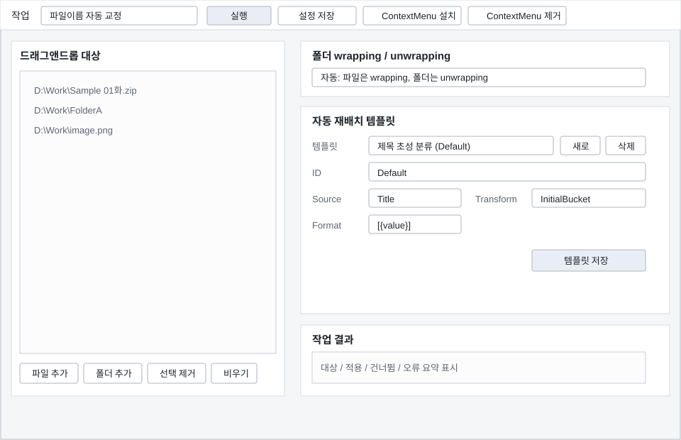

# FileTools

Windows Explorer ContextMenu and standalone WinForms utility for small file-management operations.

## Features

FileTools provides three current-user ContextMenu actions for selected files and folders:

1. **파일이름 자동 교정**
   - Uses the filename correction flow derived from `NameCorrector`.
   - Normalizes Korean jamo/Unicode, extracts title/episode/tag/author parts, makes Windows-safe names, and avoids conflicts with suffixes.
   - Items that require human review are skipped during automatic ContextMenu execution.

2. **폴더 wrapping / unwrapping**
   - In automatic mode, selected files are wrapped into same-stem folders.
   - Selected folders are unwrapped when they are single-file folders, otherwise direct child files are moved up.
   - Single-file folder unwrapping can keep the original filename, rename to the folder name, or rename to `folder-file`.
   - Existing destination files are not overwritten.

3. **폴더 자동 재배치**
   - Uses lightweight AutoRelocation templates derived from `ImageArchiveManager`.
   - Default template moves items into title-initial buckets such as `[ㄱ]`, `[A]`, and `[0A]`.
   - Template prefilters can skip review-only items during automatic execution.

The Explorer command only starts the executable. It queues selected items briefly, merges Explorer's per-item invocations, performs the work automatically, and exits silently when there are no errors.
The non-processing **FileTools 열기 / Open FileTools** command is registered after a separator and requested at the bottom of the Explorer menu so it is not grouped with automatic file operations.

## Standalone UI

Run `FileTools.exe` without arguments to open the drag-and-drop work plan window.



The standalone window supports:

- Drag and drop files/folders into the target list.
- Manual file/folder selection.
- Adding multiple planned actions to each target before changing files.
- Chaining filename correction, folder wrapping, folder unwrapping, and AutoRelocation actions.
- Double-clicking a planned action to reopen the matching action dialog.
- Running all target plans in order with one command.
- Opening a separate tabbed settings window for defaults, rename options, AutoRelocation defaults, folder options, and Explorer ContextMenu registration.

The settings window owns operational defaults and Explorer ContextMenu installation/removal. ContextMenu registration can be grouped or expanded, and individual ContextMenu actions can be enabled or disabled.
Folder wrapping/unwrapping and AutoRelocation commands can be selected independently for Explorer registration. Pressing OK in the settings window saves the options and synchronizes the current-user ContextMenu registration, even if the Install/Remove buttons are not pressed.
The app icon is stored as transparent PNG and multi-size ICO assets under `src\FileTools.App\Resources`; the EXE and MSI product metadata both use the ICO.

Separate dialogs are available for:

- Rename replacement dictionary entries (`source -> replacement`).
- Rename common phrase dictionary entries used by the filename correction scorer.
- AutoRelocation template editing for the current lightweight template model.

Settings and templates are stored under:

```text
%APPDATA%\FileTools
%APPDATA%\FileTools\rename-dictionary.json
%APPDATA%\FileTools\Relocate
```

If `%APPDATA%` is not writable, FileTools falls back to `FileToolsData` next to the executable.

## UI Localization

The app UI follows the system UI culture through .NET `CurrentUICulture`.
English is the neutral/default resource, and Korean is provided as a satellite resource.
Unsupported UI cultures fall back to English.

```text
src\FileTools.App\Resources\Strings.resx
src\FileTools.App\Resources\Strings.ko.resx
```

`MainForm` is split into a WinForms Designer-friendly partial class:

```text
src\FileTools.App\Ui\MainForm.cs
src\FileTools.App\Ui\MainForm.Designer.cs
src\FileTools.App\Ui\MainForm.resx
```

Keep layout/control declarations in `MainForm.Designer.cs`, and keep runtime behavior and localized text binding in `MainForm.cs`.
Form-level culture resources such as `Ui\MainForm.ko.resx` are intentionally excluded from the build; add UI strings only to `Resources\Strings*.resx`.
The Designer file keeps neutral English text and placeholder combo items so Visual Studio can render the form without running runtime localization; the app overwrites those values from `Resources\Strings*.resx` at startup.

## Build Requirement

- Windows
- .NET 8 SDK or newer

## Build

```powershell
dotnet build FileTools.sln
```

Publish:

```powershell
dotnet publish .\src\FileTools.App\FileTools.App.csproj -c Release -r win-x64 --self-contained false -p:PublishSingleFile=true
```

Output:

```text
src\FileTools.App\bin\Release\net8.0-windows\win-x64\publish\FileTools.exe
```

## Build MSI

The MSI installer uses WiX Toolset SDK-style project files. The first build restores the WiX SDK and UI extension packages.

```powershell
.\build_msi.ps1
```

Output:

```text
installer\FileTools.Installer\bin\Release\FileTools.msi
```

The MSI publishes FileTools as a self-contained `win-x64` single-file app and installs it per-user under:

```text
%LOCALAPPDATA%\Programs\FileTools
```

MSI options:

- `FileTools`: application and Start Menu shortcut.
- `Explorer Context Menu`: optional ContextMenu registration.
- `Grouped Context Menu`: default. Shows one `FileTools` menu with subcommands.
- `Expanded Context Menu`: shows `FileTools 열기` and all tool commands directly.

The grouped menu is the default. In the feature selection page, select `Expanded Context Menu` to install the direct entries instead. If both grouped and expanded features are selected, the installer conditions prefer expanded entries. The MSI installs the default command set; after first launch, use FileTools settings to choose individual folder wrapping/unwrapping and AutoRelocation commands.

`FileTools.sln` intentionally contains only the app project so Visual Studio can load it without WiX tooling. The MSI project is isolated in `installer\FileTools.Installer.sln`; build it with `build_msi.ps1` or open that solution in Visual Studio with a WiX v4-compatible extension such as HeatWave.

## Project Layout

```text
src\FileTools.App
├─ Configuration
├─ Infrastructure
├─ Naming
├─ Operations
├─ Relocation
├─ Shell
└─ Ui

installer\FileTools.Installer
├─ FileTools.Installer.sln
└─ FileTools.Installer
```

## Install ContextMenu

Use the helper script:

```powershell
.\publish_and_install.ps1
```

Or run the published executable:

```powershell
.\FileTools.exe /install
```

This writes only to current-user registry keys:

```text
HKCU\Software\Classes\*\shell
HKCU\Software\Classes\Directory\shell
```

No administrator permission is required.

## Uninstall ContextMenu

```powershell
.\uninstall.ps1
```

Or:

```powershell
.\FileTools.exe /uninstall
```

## ContextMenu Behavior

Registered commands:

```text
FileTools.exe /open "%1"
FileTools.exe /context FileNameCorrection "%1"
FileTools.exe /context FolderStructure "%1"
FileTools.exe /context AutoRelocation "%1"
FileTools.exe /context FolderWrapFiles "%1"
FileTools.exe /context FolderUnwrapSameNameSingleFile "%1"
FileTools.exe /context FolderUnwrapSingleFile "%1"
FileTools.exe /context FolderMoveInnerFilesUp "%1"
FileTools.exe /context AutoRelocationCurrentFolder "%1"
FileTools.exe /context AutoRelocationChooseTarget "%1"
```

The first three `/context` commands are kept for backward compatibility. New registrations use ordered command keys so filename correction appears first, folder wrapping/unwrapping commands second, AutoRelocation commands third, and `Open FileTools` last.

Explorer often starts one process per selected item. FileTools waits briefly, merges those selected paths through a temporary queue, runs the selected operation, and exits automatically. If any exception occurs, an error summary is shown.

## Safety Behavior

- Existing destination files/folders are not overwritten.
- Automatic filename correction skips items marked as requiring review.
- AutoRelocation applies `(2)`, `(3)` suffixes when a target already exists.
- Folders are deleted only when empty after unwrapping/moving child files.
- Folder unwrapping only moves direct child files; nested folder contents are not flattened.

## Log

```text
%TEMP%\FileTools.log
```
