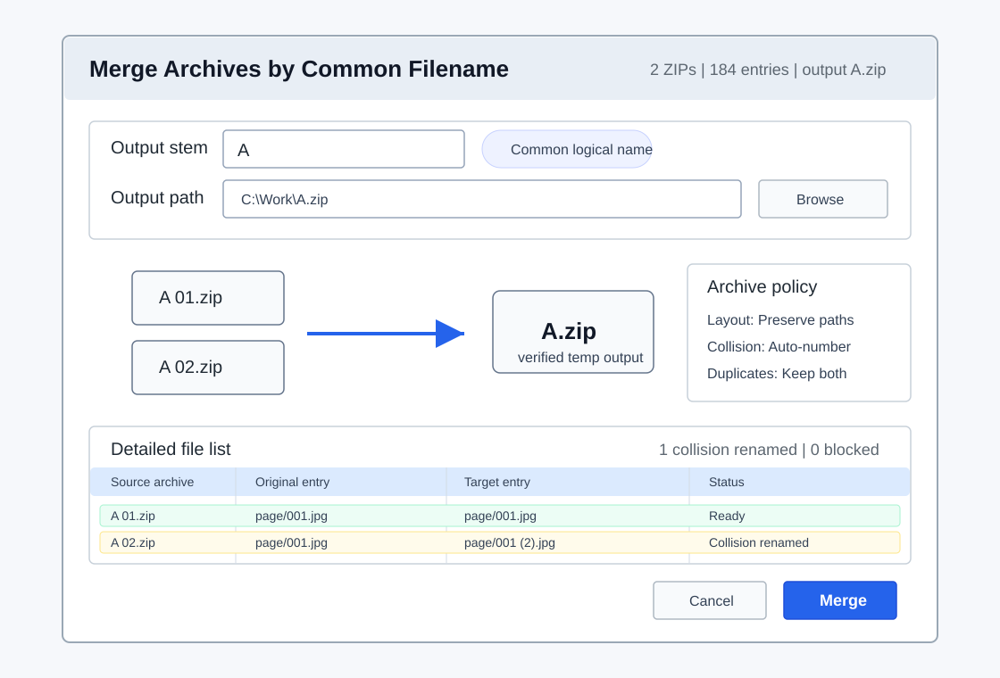

# Common Filename Archive Merge Design

Review date: 2026-06-07

This document tracks GitHub issue #9. The primary scenario is archive-file
merge by common filename, not mass-renaming selected files.

Example:

```text
A 01.zip
A 02.zip
-> A.zip
```

The selected source archives are merged into one output archive. The common
filename is used to choose the output name. General file-content merge, such as
`b.txt + b02.txt -> b.txt`, is a later feature because it needs content overlap
and duplicate-range policy.



## Positioning

The feature should extend archive merge with a better common-name flow. It
should not rename every selected file to the same base name.

Current archive merge already handles ZIP input and ZIP output, internal path
layout, collision policy, duplicate-content policy, progress, verification, and
optional source deletion. Issue #9 should focus on the user-facing flow and
common filename derivation around that engine.

First implementation scope:

- Accept two or more supported archive files.
- Calculate a logical common base name from selected archive stems.
- Preview the final output archive path before execution.
- Reuse archive merge layout, internal collision, duplicate content, failure,
  compression, verification, and source deletion policies.
- Keep unsupported non-archive files blocked in preview.

Out of first scope:

- Merging ordinary text/binary files into one file.
- Resolving overlapping text ranges or duplicate byte ranges.
- Renaming selected files in place.
- Combining mixed archive and non-archive selections.

## Entry Points

The first slice can be either:

- an option in the existing archive merge dialog: output name policy `Common
  logical filename`; or
- a separate command: `Merge archives by common filename...`.

The option-in-dialog path is lower risk because it reuses the existing archive
merge options and progress window. A separate command is useful later if the
Explorer context menu needs a clearer task label.

Implemented first slice: the existing archive merge options dialog now uses the
common logical filename as the default output name and shows the detailed entry
preview before the merge is applied. A separate command remains deferred.

Selected targets that already have planned steps should be blocked until those
steps are cleared. Archive merge is a shared multi-target operation; applying
per-target steps first would change the source set.

## Common Name Derivation

The important part is that `{CommonStem}` must mean common logical file family,
not only common prefix.

Examples:

```text
A 01.zip + A 02.zip       -> A.zip
A-01.zip + A-02.zip       -> A.zip
A_001.zip + A_002.zip     -> A.zip
Series 01.zip + Series 02.zip -> Series.zip
```

The algorithm should run in stages:

1. Take selected archive stems in target-list order.
2. Normalize whitespace and trailing separators.
3. Strip terminal sequence markers such as ` 01`, `-01`, `_001`, and similar
   numeric suffixes when at least two selected stems share the stripped base.
4. If stripping produces a shared base for every selected archive, use that
   base.
5. Otherwise fall back to the existing common-prefix helper.
6. If the result is empty, use `Merged`.

This avoids the current simple-prefix problem where `A 01` and `A 02` can
produce `A 0` instead of `A`.

Manual override should remain available in the dialog. The field is the output
stem, not a per-source rename template.

## Output Name and Extension Policy

The default output name should be:

```text
{CommonStem}{TargetExtension}
```

For the current archive engine, `{TargetExtension}` is `.zip` because ZIP output
is the supported output format. If future 7Z output is added, the same template
can use `.7z` when the selected output format is 7Z.

If the output path already exists, the normal output collision policy applies:

```text
A.zip
A (2).zip
A (3).zip
```

Source archives are not overwritten while the new archive is being written. The
existing archive merge temp-file, verify, and final-move policy remains the
right execution model.

## Archive Content Policy

Issue #9 should not invent a separate archive-writing engine. Internal merge
behavior should stay delegated to archive merge options:

- layout: group by archive name or preserve internal paths;
- internal path collision policy;
- duplicate-content policy;
- failure policy;
- compression level;
- delete originals after verified success.

The preview should make clear which layout is active, because `A 01.zip` and
`A 02.zip` may contain overlapping internal filenames. Those overlaps are
handled inside the archive merge policy, not by the output filename algorithm.

## Preview Dialog

The preview should be output-focused:

- selected archive count;
- calculated common stem;
- editable output stem;
- output path preview;
- selected output format/extension;
- active archive layout;
- internal collision and duplicate-content policies;
- blocked source rows for unsupported or missing inputs;
- warning rows for same output collision auto-numbering.

Apply should be disabled when a source is unsupported, missing, or mixed with
ordinary files in the first slice. Output path auto-numbering should be visible
but should not block Apply.

### Detailed File List

The lower part of the preview should show the archive-entry merge plan after
the source archives are scanned. This list is not for renaming source archive
files. It previews how each internal file or directory entry will be written to
the output archive.

Recommended columns:

- source archive;
- original entry path;
- target entry path;
- status;
- reason.

Example:

```text
Source      Original entry      Target entry       Status
A 01.zip    page/001.jpg        page/001.jpg       Ready
A 02.zip    page/001.jpg        page/001 (2).jpg   Collision renamed
```

This gives the user a concrete view of internal path collisions before the
merge starts. The target entry column should always show the final resolved
entry path, including auto-numbered collision names. Rows should be filterable
by ready, collision-renamed, duplicate-skipped, warning, and blocked states.

For large archives, the grid should be virtualized or paged. The dialog can
show summary counts immediately and fill the detailed rows after the scan
phase. If the active policy is `Ask`, rows that need a user decision should be
marked as blocked until the decision is answered.

## General File Merge Follow-Up

The `b.txt + b02.txt -> b.txt` scenario is a different operation. It merges file
content, not archives. It needs decisions that archive merge does not need:

- how to detect overlapping content;
- whether duplicate ranges are kept, skipped, or asked;
- whether the existing `b.txt` source can also be the output target;
- how to stage output safely before replacing a selected source;
- how to represent partial content merge failures.

Keep this as a deferred follow-up after common-name archive merge is stable.

## Test Coverage

Automated coverage should include:

- `A 01.zip + A 02.zip -> A.zip` common logical stem;
- separator variants: space, hyphen, underscore;
- existing output collision auto-numbering;
- unsupported non-archive source blocking;
- missing source blocking;
- manual output stem override;
- delegation to archive merge options without changing internal layout policy;
- regression for the simple-prefix fallback when no numeric family pattern
  exists.

Implemented on 2026-06-07:

- common logical stem regression for `A 01.zip + A 02.zip -> A.zip`;
- archive entry preview regression for internal auto-number collisions such as
  `page/001.jpg -> page/001 (2).jpg`;
- managed regression pass with 57 tests.

## Deferred Decisions

- Whether this is an archive merge dialog option or a separate command.
- Whether the default layout for common-name archive merge should remain the
  saved archive merge default or force `PreserveInternalPaths`.
- Whether future non-ZIP output should preserve the dominant selected archive
  extension or use an explicit output-format selector.
