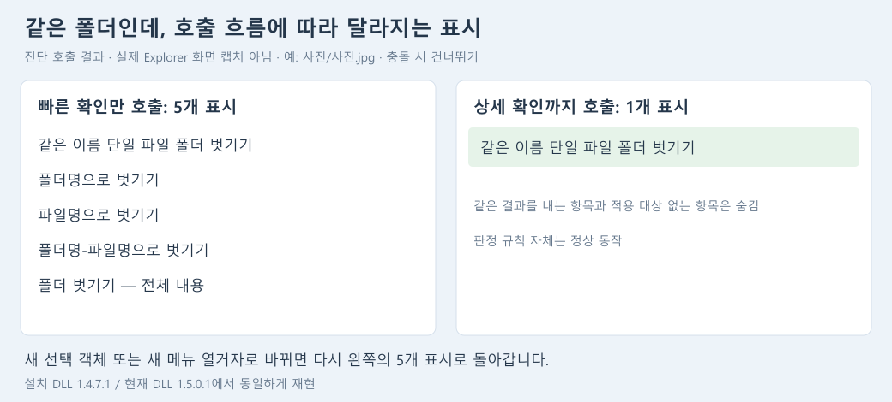

# 폴더 선택 시 벗기기 메뉴 전체 표시 진단

검토일: 2026-09-19. 사용자 확인 증상: **폴더 선택 시 벗기기 메뉴가 전부 표시됨**.
상태: 원인 경로 재현 완료. 메뉴 실행 코드는 수정하지 않았다.

## 작업 체크포인트

- 브랜치: `codex/1.5.0.0`.
- 커밋: `4619ab5` — `feat: complete catalog and comparison updates for 1.5.0.1`.
- 앱/ShellExt/설치/번들/빌드 및 현재 버전 문서를 1.5.0.0 → 1.5.0.1로 갱신했다.
- Release x64 솔루션 빌드와 관리 코드 279개 테스트 통과. 앱/ShellExt 바이너리 버전도 1.5.0.1로 확인했다.
- 이 커밋은 앞서 완료한 파일 목록/조건 수집/비교 보완을 저장한다. 푸시, 설치본 생성, 설치 변경은 수행하지 않았다.

## 실제 등록과 재현 방법

- HKCU COM 및 Directory 메뉴 등록은 `%LOCALAPPDATA%\Programs\FileTools\FileTools.ShellExt.dll`을 사용한다.
- 등록 대상 파일 버전: **1.4.7.1**.
- SHA-256: `7644D33F7EF723D6517821470F815E56C19DB12324669C815203BE38D0D0F3C1`.
- `%APPDATA%\FileTools`에 남은 1.4.7.0 DLL은 이번에 확인한 COM 등록 대상이 아니다.
- 관련 메뉴 설정은 켜져 있고, 충돌 정책은 Skip(0)이다.
- 검증용 `Same/Same.txt`, `Different/Other.txt`, 파일 2개가 든 `Multiple`, 빈 `Empty` 폴더를 만들었다.
- 별도 진단 프로세스에서 등록 DLL의 COM 클래스와 하위 메뉴를 직접 호출했다.
  같은 조건을 체크포인트 DLL 1.5.0.1에도 적용했으며 결과는 동일했다.
- **Invoke는 호출하지 않았다.** 설치 파일·등록·Explorer 프로세스도 변경하지 않았다.

## 재현 결과

표의 개수는 전체 FileTools 메뉴 수가 아닌 **벗기기 관련 5개 명령의 표시 개수**다.

| 선택한 폴더 | 빠른 호출만 반복 | 상세 호출을 직접 제공 | 같은 선택 객체로 이후 빠른 호출 | 같은 경로의 새 선택 객체 / 새 메뉴 열거자 |
| --- | ---: | ---: | ---: | ---: |
| 같은 이름 단일 파일 | 5 | 1 | 1 | 5 |
| 다른 이름 단일 파일 | 5 | 3 | 3 | 5 |
| 파일 여러 개 | 5 | 1 | 1 | 5 |
| 빈 폴더 | 5 | 0 | 0 | 5 |

첫 빠른 호출과 두 번째 빠른 호출의 결과가 같다. 상세 호출이 오지 않으면 일시적으로만 넓게 보이는 것이 아니라 계속 5개가 남는다.

## 원인

1. **1.4.7.1의 비활성화 수정이 상세 판정 전 상태를 넓게 허용한다.**
   `MenuSelectionCache.GetFallbackState`는 파일/폴더 종류와 개수만 확인한다.
   정상 폴더이면 벗기기 5개를 모두 `ECS_ENABLED`로 반환한다.
   비활성 상태로 멈추는 문제는 피했지만 폴더 내용에 따른 숨김/중복 제거는 생략된다.
2. **상세 분석은 후속 느린 호출에만 연결되어 있다.**
   `GetState(..., TRUE, ...)`에서만 `AnalyzeSelection`을 실행한다.
   빠른 경로는 성공 반환하며 별도 분석 예약이나 메뉴 갱신 경로가 없다.
   `Root.GetState`도 상세 결과를 미리 준비하지 않는다.
3. **같은 경로라도 객체가 달라지면 상세 결과를 이용하지 못한다.**
   빠른 경로의 캐시 확인은 선택 객체의 COM identity에 의존한다.
   같은 폴더의 새 선택 객체는 넓은 기본 상태로 돌아간다.
   새 메뉴 열거자는 캐시 자체가 새로 생성된다.

근거: [빠른/상세 상태 처리](../src/FileTools.ShellExt/FileToolsShellExt.cpp#L442),
[기본 표시 상태](../src/FileTools.ShellExt/FileToolsShellExt.cpp#L476),
[루트/하위 메뉴 생성](../src/FileTools.ShellExt/FileToolsShellExt.cpp#L838),
[열거자 캐시 생성](../src/FileTools.ShellExt/FileToolsShellExt.cpp#L918).

## 기존 테스트가 놓친 부분

기존 네이티브 테스트는 빠른 호출에서 ‘비활성이 아님’과 ‘폴더를 읽지 않음’을 확인한다.
이 조건은 벗기기 5개가 모두 활성인 경우에도 통과한다.
상세 숨김 검사는 테스트가 TRUE 호출을 직접 제공한 뒤 수행한다.
새 선택 객체 검사 역시 같은 이름 명령 하나가 활성인지 확인하고, 다른 4개가 숨겨지는지는 확인하지 않는다.

이번에도 기존 네이티브 652개 검사와 1,024개 정책 조합/960개 실제 실행 교차 검증은 통과했다. 이는 조건표가 없어졌다는 뜻이 아니라
사용자가 실제로 보는 호출 흐름을 완료 조건에 포함하지 못했다는 뜻이다.
실제 Explorer의 콜백 순서를 추적한 것은 아니므로 TRUE가 생략되는지, 별도 객체에 전달되는지까지는 확정하지 않는다.
다만 설치 DLL에서 두 경로 모두 사용자 증상을 만들 수 있음을 확인했다.

## 수정 범위 제안

기존 폴더별 조건표는 유지한다. 메뉴 표시 시점에 필요한 판정이 준비되고 형제 명령이
같은 결과를 사용하도록 **상태 준비·공유·갱신 경로**를 수정한다.
후속 TRUE 호출과 동일 COM 객체의 재사용이 보장된다고 가정하지 않는다.
불확실한 원격 경로/접근 오류는 기존 보수 정책을 유지하되, 정상 로컬 폴더에서
항상 불확실 상태로 남는 현재 동작과 구분한다.
빠른 콜백에 동기 폴더 읽기를 단순히 옮기는 방식은 응답성 검증 없이 채택하지 않는다.

수정 완료 조건:

- 같은 이름 단일 파일 1개, 다른 이름 단일 파일 3개, 여러 파일 1개, 빈 폴더 0개.
- 빠른 호출만 반복, 새 선택 객체, 새 열거자에서도 기대 상태가 실제 표시 과정에 반영됨.
- 이전의 전체 비활성화 재발 방지, 선택 변경/폴더 내용 변경 시 오래된 상태 제거.
- 메뉴 응답 시간과 접근 불가/원격 경로 처리 검증.
- 자동 호출 테스트뿐 아니라 설치된 Explorer의 실제 메뉴 열기·다시 열기로 확인 후 테스트 설치본 생성 판단.

진단 산출물은 `artifacts/menu-diagnosis/`의 Probe.cpp와 installed-visibility.csv,
checkpoint-visibility.csv다. 무시되는 로컬 검증 산출물이며 배포 코드에 포함되지 않는다.

## 후속 수정 — 1.5.1.0

사용자 승인 후 상태 준비·공유·갱신 경로를 수정하고 테스트용 설치본을 만들었다.
첫 빠른 호출부터 작업 스레드가 분석하고, 선택 경로로 결과를 공유하며 새 메뉴에서는
다시 검사한다. 위 진단의 이전 버전 결과는 비교 자료로 유지한다.
[수정 및 설치 패키지 검증 결과](context-menu-visibility-fix-2026-09-19.md)에 현재 결과와
검증 범위를 기록했다. 설치된 탐색기에서의 최종 확인은 테스트 설치본으로 진행한다.
