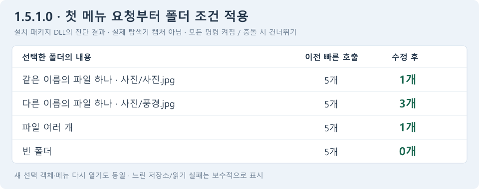

# 탐색기 벗기기 메뉴 수정 및 테스트 설치본

검증일: 2026-09-19. 테스트 버전 **1.5.1.0**, 브랜치 `codex/1.5.0.0`.

## 수정한 문제

이전 DLL은 후속 느린 상태 호출이 와야 폴더별 표시 조건을 적용했다. 빠른 호출만
들어오거나 선택 COM 객체가 바뀌면 일반 폴더에서도 벗기기 5개가 모두 남았다.
설치된 1.4.7.1과 체크포인트 1.5.0.1에서 재현한 내용은
[이전 진단](context-menu-visibility-diagnosis-2026-09-19.md)에 보관했다.

첫 상태 요청부터 백그라운드 분석을 시작하도록 바꿨다. 같은 선택 경로는 결과를
공유하고 새 메뉴에서는 다시 검사한다. 기존 조건표와 실행 방식은 유지한다.

위 그림은 **진단 호출 결과이며 실제 탐색기 화면 캡처가 아니다.** 모든 관련 메뉴를
켜고 충돌 시 건너뛰기를 선택한 일반 로컬 폴더 기준이다.

| 폴더 내용 | 이전 빠른 호출 | 수정 후 빠른 호출 | 새 선택 객체 | 메뉴 다시 열기 |
| --- | ---: | ---: | ---: | ---: |
| 폴더와 같은 이름의 파일 하나 | 5 | 1 | 1 | 1 |
| 폴더와 다른 이름의 파일 하나 | 5 | 3 | 3 | 3 |
| 파일 여러 개 | 5 | 1 | 1 | 1 |
| 빈 폴더 | 5 | 0 | 0 | 0 |

## 응답성과 수명

- 폴더 속성/내용 분석은 작업 스레드가 수행한다. 셸 인터페이스를 작업 스레드에 넘기지 않는다.
- 결과 대기는 선택당 한 번, 최대 50ms이며 형제 명령마다 반복하지 않는다.
  운영체제 스케줄링 오차가 있으며 셸 공급자의 경로/집계 속성 호출은 이 예산 밖이다.
  전체 메뉴 표시 시간이 항상 50ms 이하라는 보장은 아니다.
- 파일 내용은 읽지 않는다. 두 번째 파일/첫 하위 폴더에서 조기 종료하며 기존
  속성 읽기 256개, 폴더 열기 128개, 폴더당 열거 처리 8회 제한을 유지한다.
- 동시에 진행하는 분석은 DLL 전체에서 최대 2개다. 작업이 막혀도 대기열을 계속
  늘리지 않는다. 메뉴가 닫혀도 작업 입력과 DLL은 콜백 반환까지 살아 있다.
- 시간 초과/접근 오류/UNC/네트워크/reparse/offline/recall 폴더는 보수적으로 표시한다.
  이런 경우에는 벗기기 명령이 더 많이 남을 수 있다. 준비되지 않았다고 전체를
  비활성화하지 않으며, 클릭 후 실제 처리 조건을 다시 검사한다.
- 상세 규칙은 [벗기기 메뉴 검토](unwrap-command-visibility-review.md)에 기록했다.

## 검증 결과

- Release x64 솔루션 빌드 통과, 관리 코드 테스트 **279개 통과**.
- `scripts/test_unwrap_menu.ps1`: 네이티브 **1,013개 검사 통과**.
  최초 빠른 호출만 사용한 정확한 메뉴 집합, 새 COM 선택 객체, 새 열거자,
  선택/내용 변경, 시간 초과, 분석 실패, 작업 수 제한, 메뉴 종료 중 작업 수명을 포함한다.
- 네이티브 정책 **1,024개 조합**을 실제 파일 작업 **960회 실행**과 교차 검증했다.
- 의도적으로 막힌 분석에서 첫 대기는 약 58ms였다. 형제 명령에 대기가 누적되지
  않았고, 작업 완료 후 결과를 재사용했다. 분석 예외와 늦게 끝난 이전 선택도 검증했다.
- 빌드 DLL과 MSI에서 추출한 DLL에 각각 COM 상태 검사를 수행했다. 네 폴더 ×
  여섯 호출 흐름의 **24개 결과가 각각 기대값과 일치**했고 E_PENDING은 없었다.
  상태 조회만 수행했으며 이 검사에서는 메뉴 명령을 실행하지 않았다.
- 테스트 설치본 생성 통과(경고/오류 0개). Setup, MSI, MSIX, 앱, ShellExt가
  모두 **1.5.1.0**임을 확인했다.
- 서명한 Burn 설치본을 다시 추출해 MSI가 원본과 SHA256 기준으로 같음을 확인했다.
  MSI 안의 ShellExt도 서명한 빌드 DLL과 같았다.
- Setup/Burn 엔진/MSI/MSIX/ShellExt의 서명 인증서가 제공한 CER와 일치했다.
  로컬 임시 자체서명 인증서이므로 신뢰 체인 검사는 미신뢰 루트로 종료된다.
  인증서를 시스템 신뢰 저장소에 추가하지 않았다.

진단 원본 CSV는 무시되는 로컬 `artifacts/menu-diagnosis/`의
`fixed-visibility.csv`, `packaged-visibility.csv`에 있다. 자동 회귀 검사는
`tests/FileTools.ShellExt.Tests/MenuTests.cpp`에 포함되어 있다.

## 설치본과 실제 탐색기 확인

권장 테스트 설치본:
`artifacts/test-installers/1.5.1.0/FileTools-1.5.1.0-win-x64-setup.exe`

같은 폴더에 직접 설치용 MSI, identity MSIX, 공개 CER, `checksums.txt`를 함께 보관했다.
개인 키는 배포 파일에 포함하지 않는다. 태그나 GitHub Release는 만들지 않는다.

현재 설치된 앱과 DLL은 교체하지 않았다. **설치/업그레이드와 실제 탐색기의 메뉴
상호작용은 이번 자동 검증 범위 밖**이다. 테스트 설치 후 다음 항목을 확인한다.

1. 앱의 프로그램 정보에 1.5.1.0이 표시되는지 확인한다.
2. 일반 로컬 폴더 네 종류에서 위 표의 벗기기 메뉴 개수를 확인한다.
   기본 충돌 정책은 건너뛰기이며 자동 번호 설정에서는 전체 내용 명령이 더 남을 수 있다.
3. 같은 폴더의 메뉴를 닫았다 다시 열고, 파일을 추가한 뒤 다시 열어 조건이 갱신되는지 확인한다.
4. 파일 선택, 복수 폴더 선택에서도 사용할 수 있는 명령이 비활성화되지 않는지 확인한다.

현재 탐색기가 이전 DLL을 계속 사용하면 설치 완료 후 탐색기를 재시작하거나
다시 로그인한 뒤 확인한다. 열린 파일 작업을 중단하는 탐색기 재시작은 자동 수행하지 않았다.
