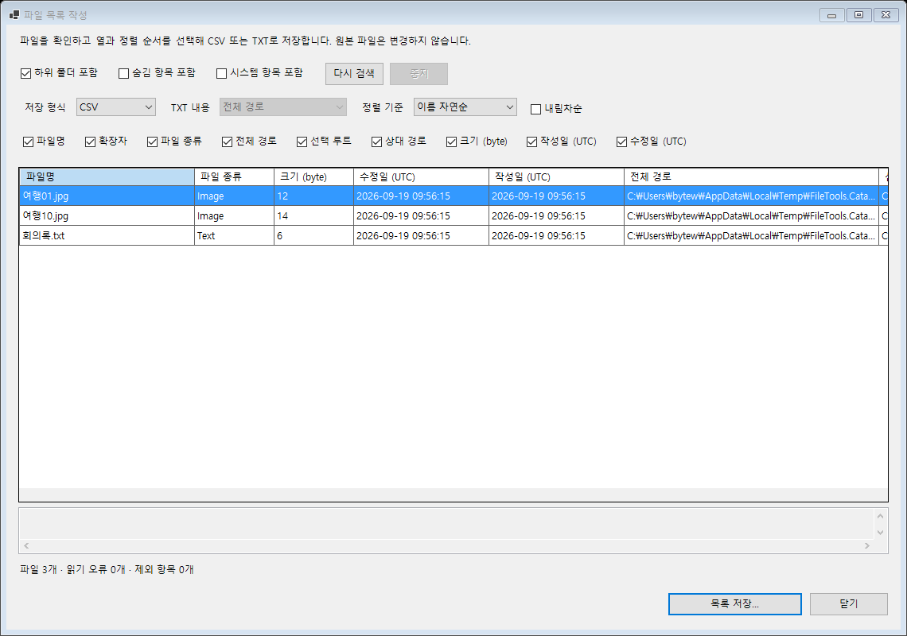
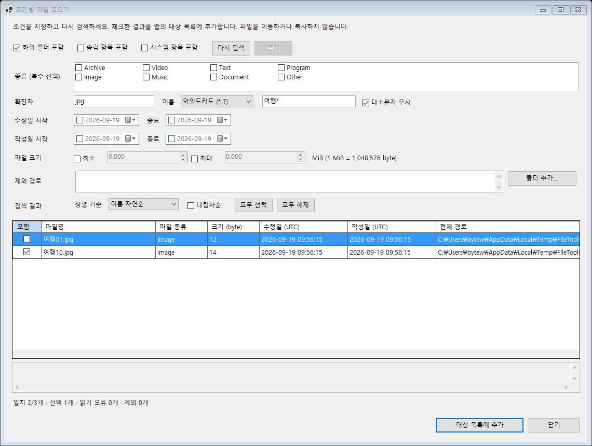

# 파일 목록 작성과 조건별 파일 모으기

2026-09-19, `codex/1.5.0.0`. 사용자 요청으로 4번과 5번을 먼저 구현했다.
현재 개발 버전은 `1.5.0.1`이다. 3번도 기존 비교 보완으로 축소해 구현했으며 [사용 방법](file-compare.md)을 참고한다.

## 파일 목록 작성

메인 대상 목록에서 파일이나 폴더를 선택하고 **작업 → 파일 목록 작성**을 연다.
작업이 이미 붙어 있는 대상도 조회할 수 있으며, 현재 디스크에 있는 파일을 기준으로 목록을 만든다.

기본값은 하위 폴더 포함, 숨김/시스템 항목 제외다. 탐색 옵션을 바꾸면 **다시 검색**한다.
결과는 이름 자연순, 전체 경로, 종류, 크기, 작성일, 수정일로 정렬할 수 있고 내림차순도 지원한다.
정렬 기준이 같으면 전체 경로로 순서를 고정한다.

**목록 저장**에서 CSV 또는 TXT를 저장한다. 결과를 읽는 동안 원본을 변경하지 않는다.
저장 파일 자체가 목록에 있으면 해당 항목은 출력에서 제외하고 제외 건수를 표시한다.

| 형식 | 동작 |
| --- | --- |
| CSV | 파일명·확장자·종류·전체 경로·선택 루트·상대 경로·크기(byte)·작성일·수정일 중 선택한 열 저장 |
| TXT | 전체 경로·상대 경로·파일명 중 하나를 한 줄씩 저장 |

- UTF-8 BOM과 CRLF를 사용한다. CSV의 쉼표·큰따옴표·줄바꿈은 CSV 규칙에 따라 이스케이프한다.
- CSV 텍스트가 `=`, `+`, `-`, `@` 등으로 시작해 수식으로 해석될 수 있으면 앞에 작은따옴표를 붙인다.
  TXT는 이 변환 없이 원문을 저장한다.
- CSV 크기는 정수 byte, 날짜는 UTC 오프셋이 포함된 ISO 8601 형식이다.
  화면의 날짜도 UTC로 표시하되 초 단위로 줄여 보여준다.
- 여러 루트를 선택하면 각 파일에 루트와 상대 경로를 함께 보관한다.
  겹치는 루트는 바깥 루트를 우선하고 같은 경로는 한 번만 포함한다.
- CSV는 열을 하나 이상 선택해야 저장할 수 있다. 결과가 없으면 헤더만 있는 CSV 또는 빈 TXT를 저장할 수 있다.
- 기존 파일 교체는 저장 대화상자에서 확인한다. 같은 폴더의 임시 파일에 먼저 작성하고 성공 시 확정한다.
  취소·쓰기 실패 때 기존 출력은 유지하며, 검토 뒤 출력 파일이 바뀌거나 새로 생기면 덮어쓰지 않는다.

## 조건별 파일 모으기

메인 대상 목록에서 검색할 폴더나 파일을 선택하고 **작업 → 조건별 파일 모으기**를 연다.
조건을 지정한 뒤 **다시 검색**하고, 결과를 체크해 **대상 목록에 추가**한다.
이 기능은 앱의 작업 대상을 모으며 파일을 복사하거나 이동하지 않는다.

| 조건 | 처리 방식 |
| --- | --- |
| 종류 | 기존 설정의 사용자 정의 확장자 분류를 공유. 여러 종류는 OR, 미선택은 전체 |
| 확장자 | `jpg; png; pdf`처럼 공백·쉼표·세미콜론으로 구분. `.jpg`, `*.jpg`도 허용 |
| 이름 | 파일명 전체에 포함·일치·시작·끝·와일드카드 적용. `*`는 임의 길이, `?`는 한 문자 |
| 대소문자 | 이름 비교는 기본 무시, 옵션으로 구분. 종류와 확장자는 항상 무시 |
| 수정일·작성일 | 체크한 시작일/종료일을 각각 적용. 작성일은 파일시스템 생성 시각 |
| 크기 | 체크한 최소·최대 범위, 양 끝 포함. MiB 단위, 소수점 세 자리 입력 |
| 제외 경로 | 한 줄에 하나씩 전체 파일/폴더 경로. 폴더를 제외하면 하위도 제외 |

서로 다른 조건은 모두 만족해야 한다(AND). 각 종류 목록과 확장자 목록 안에서는 하나만 맞으면 된다(OR).
날짜 입력은 컴퓨터의 현지 날짜를 사용한다. 시작일 00:00 이상, 종료일 다음 날 00:00 미만을
UTC로 변환해 비교하므로 종료일 하루 전체가 포함된다. 일광절약시간으로 하루 길이가 달라도 같은 규칙을 적용한다.
크기의 1 MiB는 1,048,576 byte이며 최소는 byte로 올림, 최대는 byte로 내림한다.

조건을 바꾸면 이전 결과의 추가 버튼이 비활성화된다. 날짜 체크 상태도 최종 추가 전에 다시 확인한다.
모두 선택/해제와 개별 체크를 제공하며 체크 상태는 정렬을 바꿔도 유지된다. 다시 검색하면 새 결과를 모두 선택한다.
기존 대상은 중복 추가하지 않고 기존 작업 계획도 보존한다. 사라졌거나 폴더/링크로 바뀐 파일은 추가 직전에 제외한다.

## 공통 탐색 정책

- 실제 파일 경로 기준으로 중복을 제거한다. 내용이 같은 다른 경로나 하드 링크를 중복 내용으로 판정하는 기능은 아니다.
- 연결 폴더(reparse point)와 링크 파일은 따라가지 않는다. 선택 경로의 상위 폴더도 링크 여부를 확인한다.
- 하위 폴더 포함을 끄면 선택 폴더의 바로 아래 파일만 읽는다. 별도로 선택한 깊은 폴더는 독립적으로 읽는다.
- 접근 불가/사라진 경로는 읽기 오류로, 조건 불일치는 검색 결과 제외로 구별한다.
  화면은 전체 오류 건수와 처음 200개의 오류 경로를 보여준다. 오류가 있으면 성공한 범위만 결과에 포함된다.
- 검색과 저장은 중지할 수 있다. 검색이 취소되면 불완전한 결과로 저장하거나 수집하지 않는다.
  창을 닫으면 현재 작업을 취소하고 반환을 기다린 뒤 닫는다.
- 결과 표는 가상 모드로 표시한다. 네트워크 파일시스템 호출 자체가 멈춘 경우에는 해당 호출이 반환되어야 취소가 완료된다.
- 저장 전까지의 검색 결과는 검색 시점의 메타데이터다. 최신 상태가 필요하면 다시 검색한다.

## 검증

- CPU 4코어/8스레드, RAM 약 32GB 중 가용 약 4.4GB를 확인하고 단일 빌드 프로세스로 검증했다.
- 관리 앱 Release 빌드: 경고 0, 오류 0. 전체 Release 테스트 **240개 통과**.
- 신규 검증 **43개**: 탐색/내보내기 25개, 조건 수집 18개.
  겹치는 루트, 사용자 종류, 숨김/시스템, 경로 제외, 누락 경로, 정렬, 취소,
  CSV 한글·쉼표·따옴표 재읽기, 큰 크기 값, 수식 방지, TXT 원문, 출력 자체 제외,
  기존 출력 보호, 검토/저장 중 출력 변경, 조건 AND/OR, 날짜 경계와 23/25시간 날짜를 포함한다.
- 실제 WinForms 모달 창에서 조건 변경 후 재검색, 체크한 결과만 전달, 기존 대상 중복 방지와 작업 유지,
  날짜 체크 변경 시 오래된 결과 차단을 확인했다.
- 한글 기본/최소 크기 검토: 목록 1140×800 / 920×650, 수집 1140×860 / 920×760.
- 새 탐색기 전용 명령과 설치 패키지는 이번 작업에 추가하지 않았다. 네트워크 장애·모든 화면 배율은 별도 검증 대상이다.

구현: `Operations/FileCatalog.cs`, `FileListExport.cs`, `FileCollectionQuery.cs`,
`Ui/FileCatalogDialog*.cs`, `Ui/MainForm.FileOrganization*.cs`.
