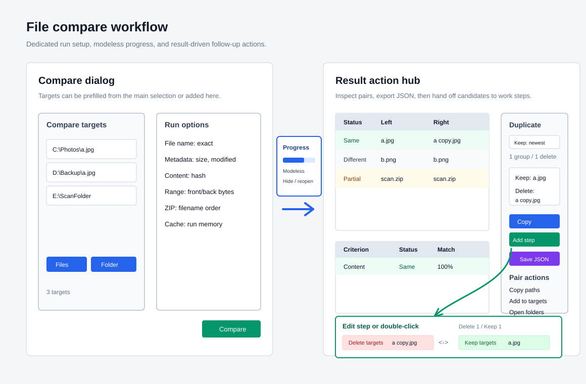

# File Compare Design

Review date: 2026-06-07

This document tracks GitHub issue #6. The first implementation slice added the
comparison option model and engine. Later slices wire a dedicated comparison
workflow, grouped settings controls, and the WinForms result/action dialog.

## Target Collection

File comparison accepts two or more selected files and folders. Folders are not
treated as folder sets. Instead, FileTools recursively collects each contained
file and compares every collected file with every other collected file.

Examples:

- 2 files -> 1 file pair
- 3 files -> 3 file pairs
- 2 folders with 5 total files -> 10 file pairs

Duplicate physical paths are removed before pair generation.

## Option Groups

### File Name

- Enable or disable filename comparison.
- Filename matching mode:
  - exact filename
  - stem without extension
  - relative path
  - common name overlap
  - none

Relative path mode is useful when selected folders should keep their internal
folder context while still comparing files one by one.

Common name overlap finds the longest common substring in the comparison names.
The threshold can be a minimum character count or a minimum percentage of the
shorter name.

### Metadata

- Created time.
- Modified time.
- File size.

Metadata criteria are strict. If a selected metadata criterion differs and early
exit is enabled, content comparison for that pair is skipped.

### Content

- Content mode:
  - SHA-256 hash
  - byte-to-byte
- Comparison range:
  - full content
  - front N bytes
  - back N bytes
  - middle part, using start offset plus length
  - front and back N bytes each
  - byte / KiB / MiB display units, normalized to bytes for execution
- Archive handling:
  - compare archive file as a normal file
  - extract ZIP entries and compare entry contents
- Archive entry order:
  - original entry order
  - filename order
- Archive extraction scope:
  - all extracted entries
  - first N entries after ordering
  - optionally compare only entries with the same relative path

The current archive-content comparison supports ZIP input. Broader archive
reader work, including 7Z input policy, remains tracked by issue #8.

### Other Options

- Early exit is enabled by default.
- Hash comparisons use a per-run memory cache keyed by file path, size,
  timestamps, selected range, and hash algorithm.
- Partial match is reported only when the calculated ratio is at least 10%.
- Byte-to-byte comparison first hashes the leading 10% of the selected range.
  Full byte comparison starts only when that small hash matches.

## Result Status

- `Same`: all selected criteria match.
- `Different`: selected criteria differ and the content match ratio is below the
  partial-match threshold.
- `PartialMatch`: content ratio is at least 10% but less than full equality.
- `Failed`: comparison could not be completed.

## Dedicated Workflow

The main menu and toolbar open a file-comparison dialog instead of immediately
running against the current selection. Existing selected targets are prefilled
when available, but the dialog can also start empty and let the user add files or
folders directly.

The dialog uses the global file-comparison settings as defaults. Changes made in
the dialog apply only to that comparison run and do not overwrite saved settings.

## Result Actions

The result dialog is the handoff point for follow-up work:

- Status-filtered pair results remain the primary inspection surface.
- A duplicate group panel is built only from `Same` pairs that include a
  same-content criterion. Metadata-only matches are not treated as delete
  candidates.
- Duplicate groups can keep the first comparison-order item, newest modified
  item, oldest modified item, shortest path, or longest path. The remaining
  paths become delete candidates.
- The default duplicate-delete keep rule preserves the largest file, then the
  oldest created file when sizes match. Delete candidates are ordered by smaller
  file size, then newer creation time.
- Delete candidates can be copied or sent to the main work plan as
  `DuplicateDelete` steps. The handoff sends every path in the selected
  duplicate group to the main target list, but applies `DuplicateDelete` only to
  delete candidates. Kept files remain visible in the editor without a delete
  step. The step preview labels the file as a delete candidate and moves files
  to the Recycle Bin only.
- Double-clicking a `DuplicateDelete` step, or pressing the work-plan edit
  button, opens a two-pane delete/keep editor for all current file targets. The
  left pane is the Recycle-Bin delete set and the right pane is the keep set, so
  the user can explicitly move files between outcomes before execution.
- The selected pair can be copied, sent to the main target list, or opened in
  Explorer.
- Results can be exported to JSON on demand. The JSON document includes a
  `FileTools.FileCompareResult` document type and schema version so a future
  import command can reconstruct the result dialog.

## Progress

Comparison progress is shown in a modeless dialog. Closing the dialog hides it
without cancelling the comparison. The main Tasks menu and toolbar expose a
"show progress" command that reopens the current progress session.

## Implemented Work

Implemented on 2026-06-07:

- `FileCompareOptions` option model.
- Pairwise file/folder target collection.
- Filename, created time, modified time, size, hash, and byte-to-byte criteria.
- Common-name filename matching with character or percent thresholds.
- Full/front/back/middle-part/front-and-back content ranges, including middle
  start offset plus length and byte/KiB/MiB display units.
- Byte-to-byte 10% leading-range hash prefilter.
- Per-run hash cache for file hash comparisons.
- ZIP entry content comparison with original-order or filename-order pairing,
  optional first-N entry scope, and optional same-relative-path entry pairing.
- Automated tests for folder expansion, partial match threshold, byte prefilter,
  hash cache reuse, archive entry ordering, common-name matching,
  middle-part ranges, archive entry scoping, and range unit conversion.
- Selected-target compare command from the main Tasks menu and action toolbar.
- Dedicated file compare dialog for target collection and per-run options.
- Grouped settings UI for file name, metadata, content, and other options.
- Dependent settings controls are disabled when their parent checkbox or mode
  does not apply.
- Result dialog with summary counts, status filtering, sortable pair rows, and
  per-criterion detail rows.
- Result action panel with content-confirmed duplicate groups, delete-candidate
  copy, duplicate-delete step handoff, selected-pair copy, selected-folder open,
  keep-mode selection, and JSON export.
- Modeless progress dialog with cancel and reopen support.
- `DuplicateDelete` work-plan step that moves duplicate files to the Recycle Bin.
- Internal-only Explorer command route: `/context FileCompare "%1"` queues
  selected files/folders, opens the main window, and preloads the dedicated file
  compare dialog. It is intentionally not registered or exposed in settings yet.
- Duplicate-delete step editor opened by double-clicking the work-plan step or
  pressing the edit step button, with separate delete-target and keep-target
  panes plus Recycle-Bin-only behavior.
- Duplicate-delete result handoff now includes the kept same-content file in the
  main target list so the step editor can show both delete and keep outcomes.
- Duplicate-delete steps store their source duplicate group paths and editor
  changes resynchronize that whole group before adding the selected delete
  steps, preventing stale delete steps from remaining on the previous target.
- Automated tests for duplicate group construction and metadata-only match
  exclusion.
- Automated tests for duplicate keep-mode ordering and JSON export schema.
- Automated tests for duplicate-delete step selection synchronization and
  delete-candidate preview text.

## Remaining Work

- Add JSON result import and result-dialog reload support.
- Add manual UI validation feedback from large mixed file sets.
- Manually validate the expanded file compare option UI and two-pane
  duplicate-delete step editor with small and narrow window sizes, including the
  result dialog action panel splitter.
- After manual smoke testing of `/context FileCompare`, decide whether to expose
  the command through Explorer registration, settings, and the native ShellExt
  submenu.
