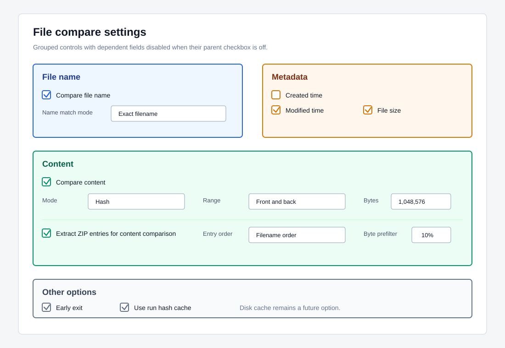
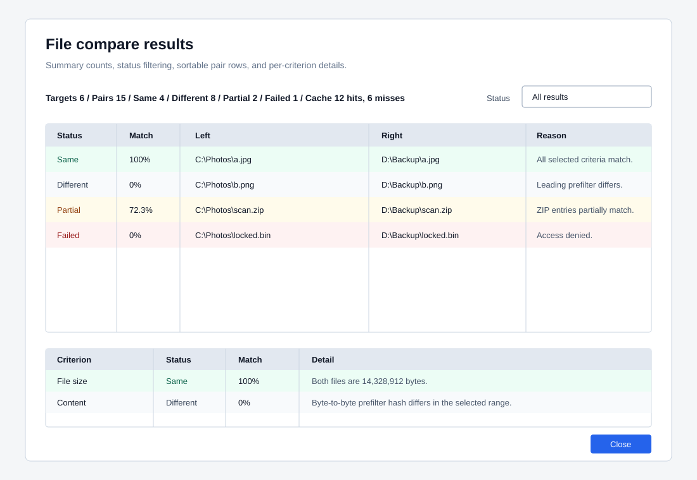

# File Compare Design

Review date: 2026-06-07

This document tracks GitHub issue #6. The first implementation slice added the
comparison option model and engine. The second slice wires the selected-target
command, grouped settings controls, and the WinForms result dialog.

## Target Collection

File comparison accepts two or more selected files and folders. Folders are not
treated as folder sets. Instead, FileTools recursively collects each contained
file and compares every collected file with every other collected file.

Examples:

- 2 files -> 1 file pair
- 3 files -> 3 file pairs
- 2 folders with 5 total files -> 10 file pairs

Duplicate physical paths are removed before pair generation.

## Option Groups

### File Name

- Enable or disable filename comparison.
- Filename matching mode:
  - exact filename
  - stem without extension
  - relative path
  - none

Relative path mode is useful when selected folders should keep their internal
folder context while still comparing files one by one.

### Metadata

- Created time.
- Modified time.
- File size.

Metadata criteria are strict. If a selected metadata criterion differs and early
exit is enabled, content comparison for that pair is skipped.

### Content

- Content mode:
  - SHA-256 hash
  - byte-to-byte
- Comparison range:
  - full content
  - front N bytes
  - back N bytes
  - middle N bytes
  - front and back N bytes each
- Archive handling:
  - compare archive file as a normal file
  - extract ZIP entries and compare entry contents
- Archive entry order:
  - original entry order
  - filename order

The current archive-content comparison supports ZIP input. Broader archive
reader work, including 7Z input policy, remains tracked by issue #8.

### Other Options

- Early exit is enabled by default.
- Hash comparisons use a per-run memory cache keyed by file path, size,
  timestamps, selected range, and hash algorithm.
- Partial match is reported only when the calculated ratio is at least 10%.
- Byte-to-byte comparison first hashes the leading 10% of the selected range.
  Full byte comparison starts only when that small hash matches.

## Result Status

- `Same`: all selected criteria match.
- `Different`: selected criteria differ and the content match ratio is below the
  partial-match threshold.
- `PartialMatch`: content ratio is at least 10% but less than full equality.
- `Failed`: comparison could not be completed.

## Implemented Work

Implemented on 2026-06-07:

- `FileCompareOptions` option model.
- Pairwise file/folder target collection.
- Filename, created time, modified time, size, hash, and byte-to-byte criteria.
- Full/front/back/middle/front-and-back content ranges.
- Byte-to-byte 10% leading-range hash prefilter.
- Per-run hash cache for file hash comparisons.
- ZIP entry content comparison with original-order or filename-order pairing.
- Automated tests for folder expansion, partial match threshold, byte prefilter,
  hash cache reuse, and archive entry ordering.
- Selected-target compare command from the main Tasks menu and action toolbar.
- Grouped settings UI for file name, metadata, content, and other options.
- Dependent settings controls are disabled when their parent checkbox or mode
  does not apply.
- Result dialog with summary counts, status filtering, sortable pair rows, and
  per-criterion detail rows.

## Remaining Work

- Add visible progress reporting for large comparison runs.
- Add result export or copy support after the first manual UI validation pass.
- Decide whether Explorer context menu integration should be added after the app
  UI is stable.
