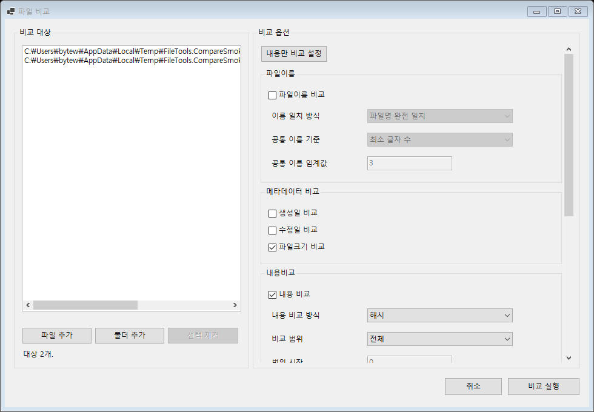
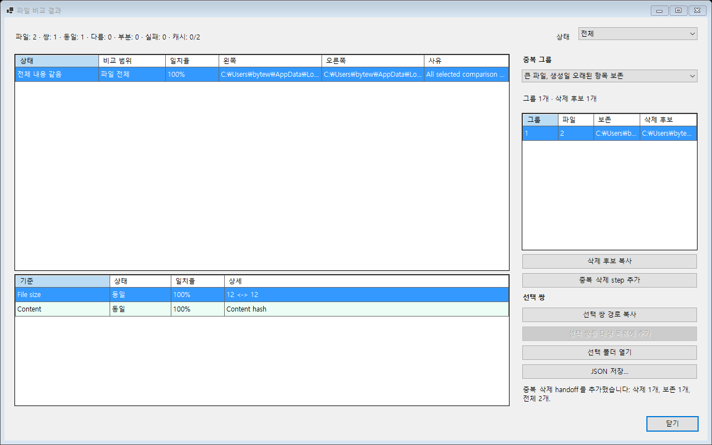

# 파일 비교 보완 사용 방법

구현·검증일: 2026-09-19. 현재 테스트 빌드 1.5.1.0, 공개 배포 전.

기존 파일 비교에서 내용 확인과 필요한 복사본 정리까지 이어지는 흐름을 보완했다.
별도 중복 검색 기능이나 관리 화면은 추가하지 않았다.

## 내용만 비교

파일 비교 창에서 파일/폴더를 추가한 뒤 **내용만 비교 설정**을 누른다.
이름·작성일·수정일은 제외하고 크기와 파일 전체 SHA-256으로 비교한다.
ZIP도 파일 전체를 비교한다. 이번 실행에만 적용하며 저장된 기본 설정은 바꾸지 않는다.
기존 상세 설정은 계속 직접 조정할 수 있다.

## 결과 확인

결과에 **비교 범위**를 표시한다. 전체 내용이 같으면 ‘전체 내용 같음’,
일부 범위가 같으면 ‘선택 구간 같음’으로 구분한다.
압축 내부 비교와 이름·속성만 확인한 결과도 별도로 표시한다.

상태 필터와 상단 집계는 기존처럼 선택한 모든 기준의 종합 판정을 따른다.
이름/날짜까지 비교했고 빠른 종료를 껐다면, 전체 내용은 같아도 종합 판정은 부분 일치일 수 있다.
일치율은 선택한 기준/구간의 점수이며 사진 등의 지각적 유사도를 뜻하지 않는다.

## 필요한 복사본 정리

1. 전체 내용이 확인된 그룹에서 기존 보존 기준으로 남길 파일을 고른다.
2. 중복 삭제 단계를 메인 작업 계획에 추가한다. 단계 편집에서 보존/정리 대상을 바꿀 수 있지만 최소 하나는 남겨야 한다.
3. 실행 시 비교 당시 파일 식별·크기·시각과 현재 파일을 확인하고 보존본과 후보의 전체 바이트를 다시 비교한다.
4. 정상 후보만 휴지통으로 이동한다. 보존본 소실, 파일 교체/변경, 링크, 충돌하는 작업은 보류한다.

부분 구간 일치, ZIP 엔트리 일치, 이름/속성 일치만으로는 정리 단계를 만들지 않는다.
하드링크는 독립 복사본으로 취급하지 않는다. 파일 식별 정보를 얻지 못한 대상도 정리 후보에서 제외한다.
휴지통 사용이 불가능하면 실패를 기록하고 영구삭제로 전환하지 않는다.

실행 중 보존본은 쓰기/삭제를 막고, 후보는 쓰기를 막으며 Shell 이동 직전 다시 확인한다.
후보 이동을 허용하려면 삭제 공유가 필요하므로 경로 기반 Shell 이동 전체를 원자적인 작업으로 보장하지는 않는다.
이미 이동한 파일은 완료로 남고 실패/취소한 단계는 재확인 후 실행할 수 있다.

JSON 내보내기는 스키마 3으로 비교 범위와 전체 내용 일치 여부를 기록한다.
JSON 다시 열기, 전용 대량 검색, 기준 폴더 모드 등 추가 고도화는 후속 검토 사항이다.
현재 전체 쌍 비교 구조는 유지하므로 대량 검색 성능이 해결된 것으로 보지 않는다.

## 검증

- 관리 코드 Release 빌드 및 전체 **279개 테스트 통과**. 이번 비교/정리 경계 테스트 39개 추가.
- 다른 이름/날짜의 동일 내용, 다른 길이/내용, 0바이트, 부분 구간, ZIP 일부 항목, 메타데이터 전용,
  비교 중 변경, 짧은 스트림 읽기/예기치 않은 EOF, 청크 도중 취소, 읽기 잠금, 해시 캐시 오염 방지를 확인했다.
- 보존본 소실, 경로 교체, 크기/시각을 복구한 내용 변경, 모든 파일 삭제 선택, 하드링크,
  작업/출력 경로 충돌, Shell 직전 교체/취소, 휴지통 실패 시 원본 보존을 확인했다.
- 실제 한국어 비교/결과 창을 기본·최소 크기로 확인하고 설정 적용 및 검증 정보의 메인 계획 전달을 확인했다. 최소 크기에서 대상 제거 버튼이 잘리던 배치도 수정했다.
- 생성한 임시 복사본을 실제 휴지통으로 이동하고 복원했다. 메인 계획의 완료 단계 정리도 확인했다.
- 네트워크/이동식 드라이브 전체 조합, 설치 패키지, 실제 Explorer 연동은 이번 앱 기능 검증 범위 밖이다.
