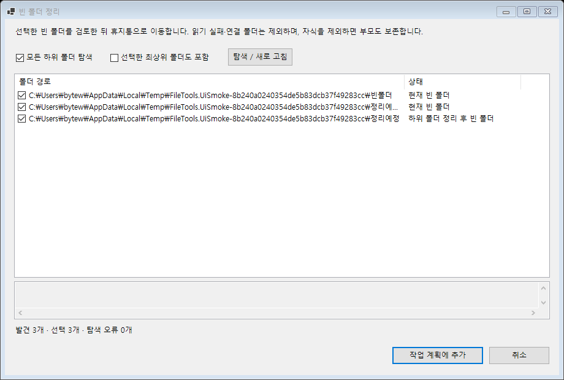
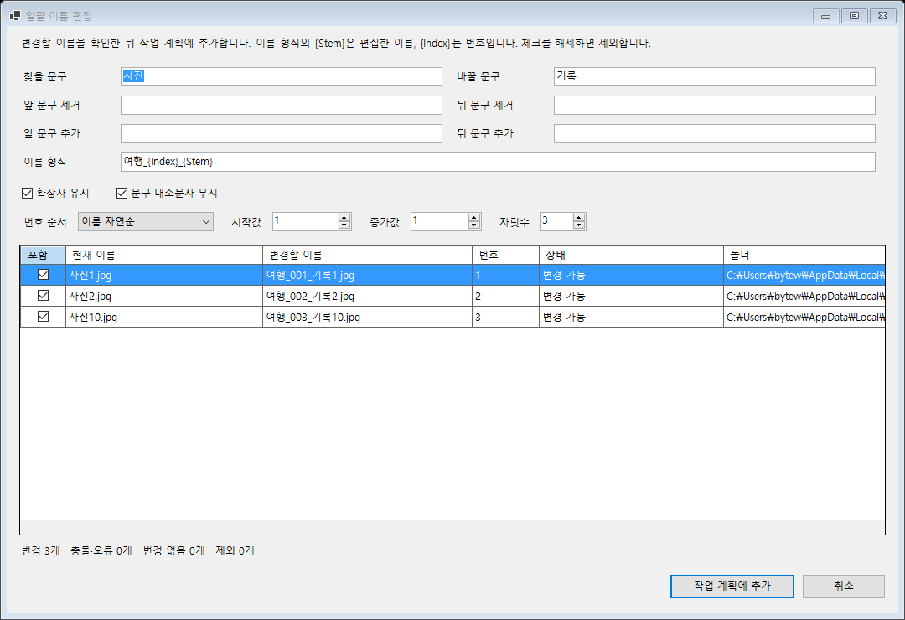

# 빈 폴더 정리와 일괄 이름 편집

2026-09-19, `codex/1.5.0.0` 개발 브랜치. 두 기능은 구현·로컬 검증을 마쳤으며 아직 배포되지 않았다.
커밋 요청에 따라 앱·ShellExt·설치/번들 프로젝트 및 관련 버전을 `1.5.0.0`으로 일괄 갱신했다.

## 빈 폴더 정리

대상 목록에서 작업이 없는 폴더를 선택하고 **작업 → 빈 폴더 정리**를 연다.
기본값은 모든 하위 폴더 탐색, 선택한 폴더 자체 보존이다. 하위 탐색 옵션을 끄면
바로 아래 폴더까지만 확인한다. 선택한 폴더 자체도 정리하려면 해당 옵션을 켜고 다시 탐색한다.

현재 빈 폴더와 하위 후보를 정리하면 비게 될 부모를 구분한다.
부모를 체크하면 하위 후보도 체크하고, 하위를 제외하면 그 부모도 제외한다.
**작업 계획에 추가** 후 메인 창에서 실행하면 깊은 폴더부터 휴지통으로 이동한다.
계획을 두 번 클릭하면 남은 후보를 다시 검토할 수 있다.

- 휴지통 이동만 제공한다. 영구 삭제로 자동 전환하는 앱 코드는 없다.
- 숨김·시스템 항목과 0바이트 파일도 내용으로 취급한다. 연결된 폴더는 따라가지 않는다.
- 선택 범위를 겹쳐 넣어도 중복 처리하지 않으며, 기본 보존 옵션에서는 내부에 따로 선택한 루트도 보존한다.
- 드라이브 루트 자체는 후보에 넣지 않는다. 탐색 실패는 빈 폴더로 취급하지 않고 경로별로 표시한다.
- 실행 직전과 Windows Shell의 삭제 전 콜백에서 빈 상태·연결 경로를 재검증한다.
  파일이 생겼으면 건너뛰고, 성공한 후보만 계획에서 제거한다. 실행 중 새 후보를 추가하지 않는다.
- 중지하면 진행 중인 Shell 작업이 반환된 뒤 다음 후보부터 중단한다.
  부분 실패 항목은 남아서 재검토·재시도할 수 있다.

휴지통 처리는 `IFileOperation`의 `FOFX_RECYCLEONDELETE`를 사용하고,
삭제 전 콜백에서 휴지통 플래그가 없는 작업을 거부한다.
Windows가 중단하거나 휴지통 결과를 확인하지 못하면 실패로 보고한다.
다른 프로그램의 동시 변경까지 원자적으로 차단하는 잠금은 제공하지 않는다.
API 근거: [작업 플래그](https://learn.microsoft.com/en-us/windows/win32/api/shobjidl_core/nf-shobjidl_core-ifileoperation-setoperationflags),
[삭제 전 콜백](https://learn.microsoft.com/en-us/windows/win32/api/shobjidl_core/nf-shobjidl_core-ifileoperationprogresssink-predeleteitem).

## 일괄 이름 편집

대상 목록에서 작업이 없는 일반 파일을 선택하고 **작업 → 일괄 이름 편집**을 연다.
폴더명과 링크 파일은 지원하지 않는다. 규칙은 이번 선택에만 적용하며 기존 자동교정 설정을 바꾸지 않는다.

편집 순서는 앞/뒤 문구 제거 → 문자열 치환 → 앞/뒤 문구 추가 → 이름 형식 적용이다.
확장자 유지를 켜면 마지막 확장자를 편집 대상에서 분리한 뒤 결과 뒤에 다시 붙인다.
문구 비교는 기본적으로 대소문자를 구분하지 않으며 옵션으로 구분할 수 있다.

| 설정 | 동작 |
| --- | --- |
| `{Stem}` | 위의 문구 편집을 거친 이름 |
| `{Index}` | 지정한 자릿수로 채운 번호 |
| `{Index:000}` | 이 토큰에서만 세 자리 번호 사용 |
| `{{`, `}}` | 중괄호 자체를 이름에 삽입 |
| 번호 순서 | 이름 자연순(기본), 목록 입력순, 수정일 오래된 순, 작성일 오래된 순 |
| 시작값·증가값·자릿수 | 기본 1·1·3, 증가값은 양수, 자릿수는 1~10 |

작성일은 파일시스템 생성 시각이다. 이름 자연순은 `사진1`, `사진2`, `사진10` 순이다.
결과 체크를 해제하면 제외되고 번호를 다시 계산한다. 변경 없는 파일도 포함 상태이면 번호를 부여받는다.
같은 정렬 값은 전체 경로로 순서를 고정한다. 번호는 최대 2,147,483,647까지 지원한다.

모든 포함 항목에 대해 이름과 충돌을 확인한다. 오류가 있으면 계획에 추가할 수 없다.
Windows 금지 문자, 예약 장치 이름, 빈 이름, 끝의 점/공백, 255자를 넘는 이름,
같은 폴더 안의 중복 결과와 기존 파일/폴더 충돌을 차단한다. 이름 맞교환도 충돌로 처리한다.
같은 이름이어도 폴더가 다르면 허용한다. 대소문자만 바꾸는 편집도 지원한다.

계획에는 확정한 이름·번호·원본 파일 식별 정보가 저장된다. 실행 순서를 바꿔도 번호를 다시 매기지 않는다.
파일 ID·크기·작성/수정 시각이 바뀌거나 대상 이름이 점유되면 해당 작업을 실패로 남긴다.
덮어쓰기나 임의의 충돌 번호 추가는 하지 않는다. 성공한 항목은 계획에서 제거하고 새 경로를 표시한다.
일괄 편집은 전체 묶음을 원자적으로 되돌리는 트랜잭션이 아니므로 앞서 성공한 변경은 유지된다.

계획 행을 두 번 클릭하면 아직 원래 대상 목록에 남아 있는 묶음의 설정을 함께 편집한다.
이미 완료해 경로가 바뀐 파일에는 다시 적용하지 않는다. 이 첫 구현에서는 기존 작업이 있는
파일에 일괄 편집을 추가하거나, 일괄 편집 대기 중 기존 이름 교정·재배치를 추가하지 않는다.

## 검증

- PC 자원 확인: Xeon E3-1270 v5(4코어/8스레드), RAM 약 32GB/가용 약 18.7GB,
  저장소 여유 약 1.23TB. 임시 데이터로 Release 빌드·실제 파일 작업을 실행했다.
- 기존 157개 + 빈 폴더 16개 + 일괄 편집 24개 = **Release 테스트 197개 통과**.
- 빈 폴더: 중첩·겹치는 루트·숨김/0바이트 파일·후보 제외·후발 파일·범위 이탈·실패·취소·재시도.
- 일괄 편집: 편집 순서·확장자·자연/입력/날짜 순서·제외 후 번호·예약/잘못된 이름·충돌·오버플로·취소,
  미리보기 이후 대상 생성/원본 변경/파일 교체, 실행 순서 독립성, 대소문자 변경, 실패 후 후속 단계 차단.
- 로컬 Windows 드라이브에서 실제 빈 폴더 휴지통 이동 → 휴지통 조회 → 원위치 복원 통과.
- 메인 창 명령 활성 조건, 일괄 작업 추가, 실제 이름 변경, 완료 후 계획 제거 및 대상 경로 갱신을 연결 검증했다.
- 실제 WinForms 한글 창을 캡처해 검토했다. 일괄 편집 기본 1080×740 및 최소 880×600 크기를 확인했다.
- 새 전용 탐색기 메뉴, 설치 프로그램 배포, 네트워크/이동식 드라이브별 휴지통 동작,
  모든 화면 배율의 UI 검증은 이번 검증에 포함하지 않았다.

후속 요청으로 4번 목록 작성과 5번 조건 수집을 먼저 구현했다. [사용 방법](file-catalog.md)을 참고한다.
3번은 기존 비교 보완으로 축소해 구현했다. [사용 방법과 검증](file-compare.md)을 참고한다.
