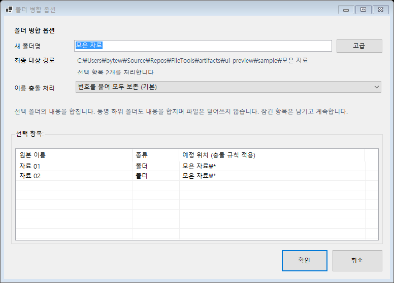
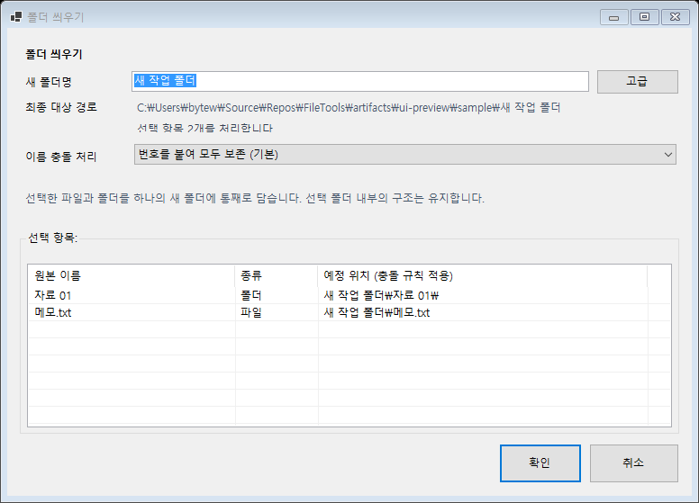

# 폴더 작업 동작과 잠긴 항목 처리

업데이트: 2026-09-19. `1.4.6.4` 이후 개발 변경이며 배포 버전은 아직 올리지 않았다.

## 작업 의미

| 작업 | 선택 조건 | 결과 |
| --- | --- | --- |
| 폴더 병합 | 폴더만 2개 이상 | 각 폴더의 내용을 하나의 새 폴더에 합침. 동명 하위 폴더도 재귀 병합 |
| 폴더 씌우기 | 파일/폴더 1개 이상, 혼합 가능 | 선택 항목을 통째로 하나의 새 폴더에 담음. 내부 구조 유지 |
| 파일별 폴더 씌우기 | 파일 | 기존 동작처럼 파일마다 폴더를 씌움. 앱 작업 메뉴에서 별도 제공 |
| 폴더 벗기기 — 전체 내용 | 폴더 | 직접 하위 파일과 폴더를 한 단계 위로 꺼냄. 하위 폴더 내용은 평탄화하지 않음 |

기존 단일 파일 폴더 벗기기와 이름 불일치 처리 옵션은 유지한다.
명령/설정 식별자 `FolderWrapFiles`, `FolderMoveInnerFilesUp`,
`FolderMergeSelectedTargets`는 기존 등록 및 설정 호환성을 위해 유지한다.
`FolderStructureOperation.WrapFiles`와 기존 개별 `FolderWrap` 플랜은
파일별 씌우기로 표시한다.

탐색기 네이티브 메뉴는 선택 조건에 따라 벗기기 명령의 중복을 제거한다.
모두 같은 이름의 단일 파일이고 충돌 정책이 건너뛰기라면 대표 명령 1개만 남는다.
빠른 메뉴 호출은 디스크를 읽지 않고, 느린 검사 결과를 형제 명령끼리 공유한다.
조건표, 읽기 제한, 판정 불가 예외와 앱 플랜 적용 경계는
[메뉴 표시 조건과 검증](unwrap-command-visibility-review.md)을 참고한다.

앱과 탐색기의 폴더 병합/씌우기는 이름 확인 후 즉시 실행한다. 선택 대상에
작업 플랜이 있으면 먼저 비워야 한다. 병합 버튼은 다중 폴더 선택에서만
사용하며, 씌우기 버튼은 폴더/파일/혼합 선택을 받는다.

## 이름과 충돌 정책

- 이름 확인창에서 새 폴더명, 실제 대상 경로, 소스 목록과 충돌 정책을 확인한다.
  작업 종류는 진입 명령으로 고정하므로 병합창에서 씌우기 모드로 바뀌지 않는다.
- 대상은 첫 번째 선택 항목의 부모 아래에 만든다. 부모가 다른 선택은 경고한다.
- 기존 대상 폴더와 같은 이름이면 새 이름에 번호를 붙여 최종 경로를 표시한다.
  확인 이후 그 경로가 점유되면 임의로 경로를 바꾸지 않고 중단한다.
- 동명 파일과 파일/폴더 간 이름 충돌은 기본적으로 `(2)`, `(3)` 등의 번호를
  붙여 보존한다. 사용자 지정 충돌 번호 템플릿을 따른다. 건너뛰기도 선택 가능하다.
- 동명 하위 폴더는 병합할 때만 내용을 합친다. 씌우기는 선택 폴더를 통째로
  이동하므로 이름 충돌 정책에 따라 별도 폴더명으로 보존하거나 건너뛴다.
- 파일을 덮어쓰는 옵션은 제공하지 않는다. 원본 폴더는 비었을 때만 삭제한다.
- 부모 폴더와 그 안의 항목을 동시에 선택하면 이동 전에 전체 선택을 거부한다.
  재귀 병합은 연결된 폴더/reparse point를 따라가지 않는다.
- 목록의 예정 위치는 구조 미리보기다. 개별 파일의 최종 충돌 번호는 실행할 때
  실제 파일시스템 상태를 기준으로 결정된다.

## 잠긴 파일과 부분 실패

벗기기와 재귀 병합은 항목별로 이동 예외를 처리한다. 실패한 경로와 이유를
결과에 남기고 형제 항목 및 다른 선택 폴더를 계속 처리한다. 씌우기도 선택
항목별로 실패를 격리한다. 이미 성공한 이동은 되돌리지 않으며 성공 집계에 남긴다.

전체 내용 벗기기의 `A/A/B` 같은 동명 폴더 승격은 바깥 폴더에 잠긴 항목이나
충돌 때문에 남은 항목이 있으면 보류한다. 잠금을 해제하고 원본 폴더에 같은
벗기기를 재실행하면 남은 항목만 처리한다. 이 과정에서 성공한 항목이 다시
움직이지 않으며 스테이징 폴더도 남지 않는지 회귀 테스트로 확인한다.

플랜 단계에서 오류 또는 건너뜀이 발생하면 해당 대상의 후속 단계를 멈춘다.
부분 실패 단계는 완료로 제거하지 않으므로 원인을 해결하고 재실행할 수 있다.
다른 대상의 계획은 계속 실행한다. 폴더 병합/선택 씌우기의 전용 재시도 버튼은
없으며, 앱 대상 목록에 남은 원본과 결과 폴더를 보존한다.

선택 대상 수와 적용 건수는 다를 수 있다. 적용 건수는 개별 이동 기준이며,
성공한 빈 폴더 병합도 포함한다. 모든 이동이 실패했다면 새로 만든 빈 대상
폴더를 정리한다.

## 현재 확인창

실제 WinForms 컨트롤을 한국어로 렌더링한 화면이다. 샘플 경로는 검증용이다.

## 검증

- Windows에서 실제 `FileShare.Read` 잠금을 사용해 이동 실패, 형제 처리 지속,
  부분 성공 집계, 잠금 해제 후 벗기기 재실행, 후속 플랜 중단을 확인한다.
- 재귀 병합, 파일명 충돌, 파일/폴더 충돌, 건너뛰기, 혼합 선택 씌우기,
  중첩 선택 거부, 확인 후 대상 경로 점유, 전체 잠금 시 빈 대상 정리를 검증한다.
- Release 전체 회귀 테스트 **157/157 통과** (2026-09-19).
- Visual Studio 18 MSBuild의 `Release|x64` 솔루션 빌드 통과.
- 네이티브 메뉴 조건 1,024개 조합을 실제 컨텍스트 명령 960회 실행 결과와 교차 검증했다.
  파일 1,000개 폴더에서도 두 번째 파일 확인 후 열거를 끝내며, 형제 메뉴는 분석 1회를 공유한다.
- 한국어 병합/씌우기 확인창 렌더링, 씌우기 확인 옵션 반환, 혼합/단일 폴더/다중 폴더 선택의 버튼 활성 상태 검증 통과.
- 설치된 탐색기에서 새 DLL을 로드하는 확인과 MSI 설치 검증은 수행하지 않았다.
  배포 전 설치/탐색기 통합 확인이 필요하다.
