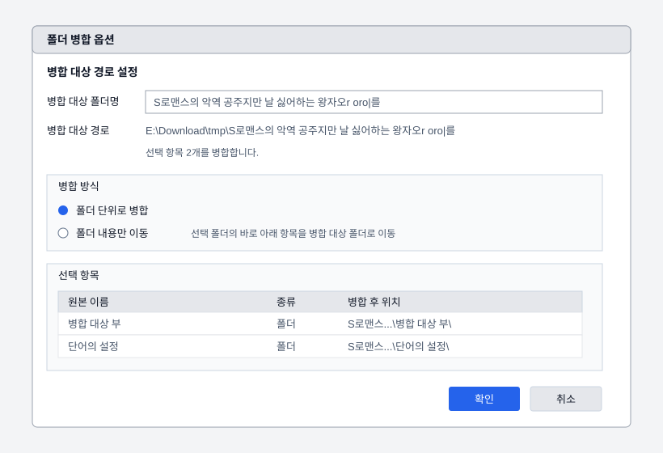

# In-App Context Menu and Folder Merge Fix Design

Review date: 2026-06-11

This document prepares the implementation pass for two related items:

- add context menus inside the standalone WinForms application;
- tighten the selected-target "merge into folder" flow before exposing it more
  broadly through quick commands.

The Explorer shell context menu already has a native `FolderMergeSelectedTargets`
command. This design focuses on the application UI first, then aligns the shell
entry point with the safer application flow.




## Current State

`MainForm` exposes commands through the menu bar and toolbars only. The target
grid and plan grid do not have `ContextMenuStrip` instances. Right-clicking a
target or plan row therefore gives no local action surface, even though the
screen is grid-centered.

Selected-target folder merge is implemented in `FolderMergeOperations` and is
available from the main window. The main-window command previews the generated
target folder path and asks for confirmation before moving files or folders.

The `/context FolderMergeSelectedTargets` path calls `MergeIntoFolder` directly.
That means an Explorer command can move selected items without showing the same
confirmation used by the app.

Folder merge currently derives the destination folder name from a simple common
prefix. For inputs like `Series 01.txt` and `Series 02.txt`, this can produce
`Series 0` instead of the more useful logical family name `Series`.

## Goals

- Make right-click behavior available where users work: the target grid and the
  plan grid.
- Reuse the existing menu/toolbar command semantics instead of introducing a
  separate command model.
- Keep context menus selection-aware: right-clicking a row should act on that
  row, while right-clicking an already selected row should preserve the current
  multi-selection.
- Keep destructive or moving operations confirm-first.
- Make folder merge destination naming less surprising for numbered sets.
- Keep a dialog-based target configuration flow for destination name and merge mode.
- Add regression tests around folder merge edge cases before changing existing
  behavior.

## Non-Goals

- Replacing the existing menu bar or toolbars.
- Rebuilding the main window layout.
- Changing archive merge behavior.
- Adding Explorer file-compare exposure as part of this pass.

## Target Grid Context Menu

The target grid context menu should be focused on selected targets. It can use
separate `ToolStripMenuItem` instances, but each item should call the same
methods as the existing menu bar and toolbar commands.

Recommended structure:

```text
Add files...
Add folder...
---
Remove selected
Move up
Move down
Merge selected into folder...
Clear
---
Add rename step
Add wrap step
Add unwrap step >
Add archive merge step >
Compare selected...
Add relocation step
```

Right-click selection behavior:

1. If the pointer is over an unselected target row, clear selection and select
   that row.
2. If the pointer is over a selected target row, keep the current selection.
3. If the pointer is over blank grid space, leave selection unchanged and show
   only general commands that still make sense, such as add and clear.

The context menu should not duplicate state rules. `UpdateCommandStates` should
continue to compute command availability and then apply the same booleans to
menu-bar, toolbar, and context-menu items.

## Plan Grid Context Menu

The plan grid context menu should be scoped to the selected step and the
displayed target plan.

Recommended structure:

```text
Edit step...
Remove step
Clear steps
---
Run plan
```

Double-click editing already exists and should remain. Right-click on a plan row
should select that row before opening the menu. Blank plan-grid space can show
`Clear steps` and `Run plan` only when the existing command state allows them.

## Implementation Shape

Expected files:

- `src/FileTools.App/Ui/MainForm.Designer.cs`
  - add `_targetContextMenu`, `_planContextMenu`, and the required context menu
    item fields;
  - instantiate and attach them to `_targetGrid` and `_planGrid`.
- `src/FileTools.App/Ui/MainForm.cs`
  - wire context menu click handlers to existing command methods;
  - add right-click row selection helpers for both grids;
  - extend `UpdateCommandStates` so context menu items follow the same enabled
    states as menu-bar and toolbar items.
- `src/FileTools.App/Resources/Strings.resx`
  - add missing context menu labels only when an existing button/menu string is
    not semantically correct.

The first implementation should avoid moving existing `ToolStripMenuItem`
objects between menus. WinForms items can only belong to one owner at a time, so
the context menu needs its own items that reuse the same handlers and images.

## Folder Merge Flow Changes

The application and shell entry points should share one confirm-first flow:

1. Normalize selected existing files/folders.
2. Require at least two sources.
3. Build a preview plan with:
   - normalized source paths;
   - calculated target parent;
   - calculated target folder name;
   - collision-resolved target folder path;
   - whether sources come from more than one parent directory.
4. Show confirmation with source count and final target folder path.
5. Use Cancel as the default button.
6. Execute only after confirmation.

For Explorer `/context FolderMergeSelectedTargets`, the confirmation can be a
simple message box in the first slice. If the user cancels, return a skipped
result rather than an error.

### 1.4.5.0 Options Dialog Update

`FolderMergeOptionsDialog` now uses the same final-name review surface for app
and Explorer entry points, but the layout is optimized for long generated names:

- the window is wider and resizable;
- target folder name and target path are separated, with tooltips for long
  paths;
- both merge modes are always visible, and contents-only mode is disabled with
  an explanation only when no folder is selected;
- the lower explanatory message box is replaced by a selected-item list showing
  source name, item kind, and the top-level merged location.
- Korean mode labels are aligned across the split button and options dialog:
  `폴더 단위로 병합` and `폴더 내용만 이동`.

### Target Parent Policy

The current behavior uses the first selected source's parent directory. Keep
that as the first implementation default for compatibility, but make it explicit
in the confirmation text.

If sources come from multiple parent directories, the confirmation text must
state that all selected sources will be moved into a folder under the first
source's parent. A later slice can add an explicit "choose target parent" dialog
if real-world use shows that cross-parent selection is common.

### Folder Name Policy

Replace the simple common-prefix-only naming with a logical merge-name analyzer:

1. Take selected file stems or folder names in selection order.
2. Normalize whitespace and trim trailing separators.
3. Extract numeric or text range tokens when the surrounding text is stable.
4. Merge contiguous or overlapping ranges and preserve disjoint range groups.
5. If the full structure is unreliable, use the strongest common text token
   found anywhere in the names.
6. If the result is empty, use the localized default merge folder name.

Examples:

```text
Series 01.txt + Series 02.txt -> Series 01~02
A-001.jpg + A-002.jpg         -> A 001~002
A 01~03.txt + A 05~08.txt     -> A 01~03, 05~08
test이름 tt.txt + 이름abc.txt -> 이름
Folder A + Folder B           -> Folder A~B
cat.txt + dog.txt             -> Merged
```

The existing collision policy should still apply after the target folder name is
chosen:

```text
Series 01~02
Series 01~02 (2)
Series 01~02 (3)
```

## Regression Tests

Add managed tests before or with the implementation:

- `FolderMergeOperations` produces `Series 01~02` for `Series 01.txt` and
  `Series 02.txt`.
- Existing target folders still auto-number.
- Mixed files and folders move into the generated folder without flattening
  source directories.
- A selected folder is skipped when the generated target folder would be inside
  that folder.
- Cross-parent selections produce a preview that identifies the first source
  parent as the target parent.
- `/context FolderMergeSelectedTargets` command parsing remains stable.

UI context menus do not need heavy automated UI testing in the first slice, but
the command-state helper should be factored so basic state behavior remains
straightforward to inspect and maintain.

## Manual Validation

After implementation:

1. Start the app and add several files to the target grid.
2. Right-click an unselected target row and confirm it becomes the active
   selection.
3. Multi-select targets, right-click one of the selected rows, and confirm the
   selection is preserved.
4. Confirm target context menu items enable and disable the same way as the menu
   bar and toolbar.
5. Add a plan step, right-click the plan grid, and verify edit/remove/clear
   behavior.
6. Run folder merge from the app and verify the confirmation target path.
7. Run folder merge through `/context FolderMergeSelectedTargets` and verify the
   same confirmation appears before items are moved.

## Documentation Updates During Implementation

When the code pass is completed, update:

- `docs/ux-mainform-review.md` with the implemented context-menu behavior;
- `README.md` context-menu and folder-merge behavior notes if shell behavior
  changes;
- `docs/next-tasks.md` with test counts and remaining follow-up.
