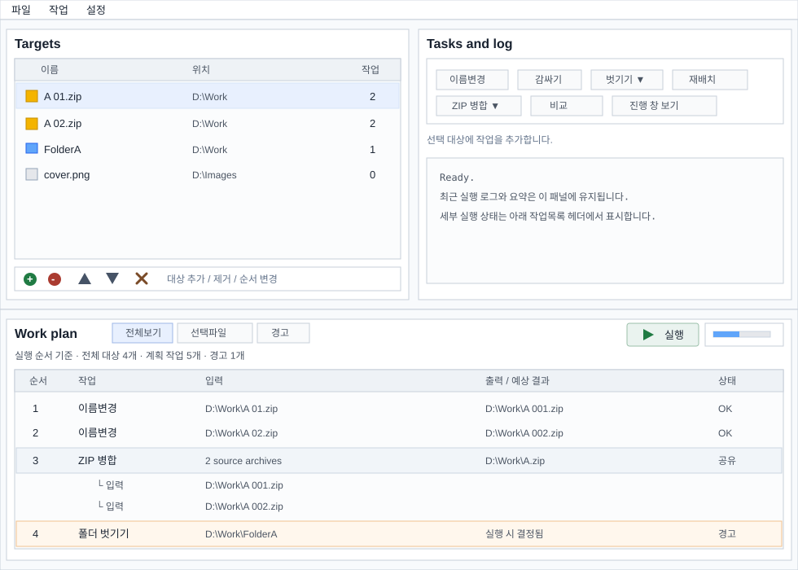

# MainForm Plan List Layout Proposal

Review date: 2026-06-12

Status: layout and projection filters connected. The current implementation has moved target/task/log controls into the top split and moved the work-plan grid plus run/stop/progress state into the bottom group. `WorkPlanDisplayBuilder` projects target plans into execution-order display rows with all-plan, selected-target, and warning filters plus shared archive-merge de-duplication, and the visible grid now uses that projection.



## Goal

Rework the standalone planner so the target list, task commands, execution feedback, and plan review each have a clearer role:

- Left/top: file and folder target list.
- Right/top: task buttons and lightweight log.
- Bottom: work plan list, execution controls, stop/progress state, and plan filters.

The bottom area should become the main execution review surface. The run/stop button and progress display belong in this same work-plan group because they act on the listed plan, not on the target list alone.

## Proposed Layout

The main window keeps a menu bar, then uses a vertical split:

1. Top split:
   - Left pane: target grid with icon, name, location, and action count.
   - Right pane: task command toolbar/panel and compact execution log.
2. Bottom pane:
   - Plan header with filter controls: all plan, selected targets, warnings.
   - Run/stop button, progress indicator, and current execution status.
   - Execution-order plan grid.

The bottom plan grid should show the order in which work will run. It should not be limited to the currently selected target by default. Selection filtering remains available through the header.

## Plan Filters

The first implementation should support these filters:

- `All plan`: shows every planned operation that will run.
- `Selected targets`: shows only operations related to the selected target rows.
- `Warnings`: shows rows with preview warnings, missing inputs, collisions, or uncertain output.

When a multi-target operation includes both selected and unselected inputs, the filtered view should still show the whole operation and visually mark which inputs matched the filter. Hiding the rest would make shared operations look smaller than they really are.

## Execution-Order Display

The display should be generated from a new UI-only projection, not directly from `WorkTargetPlan.Steps` rows. A projection model such as `PlanDisplayRow` should carry:

- row kind: operation group, input row, output row, detail row, warning row;
- operation identity: stable ID for shared operations such as archive merge;
- target reference when the row belongs to one target;
- step reference when the row maps to an editable `WorkPlanStep`;
- input path summary;
- predicted output summary;
- warning state and tooltip.

This keeps editing/removal behavior explicit even when the same operation touches multiple inputs or outputs.

## Multi-Input And Multi-Output Operations

Some operations do not fit a simple one-file-to-one-file row:

- Archive merge: many archives become one output archive.
- Duplicate delete: many related files produce delete/keep decisions.
- Folder wrap: one file becomes a file inside a new folder.
- Folder unwrap or move-up: one folder may expose one file, many files, or uncertain output.
- Future file merge: many inputs may become one output file.

The first implementation should avoid true cell merging in `DataGridView`. WinForms does not support merged cells directly, and owner-drawn merged cells would add risk to selection, accessibility, resizing, and context-menu behavior.

Use group rows instead:

```text
Order | Operation        | Input                         | Output
----- | ---------------- | ----------------------------- | -------------------------
1     | Rename           | A 01.zip                      | A 001.zip
2     | Rename           | A 02.zip                      | A 002.zip
3     | ZIP merge        | 3 source archives             | A.zip
      |   input          | A 001.zip                     |
      |   input          | A 002.zip                     |
      |   input          | A 003.zip                     |
4     | Folder unwrap    | FolderA                       | output decided at runtime
```

Later, owner drawing can make group rows look like vertically spanned cells if the group-row approach proves too visually weak.

## Command Semantics

The top-right task commands still apply to the selected target rows. The bottom plan grid selection should control only plan-row actions such as edit step, remove step, clear operation group, or jump to target.

This distinction should be visible in labels/tooltips:

- Target commands: "Add rename to selected targets", "Add unwrap to selected folders".
- Plan commands: "Edit selected plan row", "Remove selected operation", "Clear selected target plan".

If a plan row is selected for a target that is not selected in the target grid, command state must not silently apply target commands to that row. A "select target" or automatic target sync can be added later, but the first pass should prefer predictable selection boundaries.

## Shared Operation Rules

Archive merge and similar shared operations need special handling:

- Show one operation group per shared plan ID.
- Do not repeat the same archive merge as one executable row under every source file.
- Removing the group must remove the shared step from every source target.
- Editing the group must update the shared options once and refresh every affected target.
- Filtered views should show the full shared operation if any related target matches.

Duplicate delete should also be shown as a grouped operation when it came from a compare-result handoff.

## Implementation Slices

1. Add documentation and branch the work. Done.
2. Move task buttons/log into the top-right pane while preserving existing command behavior. Done.
3. Move the run/stop button and progress label into the plan group while keeping current plan grid behavior. Done.
4. Extract plan-display projection generation without changing layout. Done.
5. Add tests for projection ordering, selected-target filtering, shared archive merge de-duplication, and warning propagation. Done.
6. Connect the projection to the bottom plan grid and add filter controls. Done.
7. Improve grouped display rows for shared and uncertain operations.
8. Perform manual UI validation at small, default, and wide window sizes.

## Expected Risks

- `EditStep` currently depends on the selected target grid row. The new plan grid must carry target context per row.
- `RemoveSelectedStep` currently removes from the displayed target. Shared operations need group-level removal.
- Preview refresh may become more expensive because all target previews are built for the full plan view.
- Large target sets can create many display rows. Filtering and row virtualization may become necessary later.
- Folder operations with runtime-dependent output should be marked as uncertain rather than pretending to know every output path.
- The log and progress state must stay readable after moving into the plan group; the bottom pane should have a minimum height.

## Branch And Merge Plan

Use a dedicated branch for this redesign work. Keep each implementation slice small enough to build and test independently.

Recommended branch:

```text
codex/mainform-plan-list-layout
```

Merge only after:

- managed tests pass on the branch;
- the current behavior is preserved for adding, editing, removing, and clearing plan steps;
- archive merge and duplicate-delete shared-step behavior is manually checked;
- the proposed layout image and review documents are updated to match the implemented UI.
