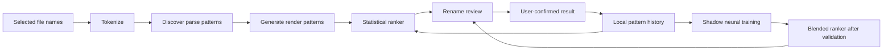

# Personal Rename Pattern Learning Design

Last updated: 2026-06-08

## Purpose

FileTools should improve rename suggestions as a user reviews and corrects
names, but the model must not infer file content without evidence. The first
learning track is therefore pattern based:

- discover structural parse patterns from selected file names;
- discover render patterns from user-confirmed outputs;
- rank parse/render pattern combinations with transparent statistics first;
- train a small neural ranker only after enough local feedback exists;
- keep statistics as fallback and as neural-ranker input features.

The goal is not automatic AI naming. The goal is to make review candidates
better match each user's preferred filename structure over time.

## Pipeline



## Pattern Discovery

Pattern discovery is deterministic and local. It works on a selected batch of
file names instead of a single name so common structure and changing positions
can be detected.

The first implementation tokenizes stems into:

- bracketed text, such as `[Author]` or `(Tag)`;
- numbers, preserving zero-padding width;
- separators, such as spaces, hyphens, underscores, and dots;
- text runs.

It then groups names by structural signatures, such as:

```text
[{BracketedText}] {Text} {Number:000}
{Text} - {Number:000} ({BracketedText})
```

Each discovered pattern receives an initial score from:

- coverage in the selected batch;
- whether a number slot is sequential;
- stable value slots across the batch;
- simplicity of the structure.

This is intentionally not a semantic parser yet. `{BracketedText}` might later
be ranked as author, tag, circle, source, or noise by a separate parse-pattern
mapper.

## Statistical Ranker

The statistical ranker is the first personalization layer. It ranks a candidate
combination:

```text
(parse pattern, render pattern)
```

using explainable features:

- how often the user chose the render pattern;
- how recently the user chose it;
- folder or batch pattern consistency;
- sequence continuity;
- field collision or missing-field risk;
- how often the user drops or preserves bracketed fields;
- separator and padding preferences.

The result should remain review-first. Statistics can move candidates up or
down, but they should not silently apply uncertain renames.

## Neural Ranker Transition

The neural ranker replaces ranking behavior gradually, not immediately.

1. Statistics only.
2. Shadow neural predictions are trained and logged without affecting UI order.
3. Historical feedback replay compares neural predictions against statistics.
4. If the neural ranker is better, blend scores, for example:

```text
final = statistics * 0.80 + neural * 0.20
```

5. Increase neural weight only after enough local data and validation.

The small model should rank pattern combinations, not generate names:

```text
input: 64-128 pattern/statistical features
hidden: 32-64
output: 1 score
```

Statistics remain the fallback and become part of the model input, so early or
bad training data cannot fully replace deterministic behavior.

## Local Feedback Data

Feedback should be local and opt-in before it affects future ranking. A future
history row can store:

```json
{
  "originalFileName": "[Author] Series 001.zip",
  "selectedFileName": "Author - Series 001.zip",
  "parsePattern": "[{BracketedText}] {Text} {Number:000}",
  "renderPattern": "{Author} - {Title} {Episode:000}{Extension}",
  "candidatePatterns": [
    "[{BracketedText}] {Text} {Number:000}",
    "{Text} - {Number:000} ({BracketedText})"
  ],
  "confirmedAtUtc": "2026-06-08T00:00:00Z"
}
```

The stored data can contain personal filenames, so it must stay under the
current user's FileTools configuration directory unless the user explicitly
exports it.

## Implementation Slices

1. Deterministic structural pattern discovery for selected names.
2. Render pattern representation and candidate generation.
3. Local feedback history format and retention controls.
4. Statistical ranker for parse/render combinations.
5. Rename review integration that shows ranked candidates and reasons.
6. Shadow neural training and replay validation.
7. Blended ranker with statistics fallback.

The current codebase now contains the first internal slice:
`FileNamePatternDiscovery` tokenizes filenames and produces ranked structural
pattern candidates. It is not wired to UI or automatic rename execution yet.
