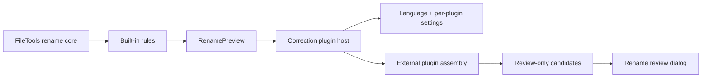
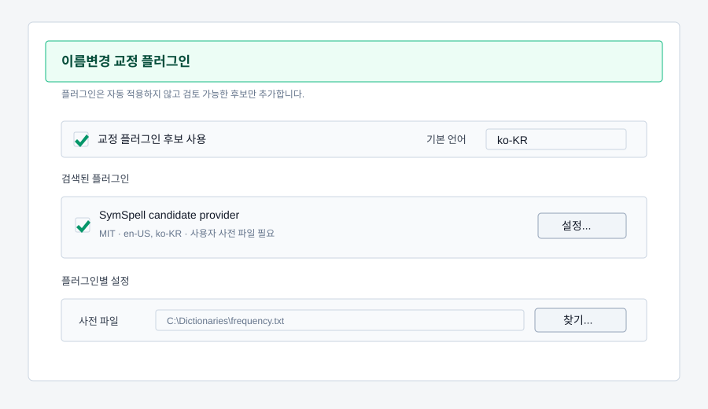

# Rename Correction Plugin Design

Last updated: 2026-06-07

## Purpose

FileTools keeps built-in rename correction deterministic and cheap, but allows
optional candidate providers to add reviewable filename suggestions. External
dictionary lookup, local LLM calls, and third-party spelling libraries must stay
outside the core rename rules so license, network, privacy, and runtime failure
boundaries remain clear.

The first implementation is intentionally small:

- FileTools owns the plugin contract, discovery, language selection, and a
  host-generated settings dialog.
- Plugins only append `NameCorrectionCandidate` rows. They do not change
  `SuggestedFileName` and cannot silently apply a rename.
- Each candidate carries a score, reason, source plugin, and `RequiresReview`
  state. The first implementation always treats plugin candidates as review
  candidates.
- The sample plugin uses the MIT-licensed SymSpell package and requires a
  user-provided frequency dictionary or corpus path. FileTools does not bundle
  third-party dictionary data in this slice.

## Runtime Boundary

The core application references only `FileTools.Correction.Abstractions`.
Concrete providers live in plugin assemblies under `Plugins/<plugin-id>` beside
the application or under `%APPDATA%\FileTools\Plugins/<plugin-id>`. A sample
plugin may be built with the solution, but it is still loaded through discovery
instead of direct application calls.

This split reduces license coupling, but does not remove all obligations:

- A plugin bundled with the installer brings its own license notices and
  dependency licenses.
- A GPL, LGPL, or CC BY-SA dictionary packaged with a plugin still has its own
  distribution requirements.
- User-selected local dictionary or corpus paths avoid FileTools distributing
  that data, but the user remains responsible for the data license.
- Internet and LLM plugins must remain opt-in and document what filename text is
  sent outside the process.

## Plugin Contract

Plugins implement one candidate provider interface:

- `Descriptor`: stable id, display name, version, license, description, and
  supported languages.
- `GetSettingDefinitions()`: schema used by FileTools to build a simple settings
  dialog. Supported controls are boolean, text, number, file path, and select.
- `NormalizeSettings(...)`: plugin-owned cleanup of string settings.
- `GenerateCandidates(...)`: synchronous candidate generation for one preview.

The request contains only data needed for filename correction:

- original path and filename;
- original and suggested stems;
- parsed title, episode, author, tags, and extension;
- selected language;
- dictionary/common phrase terms already known to FileTools.

The response contains candidate filename or stem text, score, reason, and
source. FileTools normalizes the candidate into a safe filename and de-duplicates
it against existing built-in candidates.

## Settings UX

The settings window keeps the existing collapsible group pattern. The rename
group gains a small plugin section with:

- a global enable checkbox;
- a default language combo (`ko-KR`, `en-US`, and future language codes);
- a list of discovered plugins with enable state, license text, and supported
  languages;
- a Settings button for plugin-specific fields generated from the plugin schema.

Language is selected in the FileTools settings, then passed to every plugin
request. Plugins may ignore unsupported languages or return no candidates.

## Initial SymSpell Scope

The SymSpell sample plugin is a connection test and candidate provider, not a
complete Korean spelling system.

- The plugin depends on the MIT-licensed `SymSpell` NuGet package.
- It loads a user-specified frequency dictionary file (`term count`) or a plain
  corpus file. FileTools does not ship those data files.
- It corrects token-like words inside the parsed title or suggested stem.
- It returns a candidate only when the corrected text differs from the input and
  the score meets the configured threshold.
- It does not run on every file when disabled or when the dictionary/corpus path
  is missing.

## Future Providers

Future internet dictionary or local LLM plugins should use the same contract.
They must add explicit settings for endpoint/API key/model, timeout, privacy
notice, and network failure behavior before being enabled for users.
