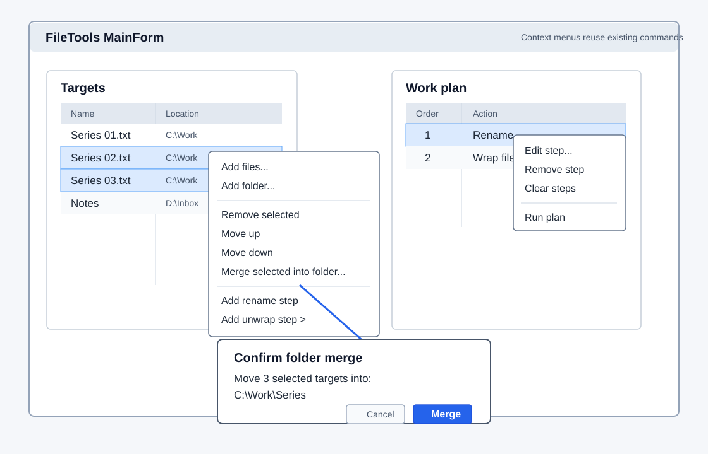

# MainForm UX Review

Review date: 2026-06-12

Scope:

- `src/FileTools.App/Ui/MainForm.Designer.cs`
- Related display logic in `MainForm.cs`, `WorkPlan.cs`, `PlanStepDialog.cs`, and `OperationResult.cs`

## Summary

The standalone window is now organized as a planner with a top target/task area and a bottom work-plan area. The top-left pane contains the target list, the top-right pane contains task commands and the compact execution log, and the bottom pane contains the filtered work plan plus run/stop/progress state.

The README now references `docs/images/current-mainform-designer-layout.svg`, which describes the current planner-oriented layout. The reference image was refreshed on 2026-06-12 to match the plan-list layout slice: menu bar, top target/task split, top-right log box, bottom filtered work-plan grid, plan execution status, progress indicator, and run/stop button.

The next layout proposal is tracked in `docs/mainform-plan-list-layout-proposal.md`. The implementation has moved the plan review surface to the bottom of the window, placed run/stop/progress state inside the same work-plan group, and connected the all-plan/selected-target/warning projection to the visible grid. Richer group rendering and more manual layout validation remain future slices.

## Implemented Layout Changes

- The left target area uses a read-only `DataGridView` with system icons, name, parent location, and action count.
- File, task, and settings commands are available from a `MenuStrip`.
- Target add/remove/reorder/clear commands sit near the target grid as icon toolbar commands.
- Main task commands sit in a fixed `ToolStrip` in the top-right task/log pane.
- Folder unwrapping uses `ToolStripSplitButton` for default unwrap, same-name unwrap, single-file mismatch modes, and moving direct child files upward.
- The work plan area sits in the bottom pane and uses a read-only `DataGridView` with order, icon-labeled action kind, input, and output/expected result columns.
- The plan toolbar includes all-plan, selected-target, and warning filters backed by `WorkPlanDisplayBuilder`.
- Shared archive-merge steps are displayed once per plan ID with input rows for source archives.
- Step options are moved out of the grid body and into row tooltips, keeping the visible grid focused on action and outcome.
- Step delete and clear-all-for-current-target commands sit on a horizontal icon+text toolbar above the plan grid.
- The work plan area shows which target is currently displayed, how many targets are selected, and the selected targets' planned step count for multi-target selections.
- Plan previews are rebuilt from the remaining step chain after add, edit, delete, or clear so downstream steps reflect the current virtual input path.
- The old always-large result box is replaced by a compact top-right log view.
- Execution uses one button inside the bottom work-plan group that shows run in the idle state and stop while running.
- The work-plan group includes a lightweight status label and marquee progress bar tied to the current execution state.
- Command state updates disable commands that do not apply to the current selection or execution state.
- Added right-click context menus on the target and plan grids, wired to the same command handlers as menu/toolbar actions.
- Context-menu selection behavior now preserves multi-row selections and updates command availability through the existing `UpdateCommandStates` flow.
- The "Merge selected into folder" split button moved into the action toolbar on the right panel.
- Added folder-merge option flow with target-name preview/edit and split-button mode support.
- For folder merges, multiple-folder selections expose a "merge folder contents only" mode and the current plan/confirmation now reflects the selected merge mode.

## Remaining UX Notes

### 1. Plan grid is filtered but still uses simple grouped rows

The target grid shows per-target action counts, and the bottom plan grid can now switch between all plan, selected targets, and warnings. Shared operations use simple group/input rows rather than owner-drawn merged cells, so richer visual grouping remains a later pass.

### 2. Icon-only commands need real-use validation

The menu bar gives every command a textual fallback, and tooltips name the toolbar actions. Still, first-time users may need icon+text for task commands if the icons are not obvious enough in practice.

### 3. The log is intentionally lightweight

The top-right log now handles progress and summary feedback. It is not a structured result viewer. If result review becomes a primary workflow, add a separate detail table with severity, target, operation, and message columns.

### 4. Layout proportions are not final

The form still starts at `980 x 700` and now uses a top/bottom split plus a fixed top-left target split distance. This is reasonable while the plan/result model is still moving, but the next layout pass should revisit minimum size, splitter constraints, and how much vertical space the log should occupy.

### 5. Preview coverage still has real-file limits

The plan grid now predicts rename, wrap, unwrap, and relocation where enough path information is available. Some folder operations still depend on actual folder contents, so the grid may show a warning when a future virtual folder cannot be inspected.

## Suggested Next Priority

1. Improve visual grouping for shared and multi-output operations without making grid selection brittle.
2. Add manual UI validation at small, default, and wide window sizes.
3. Revisit splitter constraints after manual validation.
