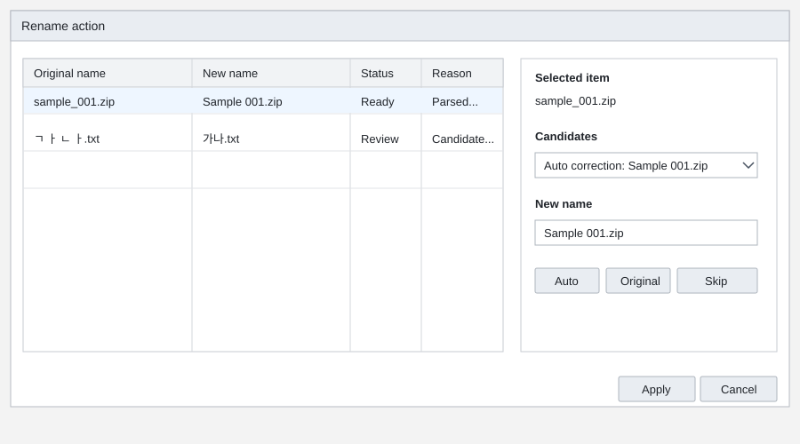

# Rename Dialog UX Review

Review date: 2026-06-02

Scope:

- `src/FileTools.App/Ui/RenameReviewDialog.cs`
- `src/FileTools.App/Configuration/SettingsStore.cs`
- `src/FileTools.App/Ui/SettingsForm.cs`
- `src/FileTools.App/Resources/Strings.resx`
- `src/FileTools.App/Resources/Strings.ko.resx`

Current reference:

## Summary

The rename dialog now supports two review modes:

- Always review before applying. This is the default.
- Review only when at least one generated rename needs review or has a conflict.

The ContextMenu execution flow still uses the dialog as the apply surface when review is required. The main application planner still uses the same dialog as a plan-editing surface, where OK stores the manual target filename instead of mutating the file system.

## Implemented Changes

- Replaced the old rename review checkbox with a `RenameReviewMode` selection.
- Kept `Always` as the default review mode.
- Added the secondary automation mode: open review only when a row is `NeedsReview` or `Conflict`.
- Added a top-right summary line showing total items, changed items, review-needed rows, conflicts, and resolved conflicts.
- Removed the reason column from the main grid.
- Rebalanced the grid around the core comparison: original name `>` new name.
- Localized row status labels instead of exposing raw enum names.
- Sorts conflict and review-needed rows above normal rows on initial load.
- Highlights review-needed and conflict rows with warm warning colors.
- Shows resolved conflict rows with a green background after user edits clear the conflict state.
- Validates rows after filename edit completion.
- Disables Apply/OK while a row has a blocking validation error such as an empty name, invalid filename, duplicate target, or existing target path.
- Sanitizes edited filenames through `WindowsFileNameSafety.MakeSafeFileName` after edit completion.
- Adds cell tooltips for full source path, target path, and validation status.

## Remaining UX Notes

### 1. Conflict semantics are intentionally conservative

Generated conflict rows still appear as conflicts until the user edits them. This keeps automatically suffixed names visible for review. If users find this too heavy, the next pass can split the status into `Conflict` and `Auto-resolved conflict`.

### 2. Candidate details are not exposed yet

The reason column was removed to keep the grid focused on before/after filenames. The rename engine still produces reasons and candidate alternatives, but the dialog does not yet show them in a selected-row detail area.

Recommended next change:

- Add an optional details panel below the grid or behind an expandable row.
- Show full original path, full target path, all reasons, and candidate alternatives there.

### 3. Extension changes are still allowed

Users can currently edit the whole target filename, including extension. This is flexible, but accidental extension removal or replacement is possible.

Recommended next change:

- Warn when a file target's extension changes.
- Consider a future split editor with stem and extension fields if accidental extension edits become common.

### 4. Size persistence is not implemented

The dialog now has a larger minimum size and resizable layout, but it does not remember the last size.

Recommended next change:

- Persist the last rename dialog size in user settings if long filenames are common in real use.

## Suggested Next Priority

1. Add selected-row details for hidden reasons and candidate alternatives.
2. Decide whether generated conflict suffixes should show as `Conflict` or `Auto-resolved conflict`.
3. Add extension-change warnings for file targets.
4. Remember the last dialog size after real-use validation.
