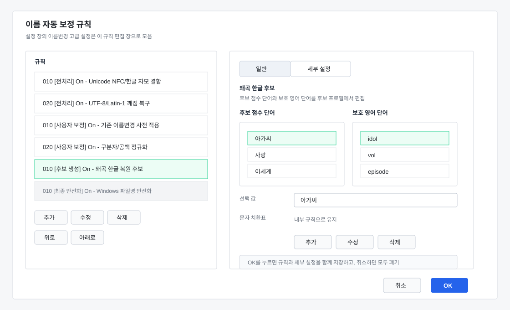

Review date: 2026-06-03

Scope:

- `src/FileTools.App/Configuration/RenameRuleStore.cs`
- `src/FileTools.App/Naming/NamingCore.cs`
- `src/FileTools.App/Ui/RenameRuleEditorDialog.cs`
- `src/FileTools.App/Ui/RenameReviewDialog.cs`

Current reference:

## Summary

The rename correction flow now uses an app-level rule document instead of treating every correction as hidden code. Built-in correction steps are represented as named rules, and user rules can be added for common deterministic edits.

The first implementation intentionally avoids script execution. Script rules remain a documented future extension because they need a separate security, timeout, and error-isolation design.

## Rule Model

Each rule has:

- Stable ID.
- Display name and description.
- Stage.
- Kind.
- Enabled state.
- Application mode.
- Order within its stage.
- Optional source/replacement values.

Supported stages:

- `Preprocess`
- `UserRewrite`
- `Candidate`
- `Extract`
- `Compose`
- `Finalize`

Supported modes:

- `Automatic`: changes the working name directly.
- `Review`: changes the working name and marks the row as review-needed.
- `CandidateOnly`: does not change the default suggestion, but records a candidate when the rule can produce one.

## Built-In Rules

The default built-in rules are:

- Unicode NFC/Hangul jamo normalization.
- UTF-8/Latin-1 mojibake recovery.
- Existing rename dictionary application.
- Separator and whitespace normalization.
- Obfuscated Hangul candidate generation.
- Bracket tag/author extraction.
- Author pattern extraction.
- Episode extraction and normalization.
- Title cleanup.
- Windows filename safety.

Windows filename safety is required and remains active even when shown in the rule list.

## Rule-Specific Settings

`RenameRuleEditorDialog` now uses right-side `General` and `Details` tabs. The `General` tab keeps the shared rule fields: enabled state, display name, stage, kind, mode, source, replacement, description, and case handling. The `Details` tab is rebuilt from the selected built-in rule kind.

Currently exposed detail panels are limited to settings that have backing storage:

- Existing rename dictionary application: inline `source -> replacement` editor backed by `rename-dictionary.json`, plus review insert phrases used by the rename review dialog.
- Obfuscated Hangul candidate generation: inline candidate scoring word and protected English word editors backed by `rename-candidate-profile.json`. The built-in replacement table remains internal but includes short review candidates such as `ㅇr -> 아` and `ㅎH -> 해`.
- Bracket metadata extraction: inline known-tag word editor backed by `rename-parser-profile.json`.
- Author extraction: inline author-prefix editor backed by `rename-parser-profile.json`.
- Episode extraction: inline episode-prefix and episode-unit editors backed by `rename-parser-profile.json`.
- Title cleanup: inline title-noise word editor backed by `rename-parser-profile.json`.

The settings window no longer exposes separate rename dictionary and common-phrase entry buttons. Those settings are reached through the selected built-in rule so the main settings window does not accumulate more rename-specific buttons.

Deferred detail panels and internals:

- Regex internals for parser extraction.
- Character replacement tables for obfuscated Hangul candidate generation.

The candidate profile separates obfuscated Hangul scoring data from review insert phrases. When `rename-candidate-profile.json` is first created, legacy common phrases are copied into the scoring word list once so existing scoring behavior is not lost; future edits are independent.

Parser profile lists are exposed as words, prefixes, and units only. User input is escaped before dynamic regex construction, so full regex editing remains intentionally unavailable.

## User Rules

The first user-rule set supports:

- Literal string replacement.
- Prefix trimming.
- Suffix trimming.
- Whitespace normalization.
- Separator normalization.
- Regex replacement.

User rules can run in `Preprocess` or `UserRewrite`. Ordering is stage-scoped: moving a rule changes its position only among rules in the same stage. This avoids unsafe cross-stage changes such as running extraction before normalization.

## Preview And Trace

Rename preview now records rule traces with before/after values. The rename review dialog exposes a `Rule trace` action for the selected row so users can see which rules changed a filename or produced candidates before applying the rename.

## Script Rules

Script-backed rules are deferred. If added later, they should follow these constraints:

- Disabled by default.
- No file system, network, or external process access.
- Typed input only: original name, current stem, extension, parsed parts, and current candidate.
- Typed output only: new name, reason, and review-required flag.
- Timeout and exception isolation per rule.
- Trace every script result.
- Default to review-required.

This keeps the app deterministic for the current implementation and leaves script support as a controlled extension point rather than an unrestricted automation surface.
