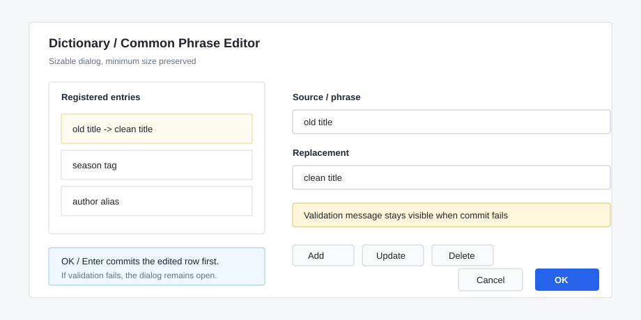
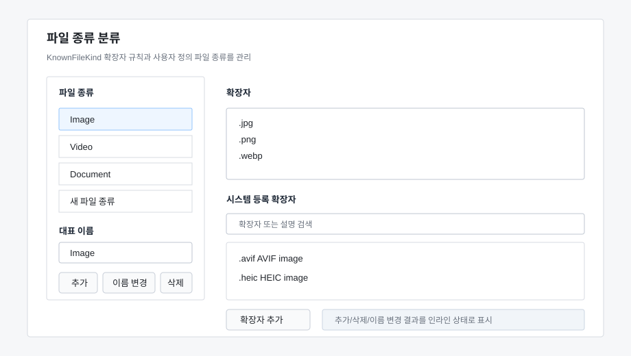

# Secondary Dialog UX Review

Review date: 2026-06-03

Scope:

- `src/FileTools.App/Ui/AutoRelocationTemplateEditorDialog.cs`
- `src/FileTools.App/Ui/PlanStepDialog.cs`
- `src/FileTools.App/Ui/RenameDictionaryEditorDialog.cs`
- `src/FileTools.App/Ui/StringListEditorDialog.cs`
- `src/FileTools.App/Ui/FileKindClassificationEditorDialog.cs`

Current reference:

## Summary

The secondary editing dialogs now better match the newer settings and rename editor direction. They avoid silent failures, handle longer values more reliably, and reduce brittle fixed-position layouts where users are likely to see long template names, paths, or localized labels.

## Implemented Changes

- AutoRelocation template editor groups now resize with the editor panel instead of staying at a fixed 760px width.
- AutoRelocation template editor keeps the primary save button at normal button width while only the editing groups stretch with the panel.
- AutoRelocation template rows now resize their label/input split when the dialog width changes.
- AutoRelocation template text fields expose their full values through tooltips for long IDs, names, formats, fallback folders, and filter values.
- Plan step dialogs now use a resizable `TableLayoutPanel` structure instead of fixed absolute coordinates.
- AutoRelocation plan-step template selection and manual target root fields resize with the dialog.
- Long selected templates and manual target paths are available through tooltips.
- Rename dictionary and common phrase editors now show inline status messages for empty values and duplicates instead of silently ignoring Add/Update.
- Rename dictionary and common phrase editor dialogs are resizable, and their input rows resize horizontally with the dialog.
- Rename dictionary and common phrase editor OK/Enter handling commits the current edited row before closing; validation failures keep the dialog open with the inline status message.
- File kind classification now manages the file kind list itself: users can add a kind, delete a kind and its extension rules, and rename the representative KnownFileKind value.
- File kind representative names are validated before saving so reserved fallbacks (`Folder`, `Other`), duplicates, empty names, and Windows-invalid path characters are rejected.
- Dialog UI construction is split into `*.Designer.cs` partial files so layout/control edits stay separate from validation, persistence, and operation logic.

## Remaining Notes

### 1. Template editing is still function-first

The AutoRelocation template editor is now safer on resize, but it is still a dense rule editor. If template editing becomes a frequent workflow, the next UX pass should add a live path preview for a sample filename and move the primary save/status feedback into the dialog instead of only using modal messages.

### 2. Dictionary editors still use simple list editing

The dictionary and phrase editors now show validation feedback, but they remain simple list editors. This is appropriate for small dictionaries. If the lists grow, add search/filter and keyboard shortcuts before adding more buttons.

### 3. Plan step dialogs are intentionally narrow

The plan step dialogs now resize and preserve long values better, but they still expose only the small set of options needed for a single action. More complex rename editing belongs in the rename review/editor dialog, and template internals belong in the template editor.

### 4. File kind classification is now user-extensible

The file kind classification editor now treats the left file-kind list as editable user data instead of a fixed set of built-in buckets. Deleting a kind removes its extension rules, so matching files fall back to `Other` until the user assigns those extensions elsewhere.
