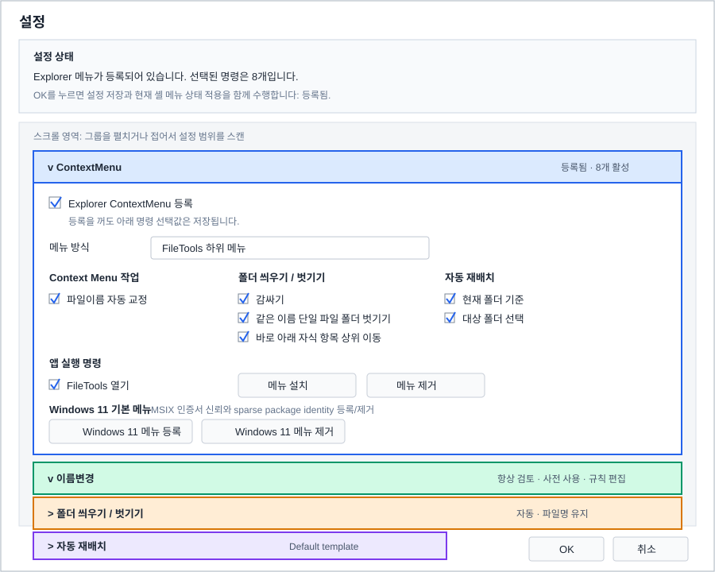

# Settings Dialog UX Review

Review date: 2026-06-02

Scope:

- `src/FileTools.App/Ui/SettingsForm.cs`
- `src/FileTools.App/Configuration/SettingsStore.cs`
- `src/FileTools.App/Program.cs`
- `src/FileTools.App/Shell/ContextMenuRegistrar.cs`
- Related standalone action dialogs in `PlanStepDialog.cs`

## Summary

The settings dialog now uses a resizable single-panel layout with a fixed status header, a scrollable settings body, fixed OK/Cancel buttons, and collapsible option groups. It covers the current core defaults: Explorer ContextMenu registration, Windows 11 native context menu identity actions, rename dictionary behavior, rename review mode, AutoRelocation default template and file-kind classification, and folder structure defaults.

The dialog keeps settings scoped to repeatable defaults. One-off execution choices stay in action dialogs or the main planner.

## Implemented Layout Changes

- The settings form is resizable and has a larger minimum size so labels, helper text, and combo boxes have room to breathe.
- The top status panel is outside the scrollable body and remains visible while users scroll through option groups.
- The status panel states whether the Explorer ContextMenu is registered and clarifies that OK saves settings and applies the shell menu state.
- The old tabs are replaced by vertically stacked collapsible groups.
- Each group has a title row with a small `v` / `>` marker and a compact summary of the current options.
- Expanded group headers use group-specific colors; body content stays neutral and uses the group color as a border.
- ContextMenu, Rename, Folder Structure, and AutoRelocation settings each have their own group.
- The ContextMenu group now includes the Windows 11 native context menu section for explicit certificate trust and sparse package identity registration/removal.
- Help text is placed under ambiguous rows such as menu layout, rename review mode, folder operation, mismatch handling, and default relocation template.
- The bottom OK/Cancel row is fixed outside the scrollable settings body.

## Current Strengths

- Context menu commands can be enabled independently, which is useful for reducing Explorer menu clutter.
- Rename correction rules, relocation templates, and AutoRelocation file-kind classification are reachable from the settings window without exposing their implementation files. Rename dictionary, review insert phrase, obfuscated Hangul candidate-profile, and parser-profile editing now live inside the correction rule editor's selected-rule detail tab.
- AutoRelocation file-kind classification now supports managing the kind list directly, including custom kinds, deletion, and representative KnownFileKind name changes.
- AutoRelocation and folder unwrap options are also available at the action-step level through `PlanStepDialog`, so the app already has a path for per-run overrides.
- The collapsible group summaries make the single-panel layout scannable even when groups are collapsed.

## UX Issues

### 1. Context menu settings mix state, command visibility, and installation actions

`SettingsForm` puts the registration checkbox, layout combo, command checkboxes, and Install/Remove buttons into one tab. Pressing OK also synchronizes Explorer registration through `SyncContextMenuRegistration`, so users can change system registration even if they never press Install or Remove.

Implemented change:

- A sticky status header shows registered/unregistered state and selected command count.
- The header states that OK saves settings and applies the current shell menu state.
- Command choices remain editable when registration is off; the header and group summary show that they are saved for future registration.

The status header should sit outside the scrollable settings body. It should remain visible while vertical scrolling through option groups, because it explains the current shell-registration state and the side effect of pressing OK.

### 2. The first tab is the most technical tab

The old first tab was `Context Menu`, but many users open settings to change operation defaults. Explorer registration is important, but it is more system-level than task-level.

Implemented change:

- The tab strip has been removed.
- The single scrollable panel uses group headers and summaries so users can scan across all setting families without switching tabs.

### 3. Some labels need examples, not just names

Options such as `단일파일 불일치`, `파일명 유지`, `폴더명으로 변경`, and `폴더명-파일명으로 변경` are correct but abstract. This setting affects actual file names and should show an example.

Implemented change:

- Inline helper text now describes the menu layout tradeoff.
- Folder mismatch handling includes an inline example for keep, folder-name, and folder-file behavior.
- AutoRelocation default template helper text explains where that default is used, and the same group opens the file-kind classification editor for KnownFileKind extension rules and file-kind list management.

### 4. Rename review mode is now explicit

The old boolean rename-review setting has been replaced with a `RenameReviewMode` selection. The default is always review, and the secondary option opens the review dialog only when a generated row needs review or has a conflict.

Remaining note:

- Keep validation mandatory for invalid names, duplicate targets, and dangerous conflicts even when the secondary automation mode is enabled.

### 5. Hidden group flags are forced on

`ContextMenuFolderStructure` and `ContextMenuAutoRelocation` exist in settings, but `SettingsForm.SaveSettingsFromUi` forces them to `true`. The UI only exposes child command toggles.

Recommended change:

- This is acceptable if group-level disable is not needed.
- If menu clutter is a common problem, expose group header toggles: `폴더 작업 표시`, `자동 재배치 표시`.

### 6. Fixed dimensions may age poorly

The old dialog used a fixed starting size and many hard-coded widths. Current Korean and English strings mostly fit, but new explanatory copy or longer template names made that brittle.

Implemented change:

- The form starts larger and has a larger minimum size.
- The form remains resizable.
- Group and row widths are recalculated from the current scroll host width to avoid horizontal scrolling.
- Combo rows resize with the dialog.
- Helper text sits under rows instead of forcing long labels into the row header.

### 7. A single-panel layout needs collapsible option groups

The tabbed layout has been replaced by one panel that lists every option group vertically. Collapsible groups keep the layout scannable.

Implemented behavior:

- Each option group has a title row that remains visible when collapsed.
- A small marker shows state: `>` when collapsed and `v` when expanded.
- The collapsed title row should include a compact summary such as `등록됨`, `6개 활성`, `항상 검토`, or the selected template name.
- Expanding and collapsing should be possible by clicking the title row and by keyboard focus with Enter or Space.
- Vertical scrolling is expected, but horizontal scrolling should be avoided.
- The bottom OK/Cancel buttons should stay fixed outside the scrollable settings body.

Implemented styling:

- Give each group a distinct but restrained identity color.
- When expanded, apply the group color to the title row background.
- Keep the body background neutral and use the group color only for the border or a subtle side accent.
- When collapsed, show only the title row, the marker, and the compact summary.
- Color is not the only state indicator; text summaries and the `>` / `v` marker carry state as well.

## Feature Granularity And Settings Additions

Add or change settings only where they protect repeat workflows:

- Rename review mode: implemented as a selection, with `항상 검토` as the default and `검토 필요/충돌이 있을 때만 검토` as the safer automation option.
- Rename correction rules: implemented in a dedicated editor so built-in rule visibility, enabled state, mode, and stage-scoped order can be managed without turning the main settings screen into a rule builder. Existing rename dictionary, review insert phrase, candidate-profile, and parser-profile settings are now edited in the rule editor's `Details` tab for the relevant built-in rule. Candidate customization is limited to obfuscated Hangul scoring words and protected English words stored in `rename-candidate-profile.json`; parser customization is limited to tag words, author prefixes, episode prefixes/units, and title noise words stored in `rename-parser-profile.json`. Character replacement tables and full regex editing remain internal.
- Explorer menu group toggles: useful if users want to hide whole feature families, not just individual commands.
- AutoRelocation default target root: useful only if users repeatedly send files to one library folder. Otherwise keep target selection per run.
- Collision handling: folder wrap/unwrap now has a dedicated name-template dialog with `skip` and `auto number`. The engine keeps `ask` as a reserved policy, but it should not be exposed until an actual prompt flow exists for planner and context-menu execution.
- Folder unwrap preview examples: implemented in the name-template dialog for wrap, unwrap mismatch, and conflict suffix samples.

Avoid adding these as global settings for now:

- Per-step AutoRelocation target root, because it already belongs in the action dialog.
- Per-step folder unwrap mode beyond the existing action dialog override.
- Template-rule internals in the main settings dialog; keep them in the dedicated template editor.

## Suggested Priority

1. Decide whether group-level context menu toggles should be surfaced.
2. Consider storing expanded/collapsed group state if users frequently revisit the same section.
3. Revisit whether Install/Remove should remain separate buttons or become one context-sensitive action.
