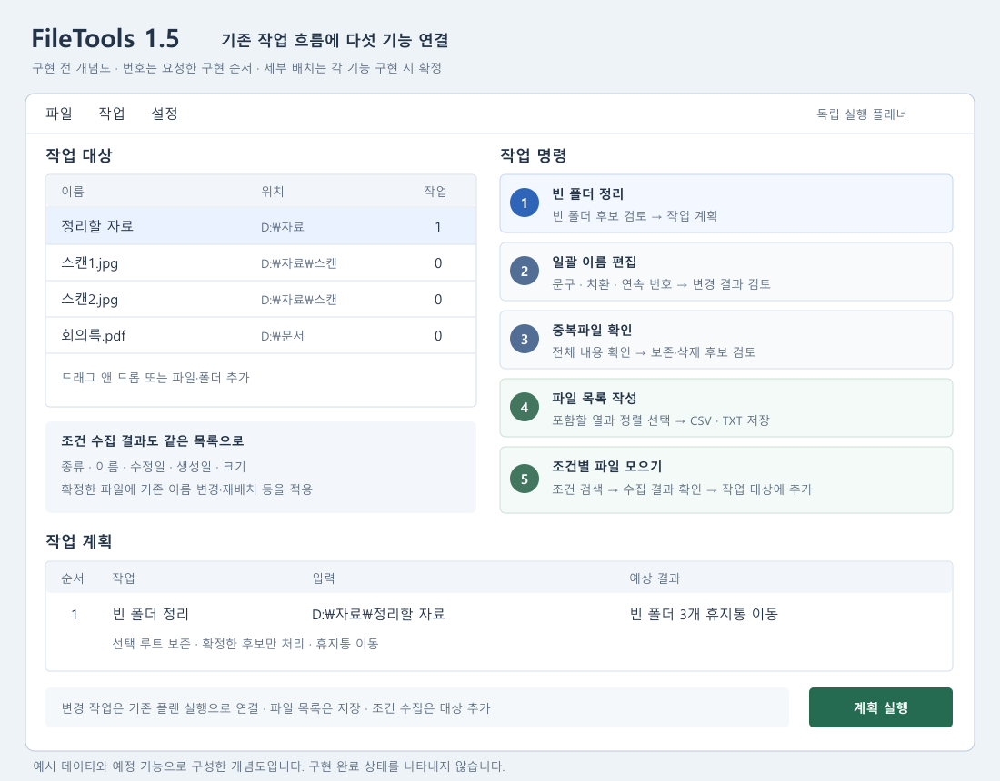

# 1.5.0.0 순차 구현 계획

작성일: 2026-09-19.
상태: 1번 빈 폴더 휴지통 정리와 2번 일괄 이름 편집 구현 및 로컬 검증 완료.
3~5번은 준비 상태다. 사용 방법과 검증 결과는 [기능 문서](file-organization.md)에 기록한다.

## 작업 기준

- 작업 브랜치: `codex/1.5.0.0`.
- 분기 기준: `master`의 `15296b3` (`1.4.7.0` 폴더 작업/메뉴 개선 커밋).
- 목표 버전: `1.5.0.0`. 저장소의 `major.minor.patch.build` 규칙에 따라
  minor를 올리고 patch/build를 0으로 초기화하는 계획이다.
- 커밋 요청에 따라 앱/셸 확장/설치/번들 프로젝트 버전을 `1.5.0.0`으로 함께 올렸다.
- 사용자가 지정한 순서를 따른다. 앞 단계의 완료 기준을 확인한 뒤 다음 기능을 구현한다.
- 이 문서의 기본값은 구현을 위한 제안이며, 별도 요청이 들어오면 해당 범위부터 갱신한다.

| 순서 | 기능 | 첫 구현 결과 | 현재 상태 |
| --- | --- | --- | --- |
| 1 | 빈 폴더 정리 | 선택 범위에서 빈 폴더를 찾아 검토하고 휴지통으로 이동 | 구현·로컬 검증 완료 |
| 2 | 일괄 이름 편집 | 선택 파일에 일회성 편집 규칙과 연속 번호 적용 | 구현·로컬 검증 완료 |
| 3 | 중복파일 확인 고도화 | 전체 내용 기준 중복 검색, 대량 처리, 삭제 전 재검증 | 준비 |
| 4 | 파일 목록 작성 | 선택 파일/폴더에서 CSV·TXT 목록 생성 | 준비 |
| 5 | 조건별 파일 모으기 | 종류·이름·수정일·생성일 등으로 파일 수집 | 준비, 수집 방식은 기본안 |

이번 순서에는 작업 조합 프리셋과 범용 실행 취소를 추가하지 않았다.
이전 [추가 기능 제안](feature-expansion-proposals-2026-09-19.md)은 검토 이력이며,
실제 준비 순서는 이 문서를 따른다.

## 공통 연결 방향

기존 대상 목록과 작업 계획을 중심으로 연결한다. 앱의 작업 명령에서 각 기능을
열고, 파일을 바꾸는 작업은 검토한 결과를 플랜에 추가해 실행한다.
목록 작성은 저장 명령으로 끝나고, 조건 수집은 확정한 파일을 대상 목록에 추가한다.
세부 배치와 버튼 문구는 해당 단계의 구현 전에 맞춘다.

아래는 기능 연결을 설명하기 위한 개념도이며 실제 구현 화면이 아니다.

- 폴더 탐색은 취소 가능하고 경로별 실패를 보고해야 한다. 읽기 실패와 빈 폴더를 구별한다.
- 탐색 범위는 선택한 루트로 제한하고 연결된 폴더/reparse point는 기본적으로 따라가지 않는다.
- 겹치는 루트와 중복 경로를 정규화해 동일 대상을 중복 처리하지 않는다.
- 읽기 전용 탐색 결과와 실제 실행 결과를 구분한다. 실행 직전 현재 상태를 다시 확인한다.
- 작업 실패/취소 후 완료한 항목과 남은 항목을 구분하고 기존 플랜의 부분 실패 정책과 맞춘다.
- 문자열은 `Resources/Strings.resx`와 `Strings.ko.resx`에 함께 추가한다.
  별도 대화상자는 저장소의 Designer 분리 규칙을 따른다.
- 탐색기 메뉴 노출은 각 기능의 앱 동작 검증 뒤 선택 조건과 비용을 확인해 연결한다.
  셸 확장 메뉴 표시 과정에서 재귀 탐색이나 파일 해시는 수행하지 않는다.

### 필요한 만큼 공통 기반을 확장

1번에서 폴더 탐색의 취소·오류·경로 정책을 만든다. 3번과 4번에서 필요한
파일 메타데이터 수집을 확장하고, 5번에서 공통 조건 평가와 수집 기능으로 연결한다.
공통 코드 재사용 때문에 5번의 사용자 기능을 먼저 구현하지 않는다.

제안하는 공통 결과는 `경로, 선택 루트, 상대 경로, 항목 종류, 확장자,
크기, 생성 시각, 수정 시각, 읽기 상태`다. 이름/경로 중복 처리와 정렬은
공통 정책으로 관리하고, 파일을 변경하는 실행 객체와는 구분한다.

## 1. 빈 폴더 정리

### 첫 범위와 기본값

- 선택 폴더와 하위 폴더를 탐색한다. 기본값은 하위 포함, 선택 루트 보존이다.
- 현재 비어 있는 폴더와, 선택한 빈 하위 폴더를 정리하면 비게 되는 부모 폴더를 구분한다.
- 삭제할 후보를 확정한 뒤 아래에서 위로 실행한다. 부모 후보의 하위 후보를 제외하면
  그 부모의 삭제 가능 여부도 다시 계산한다.
- 숨김/시스템 항목과 크기 0 파일도 폴더의 내용으로 취급한다.
- 선택 루트 자체를 정리하는 옵션은 명시적으로 켠 경우에만 적용한다.
- 사용자 지정에 따라 **휴지통 이동만** 제공한다. 실행 직전 및 Shell 작업 직전 콜백에서
  연결 경로와 빈 상태를 재확인한다. 영구 삭제 코드로 대체하지 않으며,
  휴지통 작업을 완료하지 못하면 해당 후보를 남기고 원인을 보고한다.
  운영체제 작업과 다른 프로세스의 동시 변경을 하나의 원자적 작업으로 잠그지는 않는다.
- 사용자가 확정한 후보만 처리한다. 실행 중 새로 발견된 폴더를 삭제 범위에 추가하지 않는다.

### 연결 지점

- 탐색/실행 로직은 `Operations/EmptyFolderCleanupOperations.cs`, 휴지통 연동은 `Operations/WindowsRecycleBin.cs`로 분리했다.
- [단계 모델](../src/FileTools.App/Operations/WorkPlan.cs)에 전용 작업과 옵션을 추가한다.
- [미리보기](../src/FileTools.App/Operations/WorkPlanPreviewBuilder.cs),
  [표시](../src/FileTools.App/Operations/WorkPlanDisplayBuilder.cs),
  [실행기](../src/FileTools.App/Operations/WorkPlanExecutor.cs)를 함께 연결한다.
- 기존 [폴더 작업](folder-operations.md)의 부분 실패 처리와 루트 경계를 재사용한다.

### 완료 기준

- 빈 폴더, 빈 폴더만 중첩된 트리, 파일이 든 부모, 숨김 파일,
  크기 0 파일, 읽기 실패, 연결된 폴더를 올바르게 구별한다.
- 겹치는 선택 루트가 중복 실행되지 않고, 보존하기로 한 루트가 삭제되지 않는다.
- 후보 확정 후 파일이 추가되면 해당 폴더를 보존한다.
- 중간 취소·일부 실패 후 성공 결과와 남은 후보가 정확하며 재실행할 수 있다.
- 삭제 방식과 실제 동작이 일치하고, 파일 내용이 있는 디렉터리를 강제 삭제하는 경로가 없다.

## 2. 일괄 이름 편집

### 첫 범위와 기본값

- 처음에는 선택한 파일들을 대상으로 한다. 폴더명 일괄 변경은 후속 확장으로 둔다.
- 문자열 치환, 앞/뒤 문구 추가·제거, 새 이름 형식, 연속 번호를 지원한다.
- 번호 시작값·증가값·자릿수와 번호 부여 순서를 지정한다.
  기본 순서는 숫자를 고려한 이름순이며 같은 이름은 전체 경로로 순서를 고정한다.
- 확장자는 기본 보존한다. 번호는 결과에서 제외한 파일을 빼고 확정된 적용 순서대로 부여한다.
- 규칙은 이번 선택에 적용한다. 기존 전역 이름 교정 규칙 저장과 분리한다.
- 전체 후보를 만든 뒤 유효한 Windows 이름과 묶음 내/외부 충돌을 검토한다.
- 첫 범위에서 이름 맞교환/순환 변경은 충돌로 보류한다. 임시 이름을 거치는 일괄
  트랜잭션은 별도 검증 없이 기존 순차 실행에 끼워 넣지 않는다.
- 실행 전 경로나 대상 점유 상태가 바뀌면 재계산·재확정을 요구한다.

### 연결 지점

- `Naming/BatchRenamePlanBuilder.cs`에서 후보 생성과 순번 계산을 수행하고 파일 식별 정보를 함께 캡처한다.
- [기존 이름 규칙](../src/FileTools.App/Configuration/RenameRuleStore.cs),
  [이름 템플릿](../src/FileTools.App/Naming/NameTemplate.cs),
  [이름 적용](../src/FileTools.App/Operations/RenameOperations.cs)의 공용 처리를 활용한다.
- 확정 결과는 대상별 전용 `BatchRename` 단계에 연결하고 원래 묶음의 규칙/순서도 보존한다.
  묶음 전체의 충돌 검증을 대상 하나씩 생성하는 기존 미리보기로 대체하지 않는다.
- 앞선 플랜 단계가 경로를 바꾸는 경우 적용 시점의 경로로 후보를 다시 검토한다.
  이를 지원하기 전에는 경로 변경 단계와의 조합을 명시적으로 제한한다.

### 완료 기준

- `이미지1.jpg`, `이미지2.jpg`, `이미지10.jpg`가 예상 순서대로 `자료_001.jpg`부터 변경된다.
- 한글·유니코드·확장자 없는 파일·긴 이름·예약 이름·빈 결과를 검증한다.
- 기존 파일과의 충돌, 묶음 내 충돌, 제외 후 번호 재계산, 순환 변경을 검증한다.
- 검토한 결과와 실제 적용 결과가 일치하며 기존 자동교정의 회귀 테스트가 유지된다.

## 3. 중복파일 확인 고도화

### 첫 범위와 기본값

- 이름과 시각이 달라도 파일 전체 내용이 같은 파일을 찾는 전용 검색을 제공한다.
  기존 이름·메타데이터·압축 엔트리 상세 비교도 유지한다.
- 크기로 먼저 묶고 필요할 때 일부 구간을 비교해 후보를 줄인 뒤,
  최종 판정에는 파일 전체 내용을 사용한다.
- 전체 SHA-256 계산은 읽기 청크 단위로 취소 가능해야 한다.
  결과는 중복 그룹 중심으로 구성하고 서로 다른 모든 파일 쌍의 결과를 쌓지 않는다.
- 부분 범위 일치, 일부 ZIP 엔트리 일치, 이름/메타데이터 일치는
  전체 파일 중복과 구분하며 그대로 삭제 후보로 넘기지 않는다.
- 보존 기준, 그룹별 경로·크기, 예상 정리 용량을 제공한다.
  용량은 논리적 파일 크기 기준으로 표기하고 실제 디스크 확보량으로 단정하지 않는다.
- 삭제 단계로 넘길 때 검증 범위와 파일 상태를 함께 보존한다.
  실행 직전 보존 파일의 존재와 보존/삭제 후보의 전체 내용 동일성을 다시 확인한다.
- 삭제는 기존 휴지통 처리를 따른다. 보존 대상이 사라지거나 파일 내용이 달라지면
  해당 그룹 삭제를 보류한다.
- 기존 JSON 결과 내보내기를 확장하고 저장 결과 다시 열기를 연결한다.
  불러온 결과는 과거 기록으로 취급하며 현재 파일 검증 없이 삭제를 허용하지 않는다.

### 코드 검토에서 확인한 연결 과제

- [비교 엔진](../src/FileTools.App/Operations/FileCompareOperations.cs)은 현재
  모든 대상 쌍을 비교하므로 대량 중복 검색용 그룹 처리 경로가 필요하다.
- [중복 그룹 생성](../src/FileTools.App/Operations/FileCompareResultActions.cs)의
  `IsSameContentPair`는 상태와 기준 이름으로 판정하며, 파일 전체를 비교했는지
  명시적 검증 정보를 받지 않는다. 비교 범위/검증 수준을 타입으로 전달해야 한다.
- [결과 저장](../src/FileTools.App/Operations/FileCompareResultExport.cs)은 현재
  스키마 2다. 새 검증 정보를 추가할 때 버전을 올리고 기존 결과 읽기 정책을 정의한다.
- `DuplicateDeleteStepSelection`, `WorkPlan`, `WorkPlanExecutor`까지
  보존/삭제 대상과 검증 정보가 전달되도록 연결한다.

### 완료 기준

- 이름·수정일이 다른 같은 파일을 찾고, 같은 크기의 다른 내용은 구별한다.
- 첫 구간만 같은 파일, 제한된 ZIP 엔트리만 같은 압축 파일은 자동 삭제 후보가 되지 않는다.
- 검색/저장/불러오기 이후 파일 변경, 보존 파일 삭제, 경로 교체를 재검증한다.
- 0바이트 파일, 읽기 실패, 취소, 겹치는 루트, 같은 파일을 가리키는 경로를 검증한다.
- 링크 경로와 별개 파일 복사본을 구분하고, 같은 실제 파일의 여러 경로를
  디스크 용량을 확보하는 중복 복사본으로 집계하지 않는다.
- 성능 검증에서는 파일 수 증가에 따른 비교/해시 횟수와 메모리 사용을 측정한다.
  해시 캐시가 있다고 전체 쌍 생성 비용까지 사라졌다고 간주하지 않는다.

## 4. 파일 목록 작성

### 첫 범위와 기본값

- 선택 파일과 선택 폴더 아래 파일의 목록을 CSV 또는 TXT로 저장한다.
  하위 폴더 포함 여부를 선택하고, 목록을 작성하는 동안 원본 파일은 변경하지 않는다.
- 기본 열: 파일명, 확장자, 파일 종류, 전체 경로, 루트 기준 상대 경로,
  크기(byte), 생성일, 수정일. 필요 열과 정렬 순서를 지정한다.
- 여러 루트가 있으면 루트 경로를 별도 열로 두어 같은 상대 경로를 구분한다.
- 파일 종류는 기존 AutoRelocation의 사용자 정의 확장자 분류를 공유한다.
- CSV는 UTF-8 BOM과 올바른 따옴표 이스케이프를 사용한다.
  파일명/경로가 스프레드시트 수식으로 해석되지 않도록 텍스트 열을 처리한다.
- TXT는 한 줄당 파일명/전체 경로/상대 경로 중 선택한 표현으로 작성한다.
  CSV의 스프레드시트 호환 변환이 필요 없는 원문 목록 용도로도 사용한다.
- 시각은 표준화된 형식과 오프셋을 포함하고, 파일 크기는 원시 byte 값을 보존한다.
- 출력 파일은 목록 대상에서 제외한다. 임시 출력에 쓴 뒤 성공 시 확정하며
  취소·실패 때 기존 출력 파일을 보존한다. 기존 파일 교체는 명시적으로 확인한다.

### 연결 지점과 완료 기준

- `Operations/FileListExport.cs`에 수집 결과에서 CSV/TXT를 생성하는 로직을 분리한다.
  비교 결과 전용 JSON 스키마와 일반 파일 목록 형식을 섞지 않는다.
- 한글, 쉼표, 따옴표, 수식으로 시작하는 이름, 빈 결과, 겹치는 루트,
  큰 파일 크기, 날짜·시간대, 출력 대상 자체 제외를 검증한다.
- 권한 실패는 원인과 누락 건수를 보고하고 완료한 목록의 포함 범위를 명확히 한다.
- 생성한 CSV를 다시 읽어 열과 값이 의도대로 유지되는지 확인한다.

## 5. 조건별 파일 모으기

### 공통 조건 범위

- 종류: 기존 사용자 정의 파일 종류와 직접 지정한 확장자 목록.
- 이름: 포함/일치/시작/끝, 와일드카드. 정규식은 제한 시간을 둔 고급 조건으로 검토한다.
- 날짜: 수정일과 생성일을 각각 선택해 시작일/종료일 범위를 설정한다.
  사용자가 말한 작성일은 우선 파일시스템의 생성일(`CreationTime`)로 정의한다.
  문서 내부 작성일과 사진 촬영일(EXIF)은 별도 메타데이터 확장 범위다.
- 크기 범위, 하위 폴더 포함 여부, 제외 경로, 숨김/시스템 항목 포함 여부를 제공한다.
- 서로 다른 조건 범주는 AND, 종류/확장자에서 여러 값을 고른 경우는 OR로 결합한다.
- 날짜만 지정한 범위는 현지 날짜 기준 시작일 00:00 이상부터 종료일 다음날 00:00 미만으로
  해석하고 내부 비교는 UTC로 통일한다. 메타데이터 읽기 실패는 불일치와 구분한다.

### 결과 처리 범위 — 기본안

이전 제안을 기준으로 조건에 맞는 파일을 검토한 뒤 기존 대상 목록으로 모으는
범위를 우선 계획한다. 직접 복사·이동까지 포함할지는 아직 사용자가 선택하지 않았다.
이름 편집, 중복 확인, 목록 작성, 자동 재배치에 같은 결과를 넘길 수 있다.
조건 검색 자체가 파일을 이동하거나 복사하지는 않는다.

사용자가 지정 폴더로 직접 모으기도 원하면 이 단계에 복사/이동 실행을 추가하고,
평탄화/상대 경로 유지, 충돌 보존, 이동 후 원본 처리 정책을 함께 확정한다.

### 연결 지점과 완료 기준

- `FileCollectionQuery`와 순수 조건 평가기를 두고 UI, 폴더 탐색, 파일 변경 처리를 분리한다.
- 기존 `AutoRelocationFileTypeClassifier`, 1/3/4번의 탐색 기반,
  `MainForm.AddPaths`와 연결한다.
- 확장자 대소문자, 사용자 정의 종류, 이름 조건, 날짜 경계, 크기 단위,
  조건 결합, 겹치는 루트, 취소, 접근 실패를 검증한다.
- 수집 결과에 들어 있는 파일과 이후 작업에 실제 전달되는 파일이 일치한다.

## 검증과 버전 적용

- 준비 단계에서는 문서 링크·SVG/XML·변경 범위를 확인한다.
  런타임 변경이 없으므로 이 단계에서 앱 빌드나 파일 작업 테스트를 반복하지 않는다.
- 각 기능 구현 시 CPU/가용 메모리/디스크 여유를 확인하고, 작은 임시 파일 트리에서
  관련 회귀 테스트를 먼저 실행한다. 실제 사용자 폴더를 테스트 데이터로 쓰지 않는다.
- 관리 코드 변경은 관련 테스트와 Release 앱 빌드를 수행한다.
  셸 명령을 추가/변경하면 네이티브 정책 테스트와 전체 x64 빌드를 추가한다.
- 단계별 완료 시 기능 문서, README와 다음 릴리스 노트를 실제 구현 상태로 갱신한다.
- 첫 런타임 변경 커밋 요청에 따라 `1.5.0.0`을 앱, ShellExt, 리소스,
  설치/번들 프로젝트, 빌드 스크립트와 버전 노출 문서에 일관되게 반영했다.
  같은 작업 흐름에서는 중복으로 버전을 올리지 않는다.
- 배포 전 전체 Release 회귀, x64 솔루션, 패키지 버전/서명/체크섬,
  설치 및 실제 탐색기 연결을 확인한다. 기존 `1.4.7.0` 설치 확인 잔여 항목도 별도 유지한다.

## 다음 착수 단위

다음 구현은 **3번 중복파일 확인 고도화**다.
1·2번은 앱 작업 메뉴와 계획 실행에 연결했다. 전용 탐색기 메뉴와 설치 패키지는
이번 범위에 추가하지 않았으며 배포 검증 시 별도로 판단한다.
